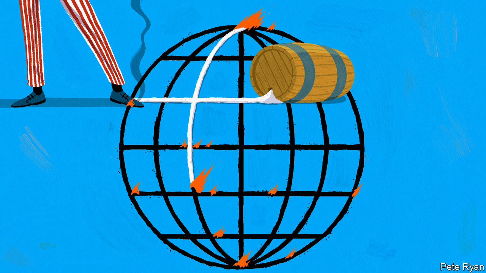
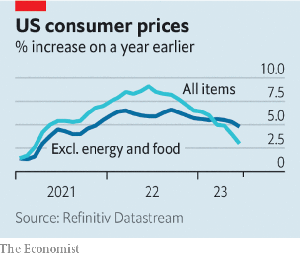

###### Economic optimism

# The world economy is still in danger 

##### Falling inflation is good news. But it is too early to hail a “soft landing” 

 

> Jul 19th 2023 

Economists are not known for their optimism, but today their good cheer is palpable. Not long ago it seemed that an American recession was inevitable, as the Federal Reserve kept raising interest rates . Other central banks were following suit, their inflation problems made worse by —a particular problem for the emerging markets that borrow and trade using America’s currency. Yet news that America’s headline rate of annual inflation fell to 3% in June has fed hopes that the Fed’s next rate rise, which is expected on July 26th, will be its last and that other central banks might relax, too. Stocks are up, bond yields are down and the greenback is at close to its weakest since the Fed began .

The surge of hope is all the more unusual because the  is slowing down. On July 17th China reported that its economy grew by a mere 0.8% in the second quarter compared with the prior three months, even though many had expected a boom after the government abandoned its “” policy in December. Global manufacturing has suffered as consumers came out of lockdowns and began eating out more and buying less home-office equipment. And, although America grew strongly in the first half of the year, most forecasters expect the economy soon to slow.

Increasingly, however, they are not expecting it to shrink. And growth cooling just enough to bring down inflation without a recession is the best-case scenario for  like America’s Even the disappointing reopening in China, which does not have an inflation problem of its own, has meant a feared surge in global commodities prices has not materialised. That has helped Europe, which has replaced piped Russian gas with shipments of the liquefied sort. 

 


Yet it would be a mistake to assume that the world economy is now on track for a so-called soft landing, for three reasons. The first is that inflation, though lower, remains far above central banks’ 2% targets. The fall in America’s headline rate has been driven by a one-off decline in energy prices: exclude food and energy, and prices are 4.8% higher than a year ago. In the euro zone the figure is 5.5%, and in both economies wages are still growing far in excess of productivity growth. 

In other words, the rich world has some way to go before it is fully disinflated—and many economists expect the last mile to be the hardest. Though stubborn inflation of, say, 3-4% does not grab headlines as much as recent alarming price rises, it would still be a problem for central bankers. They might have to choose between more tightening than is currently expected and tacitly abandoning their 2% goals. Either would be disruptive for asset markets and potentially for the real economy, too.

The second risk is that, whereas the world is seeing the benefits of cooling off now, the costs may not be visible for a while. So far America’s labour market has rebalanced fairly painlessly by reducing vacancies rather than jobs. Hiring is still strong and lay-offs are rare. With job openings less plentiful, wage growth has fallen. Yet nobody knows for how long the jobs market can shed fat rather than muscle—and in recent months the fall in job openings has stalled ominously. Across the rich world there is evidence that firms, scarred by the memory of labour shortages, have been hoarding workers they don’t need; in several countries average hours worked have been falling. Should companies decide that it is too costly to cling to workers who may or may not be needed in the future, then lay-offs could rise abruptly. 

The third danger is that divergence among the world’s big economies means that even as the pressure on the Fed lifts, policymakers elsewhere remain worried. Britain is celebrating a larger-than-expected fall in annual inflation in June, but with underlying price and wage growth of around 7% it remains a troubling outlier (see Britain section). Japan has barely started its monetary tightening; with inflation rising, the Bank of Japan may adjust its cap on long-term bond yields again at the end of July. China could be contending with a structural growth slowdown in which the economy is weighed down by bad debts, as Japan’s was in the early 1990s, and in which inflation is persistently too low.

Wherever you look, in other words, there remains immense uncertainty about where inflation and interest rates will eventually settle. By all means celebrate good news. But the world economy has not yet escaped unscathed. ■

