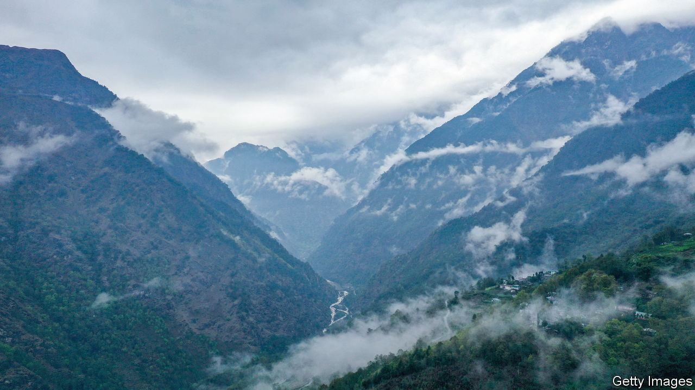

###### A Himalayan thaw

# What the China-India detente means for the West 

##### The Asian giants are learning to live with each other 

 

> Jul 20th 2023 

The hope that India might act as a pro-Western counterweight to China has become a cornerstone of American foreign policy. It is a bet on India’s  and geopolitical posture that was clearly articulated after a visit to Delhi by Bill Clinton in 2000. Every subsequent president, two Democrats and two Republicans, has doubled down on it. Hence Narendra Modi’s latest love-fest in Washington last month. Amid bilateral protestations of undying friendship, the Indian prime minister pocketed the sort of defence technology deals that America usually reserves for close allies.

But what if India, which does not enter into formal alliances, is on course to be a much less committed American partner than many in Washington assume? As we report this week in , that is a distinct possibility. It is illustrated by a quiet yet striking recent improvement in India-China ties.

They deteriorated sharply after a bloody border brawl in 2020 that claimed the lives of 20 Indian troops and at least four Chinese ones. The violence, waged with rocks and iron bars along the Asian giants’ frigid Himalayan frontier, helped spur the recent step-up in Indo-American defence co-operation. America rushed cold-weather and other gear to India’s border forces, hatched plans for more joint military exercises between the two countries, and looked on approvingly as Mr Modi’s government transferred some 70,000 troops in effect from India’s western frontier with Pakistan to its northern one with China. India also banned over 300 Chinese apps, launched tax raids on Chinese companies and introduced curbs on bilateral trade and investment. Yet much of that India-China iciness has now thawed.

The economic freeze was brief. In 2021 bilateral trade, recovering after the pandemic, grew by 43%. Last year it increased 8.6%. That put its total value at $136bn—27 times greater than when Mr Clinton was in Delhi. Meanwhile, the countries’ frontier remains largely contested and heavily militarised—but both seem keen to defuse their quarrel over it. After 18 rounds of negotiation between military commanders, they have withdrawn their troops from five potential flashpoints, in favour of “buffer zones” which neither side patrols. Only two major frontier hotspots have yet to be made safe in this way.

A world in which India and China set their territorial dispute aside, as they did previously for over three decades, following an accommodation to that end in 1988, could be very different from the one many American strategists envisage. India is already much less likely to provide support to American forces in the event of a conflict with China over Taiwan than many in Washington seem to imagine. A sustained India-China thaw would make that unimaginable. In such a world, India would also be even less of a friend to the West on thorny global issues such as climate change, trade and debt than it is currently.

A continued India-China detente would be in both countries’ interests. India’s momentary effort to reduce its economic dependence on China underlined how hard that would be. Two of Mr Modi’s biggest priorities, infrastructure and manufacturing, are especially reliant on Chinese inputs. India’s pharmaceutical industry, a big exporter, gets 70% of its active ingredients from China. And even if the prime minister could bear to curb such supplies (of which there is little sign) India’s influential business lobbies would try hard to dissuade him. The brief hiatus also illustrated their strength of feeling and traction on the issue. This does not allay India’s security concerns over China. They are long-standing and India will in any event continue to build up its defences because of them. India sees rapid economic growth as the essential condition for the build-up, among much else. And it rightly sees business with China as a necessary means to help it achieve that growth. 

For its part, China has such an obvious interest in keeping India on-side that its recent pragmatic outreach is easier to understand than its former aggressiveness. China’s former antagonism on the frontier appeared to achieve nothing except strengthening Indian security ties with America. At the same time, China’s slowing economy has underlined the growing importance of India’s vast domestic market to Chinese exporters. It may be that, at the time of the border clash, China was already more respectful of India than the violence made it seem. Recent reporting from India suggests the frontier brawl, though most obviously instigated by China, was more down to poor local decision-making than strategy. Either way, China’s strategic interests and recent outreach suggest a repeat has become less likely.

Awkward for America

A peaceful and fruitful Indo-Chinese relationship could be hugely beneficial to their massive populations and the world. It would also represent a challenge to Western thinking that American and other strategists need to weigh much more seriously. This does not weaken the case for close America-India ties. India will continue to want help protecting itself against China regardless of any improvement in the relationship; and those ties should yield manifold benefits beyond security. Yet to the extent that America’s growing belligerence towards China is intensified by an assumption that India will, if necessary, help fight its battles, it should knock it off. To be a counterweight to China, India must be not merely weighty but also willing to counter. That cannot be taken for granted. ■

