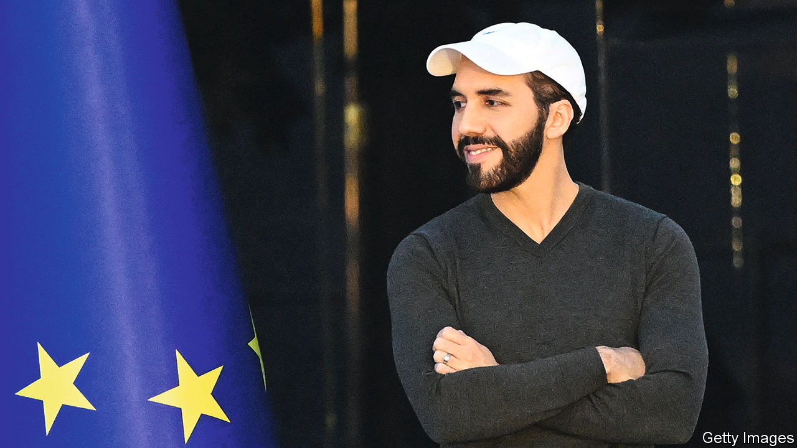

###### Chained gangs

# What the world’s budding autocrats are learning from El Salvador 

##### President Nayib Bukele is gutting democracy and being applauded for it 

 

> Jul 20th 2023 

It is a recipe to make strongmen salivate. , El Salvador’s president, has worked out how to chop away  while keeping an approval rating of 80-90%. One ingredient is his mastery of social media. The main one is locking up huge numbers of young men.

Since March last year, when Mr Bukele imposed a state of emergency, he has arrested more than 71,000 people, equivalent to 7% of male Salvadoreans aged 14-29. Anyone suspected of ties to a criminal gang can be thrown into a crowded jail—indefinitely. Little evidence is required: a suspicious tattoo or an anonymous accusation will suffice. Those detained will eventually have proper trials, the government insists, but so far they have had only cursory hearings, sometimes with hundreds of suspects appearing simultaneously before a judge. Mr Bukele glories in brutality, tweeting photos of suspects cuffed, half-naked and packed tighter than battery hens.

Outraged liberals must admit that his crackdown has brought benefits. Most touted is a plunge in the homicide rate, which fell from 51 per 100,000 the year before Mr Bukele took office in 2019 to 18 in 2021 (before the state of emergency began) and just eight last year. Analysts dispute how much credit to give Mr Bukele, but he can surely claim some.

More important, he has changed the balance of fear in El Salvador’s extortion-plagued neighbourhoods. Before, if a gangster demanded protection money, civilians paid up or braved a bullet. Few called the police, since gangsters were seldom convicted without testimony that hardly anyone was brave enough to offer. Now, it is the gangsters who are scared. Knowing that an anonymous tip-off can put them behind bars indefinitely, those still at large are in hiding. Their absence has improved countless lives. A study in 2016 found that the annual cost of gang violence in El Salvador was 16% of GDP. Today neighbourhoods are calm and businessfolk have mustered the optimism to open new shops. Hence Mr Bukele’s rock-star popularity.

Yet his scrapping of due process carries costs that will outweigh these benefits. First, untold numbers of innocents have been locked away. Their families cluster outside prisons, desperate for news of their loved ones. (The government has released 6,000 so far, but seems in no hurry to admit its mistakes.)

More insidiously, Mr Bukele has amassed powers to pave the way for his crackdown and then used it as an excuse to grab even more. He has kept the country in a state of emergency for over a year. He has purged judges who resist him. He is shrinking parliament and tweaking election rules to entrench his party’s majority. He intimidates the press: a new law prescribes jail terms of 10-15 years for journalists who repeat messages from gangs and spread “anxiety”. That could mean anyone who reports critically on crime policy. Next, Mr Bukele vows to crack down on corruption. If he applies the same rules of evidence to white-collar crimes as he does to consorting with gangsters, he will have a mighty tool for locking up opponents. El Salvador increasingly feels like a police state.

Some critics call his crackdown unsustainable. Previous attempts to crush crime with brute force have failed in El Salvador and elsewhere. Gang bonds will strengthen behind bars, so the prisoners will cause mayhem when they are eventually released. 

But what if they are not released? Mr Bukele’s crackdown is unlike previous ones. He has locked up far more people, and apparently plans to hold them until they are old men. This will be costly, but he scrimps on prisoners’ food and urges their families to chip in. He is wagering that voters care more about safe streets than abstract notions like the rule of law. If his political opponents chide him for trampling over his people’s human rights, his next electoral slogan writes itself: vote for me or the gangsters will be freed.

Mr Bukele is nearing the end of his first term as president; his party says he will run again in February. The constitution bars him from consecutive terms, but he has cooked up a Putinesque workaround: he will install a placeholder president for a few months and then return. The constitution clearly forbids a third term, but that may not stop him either. An official close to Mr Bukele told  that there was no way for him to run for a third term—“so far”.

The reputation of the self-styled “world’s coolest dictator” is spreading. Sticklers for the rule of law decry him; others study his formula. Honduras has declared a state of emergency to battle crime. The establishment candidate for Guatemala’s presidential election next month vows to build a huge prison. A combat-jacket-wearing presidential candidate in Ecuador, which also votes next month, praises Mr Bukele. So do some Republicans in the United States. His methods are ripe for copying anywhere with high crime and weak institutions, from South Africa to Papua New Guinea. They could tip such places into autocracy.

Democratic politicians everywhere should pay heed. When they fail to grapple with crime lawfully, with properly funded police and clean, efficient courts, they invite demagogues to do so lawlessly. As for Salvadoreans, if they re-elect Mr Bukele in February, as seems likely, he will have five more years to tear down their country’s democratic guardrails. And if one day they tire of him, they may struggle to get rid of him.■

