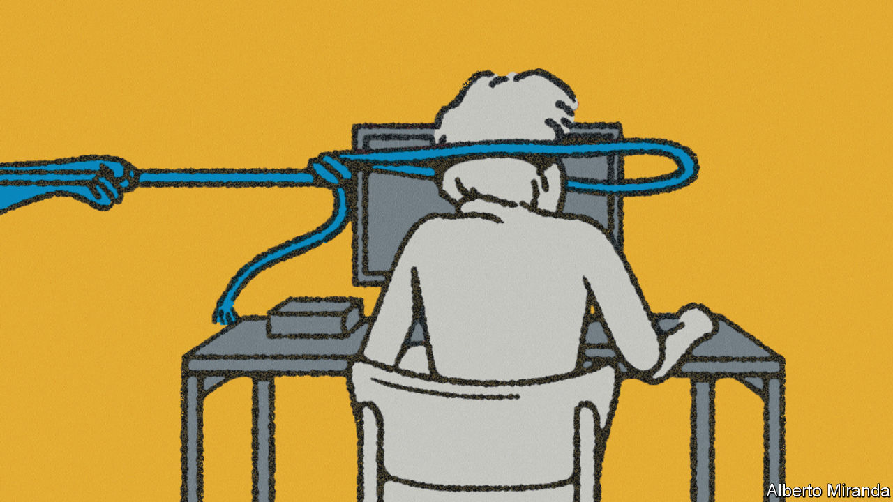

###### On deep-sea mining, water regulation in Britain, the Italian left, working from home

# Letters to the editor 

##### A selection of correspondence 

 

> Jul 20th 2023 


Protecting the sea floor

You support deep-sea mining as a means of easing the shortage of battery metals (“”, July 8th). Deep-sea mining would see industrial extraction on a far greater scale than anything on land. Modelling suggests that this could affect up to 1.5m square kilometres of the Pacific Ocean’s Clarion Clipperton Zone alone, the first area targeted for mining. It would cause irreversible biodiversity loss on the sea floor where the metal nodules support over 50% of life in the ecosystem. The hydraulic suction process would obliterate the sea floor and substrate and create sediment plumes that could travel at least a thousand kilometres.

The green transition does not require minerals from the deep sea. A 2022 report by SINTEF, a Norwegian research organisation, finds that demand for critical minerals can be reduced by 58% between 2022 and 2050 through a combination of new technology, circular-economy strategies and recycling. And nickel and cobalt are not needed for electric cars. A recent World Bank study concluded that with the rapid evolution in the battery sector, forecasting which technology will be the most used from now until 2050 is nearly impossible. Lithium iron phosphate batteries are already well-established, leaping from 10% of the global EV market share in 2018 to 34% in 2022. 

We do not need, and cannot afford, to mine our way out of the climate crisis.

Sian Owen

Director

Deep Sea Conservation Coalition


As a veteran deep-sea researcher, I can assure you that warnings that deep-sea mining will cause irreparable damage to vast areas of the ocean are not spurious. You urge the International Seabed Authority, the UN agency tasked with managing mineral resources in international waters, to finalise rules for mining as soon as possible. As a scientist involved in these policy discussions, I can tell you that there is not nearly enough evidence to ensure effective protection of the marine environment. 

Last year the World Economic Forum questioned whether the environmental costs of deep-sea mining can be justified and cautioned that these minerals may not meet environmental, social, and corporate governance (ESG) principles. Likewise, given that recent battery chemistry R&amp;D is disrupting the demand assumptions for battery metals, the demand for critical minerals from the deep sea may not be as great as you assume. The need for green technologies is indeed urgent, and the costs of both climate change and land-based mining operations are very real. However, assuming that the cost of this destruction in an environment we don’t yet understand will be small is a mistake with permanent consequences for the planet. 

Dr Beth Orcutt

Vice-president for research

Bigelow Laboratory for Ocean Sciences


You focus on the need for a mining code that would respect the precautionary principle, that mining should not be a severe environmental threat. As elaborated in my book, “The Blue Commons”, most of the negotiators of the United Nations Convention of the Law of the Sea (UNCLOS) were in fact more exercised by the need for a benefit-sharing mechanism that would respect the notion that sea resources were part of the common heritage of mankind, that is, part of the global commons.

In 1994, the International Seabed Authority (ISA) was set up with a mandate to develop such mechanisms. It has had 28 years to do so and has failed. Moreover, it has moved the proverbial goalposts by now talking of a sharing mechanism based on economic criteria that would undoubtedly favour large technologically advanced countries and a few countries with rich terrestrial mineral resources. That is far from the commons principles that guided the UNCLOS negotiators.

The trouble is that there is now far less likelihood that a sharing mechanism could be devised to obtain full agreement. The ISA has a wretchedly small regular budget, which it has topped up with comparatively large sums from mining companies that pay it for exploration licences. Perhaps unsurprisingly, it has never refused an application and has issued 31 such licences. 

The danger today is that countries, such as Nauru, collaborating with mining companies, apply to the ISA to start mining and it produces an opportunistic fudge. This should not be allowed to happen. A sharing mechanism must be established along with a mining code. The scientific community is rightly worried about the environmental dangers. Perhaps the new convincing evidence that those nodules mentioned so sanguinely in your article may be radioactive might tip the balance.

Dr Guy Standing 

Professorial research associate

School of Oriental and African Studies

University of London

If we want to survive on an inhabitable planet Earth we have to greatly reduce our resource use and allow nature to flourish. Your argument for deep-sea mining rests on the mistaken assumption that we have to replace internal-combustion engine cars with electric ones. Instead, we need a more profound transformation of our transport system with a more prominent role for public transport. This would reduce the use of natural resources and leave more space for public parks and cycle tracks. We need a true transformation, not just a little greenwashing of our harmful lifestyle.

Dr Katja Rietzler


Society faces uncomfortable decisions over how and from where we source metals for the energy transition.  should be commended for its bravery in coming out in support of collecting deep-sea metal nodules. The seemingly ironic logic of tapping the oceans to protect them has left some people anxious. Commitments to delivering a circular economy have resonated the world over, but we must be honest with ourselves that this cannot be achieved without using more metals to close the loop. You cannot recycle what you don’t have.

Climate change is the greatest threat to our oceans and by saying no to nodules we tacitly accept the alternative: more mines on land. That means more deforestation and more toxicity flooding our oceans, rivers and communities. We also should not ignore the human impact of the mining status quo, which is displacing indigenous peoples and using child slave labour to extract the very same metals that lie unattached on the sea floor and require no drilling, blasting or sacrificing of human lives to collect. 

There is a better way and the answer is clear. For the energy transition to succeed with the least impact on the environment and human lives, we need to source metals from where there is the least life, not the most.

Gerard Barron

Executive chairman and CEO

The Metals Company


 


Ofwat responds

Your article on water privatisation in Britain makes a series of assertions that do not accurately reflect how the sector works (“”, July 8th). You claim that Thames Water’s financial issues are exacerbated by high inflation. This, you say, is because customer bills rise in line with the consumer price index adjusted for housing costs, whereas some of Thames Water’s debt is linked to the (higher) retail price index. As only part of the debt is indexed to inflation, higher inflation increases the value of equity and reduces gearing, easing financing issues, the reverse of what you claim.

You then attributed the widespread concern about sewage discharges to Ofwat, Britain’s water-services regulator, blocking investment. In fact, investment in reducing sewage discharges by English water companies is determined by the Environment Agency’s water-industry national environment programme, rather than Ofwat. Capital investment in the industry since privatisation in the late 1980s has been over £190bn ($249bn), leading to an increase in the sector’s asset base from £9bn at privatisation to £94bn in 2023. Progress on reducing sewage discharges had been impeded by the lack of accurate measure of their use. Now this has been addressed, improved operational performance will drive down future sewage discharges.

We agree that in some cases companies have been overly reliant on debt rather than raising equity. Ofwat has identified issues with weak financial resilience in several companies, including Thames Water. We have taken targeted action with these companies and secured over £3bn of new equity since 2020.

Finally, although customer bills have risen by around 40% in real terms since privatisation, there has been little or no increase in the past decade for most customers. This has been due to falling returns to investors rather than reduced investment.

David Black

Chief executive

Ofwat


 


Italian peaceniks

“” (July 8th), a guided tour of European opposition to the war in Ukraine, didn’t say anything about the left in Italy. The Democratic Party, heir to the former Communist Party, is engaged in splitting hairs over supporting Ukraine. The Five Star Movement, Italy’s shrillest populists, who have perfected the art of pretending to solve problems by marching in the streets, is against the arming of Ukraine. An assortment of radical leftists and greens oppose the war in the name of abstract pacifist principles. Left-leaning Catholics oppose it on the ground of moral principle. Luckily Giorgia Meloni, the conservative prime minister, is a steadfast supporter of Ukraine’s cause.

Bruno Geddo


 


Changing lifestyles

Working from home was bolstered by the first wave of studies indicating it was more efficient. Now that the evidence is shifting in the opposite direction (, July 1st), it is worth considering why employees regard remote working as so valuable. As well as a commute-free life, it relates to how employees measure their own well-being, specifically to how they understand their personal identities. Few of us see ourselves as just workers, but define our lives through a constellation of roles; mothers, fathers, care-providers, citizens and so on. Since these identities are more closely associated with how we regard our lives than our ability to excel at our jobs, the new culture of working from home may prove hard to change. 

Dr Matthew Dennis

Assistant professor in the ethics of technology

Eindhoven University of Technology


On the same day I read your article I took my children to visit Isaac Newton’s family home in Woolsthorpe, Lincolnshire. I was reminded that it was during a plague-induced lockdown that Newton returned home and came up with the theory of gravity while sitting under the famous apple tree. This would appear to be evidence that significant accomplishments can occur while working from home.

Jonathan Ramsden


