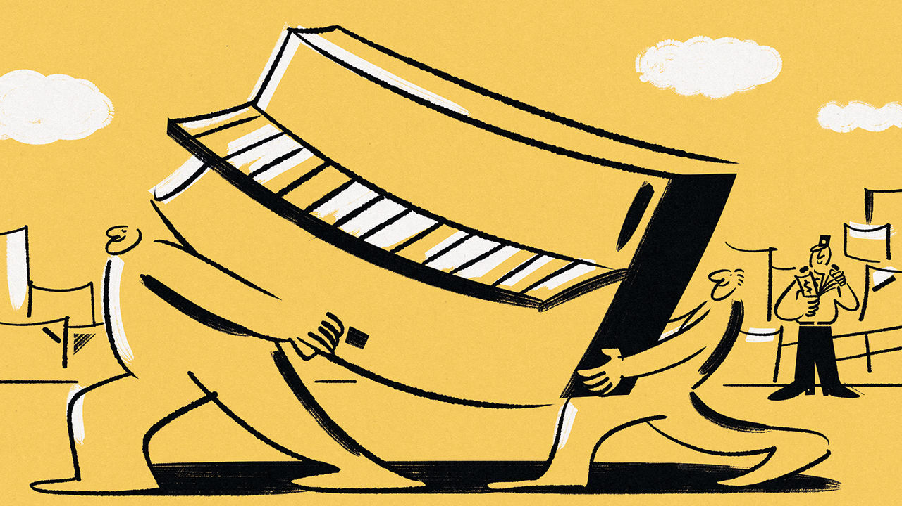

###### Tickling smuggled ivories

# How well-connected Iranians import their goodies 

##### Banned pianos still find their way in 

 

> Jul 20th 2023 

Hassan is an unlikely smuggler. Affable and a bit nerdy, he looks better suited to his old job as an international public-relations adviser. Now he is one of the many shadowy operators who send contraband to Iran. Some reckon goods worth $20bn-25bn evade Iranian border guards each year. His particular speciality is pianos.

Since Iran’s customs authorities banned the import of musical instruments in 2021, the upright pianos that Hassan (not his real name) buys for less than $900 in East Asia go for $6,000 apiece in Tehran, Iran’s capital. Musical instruments are outlawed, possibly for religious reasons; a member of the parliamentary economic committee said that those who want to tickle the ivories “must leave Iran”. 

The ban is also part of a strategy to deter imports of items officially deemed unnecessary, so as to tackle a balance-of-payments crisis that has been fuelled by Western sanctions on Iran. Foreign-made sunglasses, fancy smartphones and various fashionable items of clothing are prohibited, too. This has created a lively illicit market for traders who already benefit from the authorities’ willingness to overlook their activities in order to help them to circumvent the American embargo.

On paper the customs authority runs an anti-smuggling programme whereby millions of dollars’ worth of goods are seized every year. Yet at the same time an estimated 95% of smuggled goods enter Iran, not in pickup trucks crossing the border in the dead of night, but under the noses of customs officers, often with their tacit approval. The scale of activity is so large that some politicians lament that smuggling has wiped out hundreds of thousands of jobs for Iranians in homegrown industries. 

Hassan’s pianos arrive in large container ships. The shipping company issues him with bank guarantees for any damage incurred on the short trip between a warehouse in the United Arab Emirates and the Iranian port of Bandar Abbas. The company greases palms at the port and the pianos are unloaded and recorded as parts of musical instruments rather than as single units, thus evading the ban. They are then put onto lorries and driven to Tehran.

That 40 containers of illegal pianos can be regularly unloaded at Iran’s biggest port, which is also the Iranian navy’s main base, suggests that someone high up is taking a cut. The Iranian Revolutionary Guards Corps, the regime’s praetorian body, has long been involved in smuggling networks. When he was the country’s puritanical president, Mahmoud Ahmadinejad once castigated the corps as “our smuggler brothers”, accusing it of making money at the expense of the national treasury.

Smuggling—and the bribes that sustain it—is one way that those who call the tune in Tehran continue to prosper, while ordinary Iranians suffer under an ailing economy. Annual inflation hit 43% at the last count, in June, yet those connected to the regime’s rulers still flaunt sports cars and send their children abroad for private education. ■

