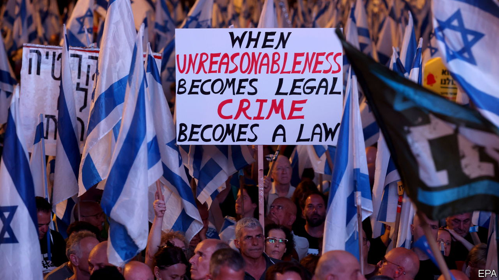

###### Just give me a reason

# Israel’s constitutional chaos is far from over 

##### It is a tussle over when judges can overrule the government 

 

> Jul 17th 2023 

By 1989 the city of Jerusalem had been trying for nearly two decades to build a new . Powerful religious groups who saw matches on the Sabbath as a desecration of Jerusalem’s sanctity had blocked the project, but at last ground could be broken. One obstacle remained. The acting interior minister, Arye Deri, an up-and-coming ultra-Orthodox politician, blocked the land-use change. Teddy Kollek, the city’s mayor, took him to court. In January 1989 the Supreme Court ruled that Mr Deri had acted “in an unreasonable way”. Two and a half years later the first match was played at Teddy Stadium.

Legal experts cite the case as one of the earliest examples of the court’s nullifying a government decision on the grounds of “reasonableness”. That principle was introduced in a ruling in 1980 by Aharon Barak, then a new judge on the Supreme Court. It revolutionised Israeli jurisprudence and is a principal source of the constitutional chaos engulfing Israel today. 

On July 23rd  government is set to pass an amendment to one of Israel’s quasi-constitutional “basic laws”. It would give the government immunity from the reasonableness standard. Israelis have been taking to the streets since the start of this year in protest. Even Israel’s closest ally is concerned. On July 17th, after meeting the Israeli president, Isaac Herzog, President Joe Biden applauded the vibrancy of Israel’s democracy but urged Mr Netanyahu not to rush his reforms and to seek a consensus for them.

The reasonableness standard has affected decisions in almost every area of Israeli politics. It was used by the Supreme Court in 1989 to force the army to put on trial a colonel who ordered his soldiers to beat up Palestinian detainees. The following year the court invoked it to direct the attorney-general to charge bankers with share manipulation. In 1993 the court again took on Mr Deri, ruling that he could not remain interior minister after being indicted for corruption. He was forced to resign, convicted and sent to prison. He then returned to politics. In January 2023 the Supreme Court ruled once again he must resign from cabinet because of a conviction for tax fraud. Seven of the justices cited the reasonableness standard. 

Mr Deri is no longer in the cabinet, but he still leads the second-largest party in Mr Netanyahu’s coalition and is one of his closest allies. “They are trying to immunise the government and all the ministers from judicial review,” says Menachem Mazuz, a former Supreme Court justice and attorney-general. 

Mr Barak was not the first to invoke the reasonableness standard but he greatly extended its scope. He was admired by many who, like him, believed that in the absence of a written constitution and bill of rights, it was up to the Supreme Court to protect individual rights and the public interest. Others criticised him for extending the court’s powers without authority. Reasonableness, argues Yoav Dotan, a law professor at the Hebrew University and a critic of the principle, is not a legal standard: it is “a linguistic construct invented by the court.”

On March 27th Mr Netanyahu announced the suspension of his proposed legal reforms in favour of pursuing a broader consensus on constitutional change. But when talks with the opposition broke down in June, the government changed tack, focusing on limiting the reasonableness standard as a first step. 

Many legal critics of the standard oppose this amendment. Mr Dotan has joined street protests against it. “I don’t want to be anyone’s useful idiot,” he says. Like many, he fears that the government’s reforms, even those he agrees with in principle, are a prelude to an erosion of democracy. 

Mr Dotan and other legal experts have advocated a less sweeping amendment that would exclude only decisions made by the entire cabinet (as opposed to individual ministers) from the reasonableness standard. The opposition parties have agreed to this in principle in exchange for the suspension of the rest of the constitutional changes for the duration of this Knesset term. But the coalition is in no mood for compromises. As huge protests return and thousands of military reservists refuse to “serve a dictatorship”, Israel is once again on the brink of civil unrest. ■

