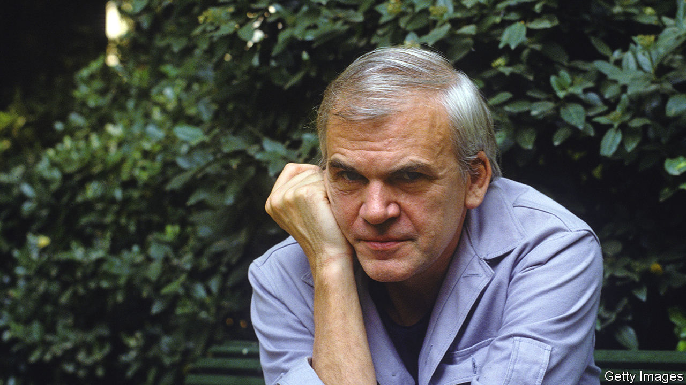

###### When angels laugh

# Milan Kundera believed that truth lay in endless questioning 

##### The Czech novelist, author of “The Unbearable Lightness of Being”, died on July 11th, aged 94 

 

> Jul 19th 2023 

Just before the Prague Spring in 1968, when the Communist regime in Czechoslovakia seemed briefly to relax, Milan Kundera managed to publish a novel about a joke. The joke, sent by a young man to a girlfriend on a postcard, read: “Optimism is the opium of the people! A ‘healthy’ atmosphere stinks of stupidity! Long live Trotsky!” It landed the young man in a lot of trouble. 

The novel, his first, sold well. But when later that year Soviet tanks rolled in, forcing his country back into line, “The Joke” disappeared from bookshops. He himself was kicked out of the Communist Party (he had been expelled before, in 1950, for being critical, but had reapplied) and was fired from his lecturer’s job at the Academy of Fine Arts. Since no one was now allowed to employ him, he played dance gigs in the taverns of mining towns. Eventually, though, there was nothing doing in Czechoslovakia, so he and his wife Vera left for France, and stayed. 

In retrospect, writing “The Joke” had been a bad decision. But it was good at the time. That was life. You had only one, with no second or third chances to take a different course. His novels were full of characters struggling, like him, to unpick the past, predict the future and, on the basis of that, jump the right way. In the most famous of them, “The Unbearable Lightness of Being”, the protagonist Tomas first appeared standing at a window, ruminating. Should he invite the lovely bartender Tereza to his room, or not? Would he get too involved? If so, how would he get out of it? After spending the night with her, the questions only multiplied. 

Tomas, like his creator, made a bad (or good) decision to defy the party. He lost his post as a surgeon and became a window cleaner. He also decided, for good or bad, to stay with Tereza. But all through the novel he had wrestled with his creator’s favourite theme, the weighing of opposites. The Greek philosopher Parmenides had stated, in particular, that lightness was positive and heaviness negative. Lightness was the realm of the soul, space, separateness and freedom; heaviness was to be earth-and-body-bound, rule-bound and constricted. Clear enough. 

But not so fast. Lightness also made both history and life insubstantial, airy as a feather, the happenings of a day. It justified betrayal, irresponsibility and breaking ranks (as he from the party), where heaviness stressed duty and obedience. Most important, lightness was about forgetting, and heaviness insisted on remembrance. What was the self, but the sum of memories? In “The Book of Laughter and Forgetting” the heroine, Tamina, clung constantly to the memory of her dead husband even when making love with other men. Was that a good or a bad thing? 

The question applied especially to Czechoslovakia, in its highly vulnerable position on the map. How could it survive without remembering its past great men, Hus, Comenius, Janacek, Kafka, or without the language they had spoken? Memory gave it identity, and gave Czechs themselves the only power they had against the states that oppressed them. In 1967 Mr Kundera appealed to fellow-writers to seize the moment with their pens. But he still resisted the thought of enclosing cultures within borders. Borders between ideas were there to be crossed. 

In Paris after 1975, living in an attic flat on the rue Récamier, feasting on frogs’ legs and eventually writing a trio of novels in French, it seemed to him that notions of “home” and “roots” might be as illusory as the rest of life. His Czech citizenship had been revoked and, though he still mostly spoke Czech, he was almost indifferent when, in 2019, he got it back. Like Goethe, he saw literature becoming global and himself as a citizen of the world. 

He had been one for a long time. His youthful reading was mostly French: Baudelaire and Rimbaud, but especially Rabelais and Diderot. French wit and experiment wonderfully foiled the socialist realism imposed on art and literature by the post-war Soviet regime. He fed it into his writing to defy the kitsch all around him. Sadly, it was kitsch he had fallen for himself when, at 18, he eagerly joined the party: all those heavy, emotional images of wheatsheaves, mothers and babes, hero-workers brandishing spanners, the glowing brotherhood of man. He saw himself as a knife-blade, cutting through the sweetish rose-tinted lies to show the shit—and the mystery—beneath.

Because truth was mysterious. And novels were a wide-open territory of play and hypotheses where he could question the world as a whole: digressively like Sterne in “Tristram Shandy”, or adventurously, like Cervantes’s Don Quixote. No answers, questions only; answers (in advance) were what kitsch provided. He played with philosophical musings, psychological analysis, investigations of misunderstood words, irony, eroticism and dreams. It could make a mish-mash for readers, especially Anglophone ones, and no other novel did as well as “Unbearable Lightness”, though “Laughter and Forgetting” and “Immortality” sold respectably. The Nobel talk came to nothing, and he was glad, because he preferred reclusive delving to any sort of fame. 

He liked to call his novels “polyphonic”: a word learned from his father, a concert pianist and musicologist. The many voices, parts and motifs in his work were united by “novelistic counterpoint” into a single music. His chief hero in the enterprise was Janacek, whose photo hung beside his father’s in the Paris flat: a composer who had refused to write by the rules but made directly for the heart of things. He doubted he himself had got anywhere close. Since the world couldn’t be stopped in its headlong rush, it was best just to laugh at it. The devil laughed, because he knew life had no meaning; the angels, as they flew over, laughed too, knowing what the meaning was. 

As a child he often sat at the piano playing two chords , C minor to F minor, until his father furiously removed him. But as those chords became heavier he felt himself grow lighter until, in a moment of ecstasy, he seemed to float free of time. If that was unbearable lightness, he—and many others—spent an awful lot of their brief, insignificant lives trying to find it again. ■

