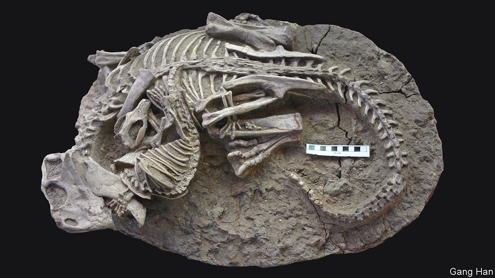

###### When mammals attack

# A spectacular new fossil shows a mammal making a meal of a dinosaur 

##### The two animals were interrupted during a fight to the death 

 

> Jul 19th 2023 

That dinosaurs ate the mammals that scurried beneath their feet is not in doubt. Now an extraordinary fossil newly described in , unearthed by a team led by Gang Han at Hainan Vocational University of Science and Technology in China, shows that sometimes the tables were turned.

The fossil—dated to about 125m years ago, during the Cretaceous period—was formed when a flow of boiling volcanic mud engulfed two animals seemingly locked in mortal combat. The one on top is a ferret-like mammal known as . The animal below is a herbivorous relative of  known as . Animal interactions such as this are exceptionally rare in the fossil record. 

One possibility is that the mammal was scavenging something already dead, rather than hunting live prey. These days it is uncommon for small mammals to attack much larger animals. But it is not unheard of. Wolverines, for instance, occasionally take caribou. And Dr Han and his colleagues point out that scavengers typically leave tooth marks all over the bones of the animals. The dinosaur’s remains show no such marks. There is also a chance the fossil could be a fake. Many of the most convincing forgeries have come, as this one did, from China—though Dr Han and his colleagues argue that the complex and entwined nature of the skeletons makes that unlikely, too. 

Assuming it is genuine, the discovery serves as a reminder that not all dinosaurs were enormous during the Cretaceous and not all mammals were tiny. From nose to tail, the dinosaur is just 1.2 metres long. The mammal is a bit under half a metre in length. Despite being half the size, the mammal has one paw firmly wrapped around one of its prey’s limbs, and another pulling on its jaw. It is biting down on the dinosaur’s chest, and has dislodged two of its ribs. Before they were interrupted, it seems that the mammal was winning.■


