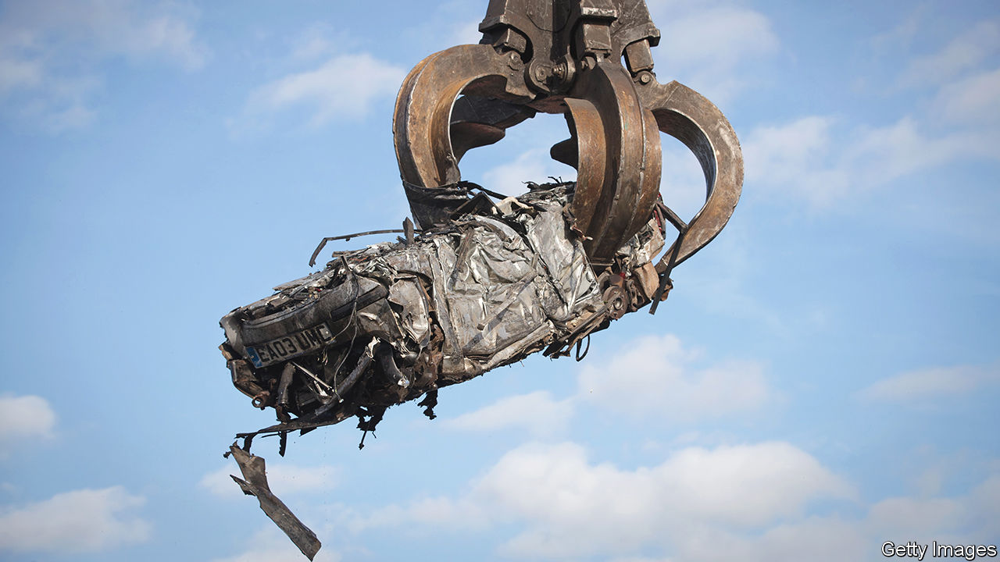

###### The Scrap Kings

# Scrapyards adopt new high-tech ways to dismantle cars 

##### Advanced “deproduction” lines are turning the car business into a circular industry 

 

> Jul 19th 2023 

Hanging on the wall in the offices of Charles Trent, a vehicle-recycling company based in Poole on Britain’s south coast, is a black-and-white photograph from the 1920s. It shows rows of old jalopies piled high in the scrapyard. Marc Trent, Charles’s great-grandson and the firm’s current boss, smiles at the photo and remarks: “those days have long gone.”

He is referring to a time when motorists usually had a bit of mechanical nous and used scrapyards as repositories of spare parts when their cars broke down. Customers, spanners in hand, would search for a donor car, negotiate a price, then remove the required component themselves.

Nowadays the customers are more likely to be professional mechanics and garages buying online. The parts they find will have already been removed, cleaned, tested and often guaranteed. As often as not they are dispatched overnight. It is all part of the transformation of what was once a murky and informal business. Stricter rules, supply-chain snarls and higher prices for both cars and components mean that firms like Charles Trent—and even some big carmakers—are turning into sophisticated recycling operations.

At its Poole facility, for instance, Charles Trent has invested around £10m ($13m) to set up a “deproduction” process for “end-of-life vehicles” (ELVs), as scrap cars are now called. When it is fully operational, the plant should be able to render more than 100 ELVs a day into their constituent parts. With plans for five more plants, the firm aims eventually to disassemble 300,000 vehicles a year, around a fifth of the total number scrapped in Britain. In total, just over 96% by weight of an ELV can be either reused or recycled, says Mr Trent. 

To do that, the firm will build something that looks much like a modern car-assembly line, but which runs backwards. When an ELV arrives, it is assessed for parts that could be reused or refurbished, the details of which go into an elaborate computer system which oversees the entire process. The car is then “depolluted”, which involves removing the wheels and decanting fuel, oil and air-conditioning gases. 

The vehicle is then loaded onto the line. Technicians, using much the same equipment found in modern car plants, systematically remove the panels, interiors, engines, gearboxes, and everything else that a different set of technicians had carefully screwed into place years before. Some are sent for recycling. Others are cleaned, tested and put up for resale. The bare shell of the vehicle is fed into a crusher, before going off to be melted down and used again. 

Worn parts, such as engines and gearboxes, can be refurbished or even “remanufactured”, a more involved process designed to return them to the condition they were in when new. LKQ is a Chicago-based firm that operates 170 dismantling plants in North America that process 700,000 ELVs a year. It reckons remanufacturing uses about 15% as much energy, and produces about 30% as much carbon emissions, as making a new part from scratch. 

A number of factors are driving the transformation. Carmakers are having to take greater responsibility for what happens to their products. (The European Union, for instance, is considering tighter recycling targets.) Reusing parts helps cut manufacturing emissions. 

Other pressures come from the market rather than the statute book. Rising prices for raw materials and parts make the cost savings from second-hand components more attractive. According to eBay, an online marketplace, used car parts are up to 70% cheaper than new ones. (eBay uses a certification scheme, with approved sellers and money-back guarantees to reassure buyers.) Second-hand parts are often faster to get hold of as well as cheaper, thanks to the supply-chain problems that have dogged the car industry since the covid-19 pandemic. Many insurance companies, which once eschewed their use, now allow some recycled components, such as body panels, in repairs. 

Carmakers are getting in on the act, too. The Stellantis group (whose biggest shareholder, Exor, also part-owns ’s parent company) this year converted a factory at its Mirafiori complex in Turin, Italy, into a centre for reconditioning components and cars. The company’s brands include Chrysler, Peugeot and Fiat. 

While an ordinary production line builds a single type of car, a deproduction line must deal with all sorts, says Loïc Bey-Rozet. Mr Bey-Rozet runs Indra Automobile Recycling, a French firm jointly owned by Suez, an environmental-services group, and Renault, a carmaker. It manages 380 independent recyclers in France, which between them dealt with 600,000 ELVs last year. It also runs a demonstration plant in Romorantin, in central France, which develops dismantling techniques for all manner of vehicles. The firm supplies “deproduction” systems to recyclers around the world, including Charles Trent.

Going electric

One of the things the firm is working on is how to deal with electric vehicles (EVs). These already require special handling. Dangerous voltages can linger in the vehicles’ electronics, for instance, even when their batteries are flat. If those batteries are damaged, they can catch fire or explode. 

At the same time, the mechanical simplicity of electric cars, at least compared with internal-combustion ones, means that the batteries are by some distance their most valuable parts. Good batteries are resold; damaged ones are sent to specialists that are setting up operations to recover the useful materials which they contain. Once the batteries are gone, though, there are comparatively few juicy pickings left for the recyclers. 

So, to try to capture more value from dismantling EVs, Indra is hoping to find ways to refurbish damaged batteries instead. This is possible because often it is not the entire battery that fails, but just one of the many smaller modules from which they are made up. Replacing the damaged part could give the rest of an old battery many more years of useful life. Doing that, though, will demand even greater technical skills and yet more specialised technology. But if there’s money in it, the scrap kings will do it. ■


