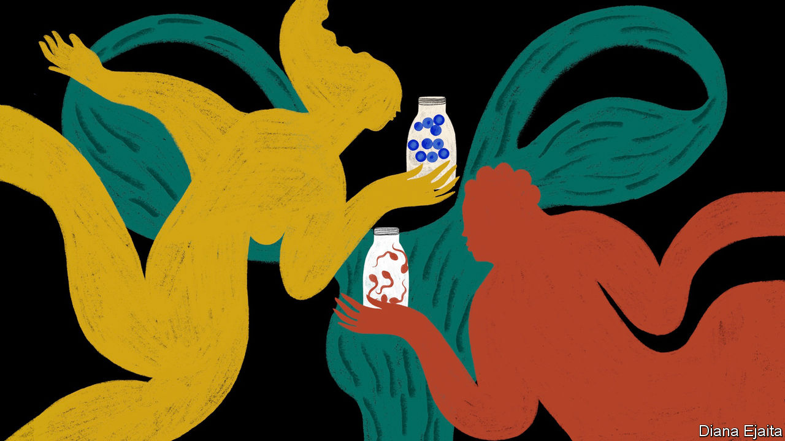
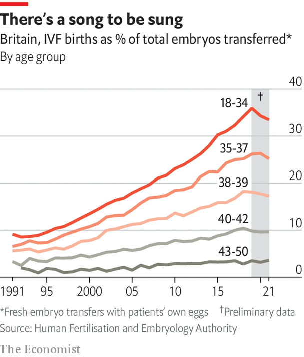

###### The most personal technology

# In vitro fertilisation is struggling to keep up with demand 

##### Developing the technology to change that is proving a difficult task 

 

> Jul 17th 2023 

With the possible exception of Adam and Eve, all human beings born before 1978 were conceived inside a woman’s body. Today the world contains at least 12m people who started off in laboratory glassware. On average, four more are born every three minutes. That is a worldwide rate of roughly one newborn in 175. 

There are various ways in which technology can assist reproduction, for example with sperm donation, hormone treatments or turkey-basters. But no other approach has had as momentous an effect as in vitro fertilisation (IVF). 

Every year over a million women go through the rigours of a hormonally heightened menstrual cycle that sees their ovaries produce several mature eggs, rather than the usual monthly singleton. Those eggs are collected with needles and either fertilised with sperm from a partner or donor, or frozen for later use. Any fertilised eggs will hopefully divide to form embryos; one or more are then transferred into the woman’s womb or, again, frozen. The experience no longer carries the level of physical risk that once it did. It remains painful, draining and intrusive. 

 


As IVF has become safer and more common, it has also become more effective, largely thanks to advances in the handling of embryos. In Britain, 25-30% of the embryos transferred to the wombs of women in their mid-30s now lead to live births. That is about four times better than in the early 1990s (see chart). Trying again does not simply multiply the odds. The more ivf cycles a woman does, the lower her chances of success with each new attempt: couples whose biology and personal circumstances mean they are more likely to conceive thanks to ivf will do so faster, leaving those with lower odds to try again. For those who do succeed, an ivf birth will be nothing short of miraculous—leading them finally to have the child they could only dream of. 

As the technology improved and the practice gained acceptance, the eggs being fertilised started to come from a wider range of sources. Louise Brown, who in 1978 became the first baby to be born from IVF, was conceived the year before with the sperm and egg of a married couple. She was presented both as a miracle of scientific progress but also, to stave off worries of a “brave new world”, as a baby like any other from a marriage like any other. 

In 1985, though, two women gave birth to IVF babies conceived using their husbands’ sperm and eggs donated by other women. That opened the way for women who were unable to conceive with their own eggs to nevertheless give birth. It also opened up the possibility of a woman carrying a child and giving birth on behalf of another couple; the first successful “gestational surrogacy” took place a year later. 

Then came the first successful pregnancy to begin with a frozen egg. The development of vitrification, or flash-freezing, made possible “cryobanks” which store the potential for future babies—straws containing eggs, sperm and embryos—in liquid nitrogen. 

Infertile heterosexual couples are not the only beneficiaries. Same-sex couples and single women can make use of IVF (and, in the case of men, surrogates) to have children that are every bit as longed for. The technology is also a boon for people at high risk of passing on a genetic disease. Since the 1990s it has been possible to remove cells from an embryo developing in a dish and inspect their DNA for a dangerous gene that one or both of the parents is known to carry. “It is, in some ways, the ultimate manifestation of preventative medicine,” says Zev Williams, of Columbia University Fertility Centre: “Helping someone be born without the disease.”

After early concerns about its unnaturalness, often but not always expressed in the name of religion, IVF has become broadly accepted. In some countries it has come to be seen as a tool against demographic change; in China over 1m IVF cycles happen every year, the highest number for any country. The process is seen as benign by most and as providential by its beneficiaries. There is, though, a side of the story less often discussed in public and instead endured in private. Most Petri-dish conceptions end not in magic but in heartache. Most of the embryos transferred back into patients do not implant in the womb, or, if they do, “fail” in some other way. These are not talked about. Indeed, the language for doing so hardly exists. 

There is a word for the loss of a confirmed pregnancy—miscarriage—but no equivalent for the loss of an embryo that never dug into the lining of the woman’s uterus and connected to her blood supply. There has never been need for such a word because, though it happens with embryos conceived inside a woman, just as for those conceived in glass, in her body the embryo is never seen, never even known about. In vitro it will have been peered at, monitored, photographed. A couple leaving a clinic after an embryo transfer know they are taking a potential life with(in) them; they will have to wait two agonising weeks to find out if it developed or decayed. The joy of the births IVF makes possible is much like the ancient joy of any birth, perhaps sweetened by the overcoming of adversity. The sadnesses it brings are new and strange. 

Records are kept of how many IVF cycles are undergone and how many births ensue: globally the ratio is about four to one. Little is done to track how many women go through cycle after cycle fruitlessly and how many couples end up, not with a child, but with an unusually lonely form of grief: the baffling experience of losing something that could have been but never was. 

Young dreams

The technology’s failure rate shows how little is really known about how to make a human life, and how randomly the chance to have children easily is distributed. Its successes hide that lack of understanding. Indeed they may perpetuate it. By providing a reasonable rate of success IVF seems to obviate the need for better understanding. Fertility researchers interviewed for this report consistently reported that basic questions about human reproduction remain a surprisingly low research priority. 

That said, one piece of basic understanding is clear. An increasingly common reason for IVF failing is age. The females of almost all other mammals can continue to bear young more or less until they die. Humans and five species of whale are the known exceptions; their fertility diminishes with the years. 

In most developed countries and many developing ones women are postponing reproduction. In England and Wales the average age for a woman to have her first child (29) is more than five years older than it was 50 years ago. In Shanghai the mean age is one year higher. In America one in five women now has her first child over 35, which in medical terms sees her classed as “geriatric”. In Spain, where maternal age shot up in the aftermath of the financial crisis of 2008, 10% of births are to mothers over 40. 

The later people try to conceive, the more they are likely to struggle to do so. If this is driving much of the increased demand for IVF, it is also responsible for a disproportionate share of its failures. In Britain, 40- to 42-year-olds see an embryo transfer lead to a baby only a third as often on average as under-35s.

It is the age of the ovary from which the egg is taken, rather than the womb that nurtures the embryo, which matters. That is why an increasing number of women in their late 20s and early 30s are having some of their eggs frozen. Should they need IVF in the future, perhaps because they have delayed trying for children, younger eggs will give them a better chance of success. 

Like delayed fertility itself, this sort of “elective” freezing looks as if it could increase the size of the IVF market. Currently less than 1% of births, this could rise to as much as 10% in the places where it can be afforded. In a few it is already almost there. 

Some observers see it going further. They imagine a time when it will be possible not just to fertilise eggs in the lab, but to make them there, too. Stem-cell science makes it possible to turn the descendants of one type of cell into another type. In mice, such techniques have been used to derive viable egg cells from skin cells. 

Sometimes never comes

The same has not yet been achieved for humans. If it were, new possibilities would open up. Older women who had not previously frozen eggs might be able to have new ones made. Gay men could combine sperm from one with an egg grown from the cells of the other to have children biologically related to both. 

An egg grown in the lab could also, in principle, be an egg engineered in the lab. There are currently gene-editing therapies in clinical trials where cells are harvested from a sick child’s bone marrow, edited to remove a harmful mutation, like that behind sickle-cell disease, and reintroduced into the body. It could be simpler and cheaper to edit the genome before conception. If eggs were easily mass-produced it might also, in principle, be possible to fertilise them in large numbers and let couples pick out embryos with particular genetic traits. 

Attempts to gain control over human biology in such ways should set a whole peal of alarm bells ringing; the technical barriers are immense, those in the realm of ethics, public morality and safety probably larger still. They suggest a level of control over human life with which many will be very uncomfortable—and which might well be illusory. After all, IVF is commonly understood, and sold, as a way to take control of errant biology, and for many it proves anything but. Studies have consistently found that a majority of IVF patients drop out before completing all the cycles which their insurers or governments will cover. The main reason they cite is psychological strain. They are experiencing the opposite of the “empowerment” often advertised. They feel wildly out of control. 

The authors of this report can empathise. We have, between us, undertaken 14 cycles of IVF, over 550 hormonal injections and countless scans and blood tests to collect around 120 eggs. Our partners have made 23 visits to awkward “sperm sample” rooms. Just 34 of the eggs that were fertilised made embryos that could be transferred into our wombs. Thirty did not implant. Three did but failed further down the road (one ectopic pregnancy and two miscarriages, one referred to by a doctor as “tripping before the finish line”). After five years each, only one of us is pregnant. ■

