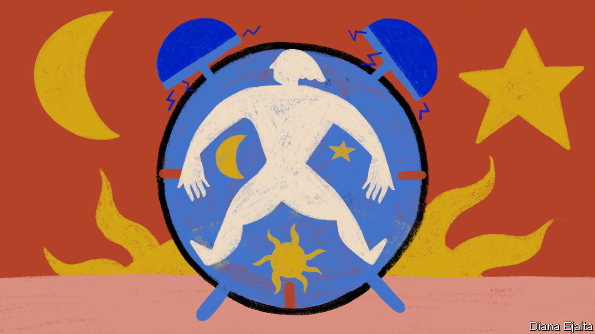

###### Conception, reconceived

# Lack of basic research has hampered assisted reproduction 

##### Finally that may be changing 

 

> Jul 17th 2023 

On the third day after fertilisation a human embryo is made of six to 12 roughly identical cells; on day four its cells appear to fuse into a mostly uniform blob; and on day five it puffs out to reveal two completely new groups of cells—an outer layer that will go on to form the placenta, and an inner clump that will develop into the fetus. How this happens is a mystery. So is how things happen after day six—a particularly frustrating one, given that it overlaps with the crucial stage during which the embryo readies itself for implantation into the wall of the uterus and a pregnancy either begins or does not. 

Many tens of millions of human embryos have been created in laboratories over the past half century. Yet how they achieve their remarkable development from a single cell to a human being remains, in substantial ways, opaque. The fundamental mechanics which govern how a new human life takes shape—the cellular, molecular and genetic underpinnings of human fertility and infertility—are, largely, a black box. 

There are many reasons for a lack of research into the basic biology of baby-making. One is that health issues perceived as significant mostly to women have often been treated as low research priorities. Another is that such studies have, until now, relied on donations of tissue, eggs, sperm and embryos. Research which creates human embryos raises issues that some funders will not countenance. Since 1996 America’s National Institutes of Health (NIH), the largest funder of biomedical research in the world, have been forbidden by law from spending money on research in which human embryos are created for research purposes only, or in which any embryos are destroyed. It is “difficult for scientists to even engage in new innovations in IVF and overcoming those really challenging cases of infertility” under such conditions, says Amander Clark of UCLA.

Then there is the nature of the problem being faced. Unlike cancer, which attracts a huge amount of research spending, infertility is not a life-threatening condition and often not really seen as a life-impairing one either—if it is seen as a medical condition at all. The American Medical Association did not recognise infertility as a disease until 2017. Nor are drug companies queuing up to take a crack at the problem. They make little money out of infertility treatment, and they allocate research money with the bottom line in mind.

Confusion is nothing new

Finally, research efforts are made in the context of IVF’s success. On average, IVF has been doing an ok job, working (in the end) for roughly half of those who try it. That makes alternative approaches less urgent. At the same time it masks the fact that growing drivers of infertility today—most notably, people seeking to start their families later—are not the sort of physical problems that IVF was designed to address. Thus an increasing number of people find themselves left behind by reproductive medicine, with all the frustration and heartache that follows. 

Added to this, ivf’s technical success is not of the sort of thing basic scientists are used to building on. The technique did not spring from insights into how fertility worked or could be improved, but on first contriving a change of venue that maximised the chances of fertilisation and then making repeated attempts at implantation and pregnancy. Its success came from learning how to extract eggs, recognise viable embryos and transfer them to the womb. Getting better at those things provides babies to some; it does not explain how they are made. 

“We are doing things a little bit backwards because we are missing the base,” says Rita Vassena, CEO of Fecundis, a Spanish-Argentinian biotech company. ”We don’t have a clear understanding even of how normal physiology in detail works...Because we are missing this very substantial bed of understanding underneath what we do, it is very hard for us to do something because [for example] we know that if we change this receptor then this cascade will work differently and the cell will do [something different]. By and large, we don’t know.” This is very different to many areas of medical research—most notably, at the moment, cancer—where a layered understanding of how cells function is used to design treatments that are meant to correct specific problems. 

Rather than being optimised according to an understanding of what happens naturally, current practices are developed on the basis of what has worked in the past. Different clinics have different practices for how to store sperm samples ahead of fertilisation. Embryologists who have analysed the commercial solutions in which clinics grow embryos have found different make-ups. That might suggest that the exact nature of the incubation medium does not matter much; alternatively it might mean that there is a long way to go to perfect procedures and maximise an embryo’s chance of survival. Having found evidence that ambient pressure controls whether the eggs of mice are dormant or not, Hayashi Katsuhiko of Osaka University suspects pressure and temperature may be vital to the fate of an embryo. Again, such factors are not standardised across labs. 

In her previous role as scientific director of the Eugin Group, which operates 69 clinics in 11 countries, Dr Vassena noticed that IVF was falling short of what happens naturally in their donation programme. A woman who has conceived and given birth naturally after just two or three months of trying can be taken as having a 30-50% success rate per egg. When such a woman donated eggs for IVF, Dr Vassena noticed the success rate frequently fell to 10% or so. “Our goal should be to [get] as close as possible to natural fertility,” she says. “We are far away from that.” 

Help seems to be at hand. Basic research into stem cells has brought forth the possibility, though still a distant one, of making eggs and possibly sperm for use in clinics through . The provision of eggs for research is a nearer-term possibility, freeing researchers from their reliance on donations. And the insights derived from watching and manipulating the production of eggs and sperm should prove very useful. Roughly a quarter of infertility is due to anovulation, a condition where women do not produce oocytes. This sort of fundamental research might provide a treatment for that. It is quite plausible that IVG will contribute more to infertility as a research tool than as a clinical alternative.

Time after time

Research will not be limited to eggs and their development. Work done with stem cells and their derivatives could make good the current lack of human tissues that can be used for research. Stem cells that have been nudged into mimicking early embryonic cells and placed in a dish are able to self-assemble into three-dimensional structures that resemble those seen within the first weeks after fertilisation. Fertility researchers in America, Europe and Israel are using stem cells to create such “embryoids” and study the processes that go on within them. 

Some embryoids are built to mimic the entire embryo, others just one aspect of its development. Neither sort “will ever be used for reproductive purposes”, says Dr Clark, adding that the latter type of embryoid lacks any potential to form a baby. “They are asking very specific questions about very specific cell types.” Such research should provide answers to questions about infertility—like what it is about an embryo which leads to a miscarriage—and also congenital disease—such as how does the heart form when it forms properly?

As with IVG, the challenges are not purely scientific. Both techniques raise questions about what science is ethically acceptable. The NIH is negotiating the federal ban on funding specific types of work with embryos by allocating grants to embryoid research on a case-by-case basis. The IVG question has not yet come up. 

A steady supply of new ethical questions is an inextricable part of assisted reproduction. Indeed, those raised in the lab can be comparatively simple compared with those already faced by judges who have to decide questions such as whether parents can use frozen cells from deceased children to create a new generation. As what makes a human becomes better understood, and as new ways of helping the process along become more practical, new arguments for legal constraint may arise. 

For many, though, they will be a price worth paying if, at the same time, in-built biological constraints are lowered. Such advances could realise new possibilities for same-sex and transgender parents and provide women with new ways to stop and reset—or render irrelevant—their biological clocks. The joy of parenthood that IVF has brought to millions could be spread yet further. The heartache of a failed IVF cycle would surely remain, but fewer would feel it. And if fewer ended up choosing quietly, privately, inconsolably to stop trying, that would be progress indeed. ■

