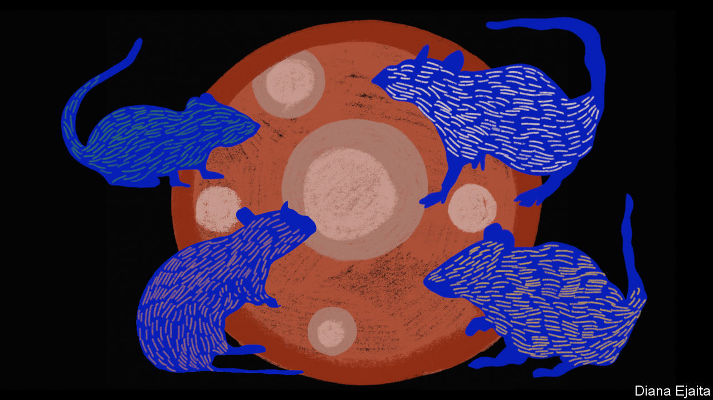

###### Eggs from scratch

# New ways of making babies are on the horizon 

##### But it is likely to be a long time before ordinary people can benefit 

 

> Jul 17th 2023 

The human genome can create cells with a remarkable range of capabilities and shapes. Looked at under the microscope, the enterocytes which line the gut bring to mind the ghosts from a Pac-Man video game. Neurons look like medieval morningstars, but with long hair. But none is more special than the big, round egg. It is not just the largest of the cells. It is also, once fertilised, the cell from which all other sorts of cell are descended.

The size of the egg allows it to carry the nutrients and chemical building blocks needed for the first days of an embryo’s development. As those days tick by, the single large cell of the fertilised egg splits into two, then four, eight and onwards until they are countless. In the earliest stages, the divisions produce “stem cells”, from which all sorts of others can be derived. As time passes, the cells specialise, expressing some genes more and some genes less, eventually producing all the intricacies of tissue and organ the newborn needs, right down to its toenails. 

In nature, this differentiation is a one-way street. In the laboratory, not so much. In 2006 Yamanaka Shinya and Takahashi Kazutoshi of Kyoto University showed how cells which expressed the genes appropriate to being part of a mouse’s skin could be stripped of their dermatological determination and reprogrammed to become something very like the stem cells which are found in embryos. These “induced pluripotent stem cells” (iPSCs) could, with the right cues, be turned into almost any other sort of cell. The next year they showed how to create human iPSCs.

In 2016, a team led by Hayashi Katsuhiko, then at Kyushu University, announced that it had turned iPSCs from a female mouse into egg cells, fertilised them and implanted the resultant embryos into the uteruses of other mice. This eventually produced eight healthy pups. In March this year a team which included several of the same researchers announced that, by using stem cells that had lost their Y chromosome, they had managed to do the same thing with eggs made from the skin of a male mouse.

These feats of reproductive wizardry have generated a palpable excitement about the new field of fertility research called “in vitro gametogenesis” (IVG). If it proves capable of producing healthy eggs where there were none before, it could herald the biggest change in reproductive technology since IVF itself. Henry Greely of Stanford University, a legal scholar who specialises in the ethics of new biotech, thinks IVG may within a few decades be widely used even by those who have no fertility problems. The reasoning is that, if IVG proves capable of producing viable eggs in copious amounts, it could allow the production of a large enough number of embryos to allow screening for a wide number of genetic traits, and that could be something many parents might want. 

Of mice and semen

The biologists behind the breakthroughs are far more circumspect. Dr Hayashi, now at Osaka University, is wary of brash statements about IVG’s prospects in humans. Amander Clark, a biologist at the University of California, Los Angeles (UCLA) who has been working on IVG since the early 2000s, reckons it is “at least a generation, if not two” away from “ever getting to the clinic”. Nevertheless, patents are being filed, VC wallets are opening and eager entrepreneurs are poking around academic labs seeking skilled researchers to poach.

The most obvious beneficiaries of a future in which people can have new oocytes made from other cells will be women with low ovarian reserves, either because of age, because cancer treatment has meant their ovaries had to be removed, or for some other reason. The technique could also offer eggs, and thus genetic parenthood, to transgender women and gay male couples. But experts expect that translating what has worked in mice into something that works for people will be very hard. 


To make eggs from mouse cells means coaxing iPSCs into becoming cells that look like “primordial germ cells”, common ancestors to egg and sperm. Those cells then have to be convinced to produce primary oocytes which themselves must then be matured into egg cells that can be fertilised. Early experiments led by Saitou Mitinori of Kyoto University and Dr Hayashi got the germ cells to go eggy by transplanting them into the ovaries of infertile mice. Signals from the tissue around them were clearly key, so the team set about reproducing them in vitro using cells from mouse ovaries (see diagram). 

The Japanese team also transplanted germ-cell-like cells into mouse testes, where they developed into cells that produced sperm. They have not done the same thing entirely in vitro; a claim to have done so by Zhou Qi at the Chinese Academy of Sciences and others has not been replicated elsewhere. To make sperm that way would be another step forward, but a less consequential one. Eggs are in much shorter supply than sperm. And in nature sperm production requires Y chromosomes. Without further innovation that would rule it out for a woman in a same-sex partnership, or a trans man, who wants to fertilise a partner’s egg. 

In humans, Dr Clark has got as far as making primordial-germ-cell-like cells from human skin. Dr Saitou has achieved the same thing using blood cells and, by incubating the products with reconstituted mouse ovaries, has nudged them one step further, to become “oogonia”, a closer precursor to egg cells. Matt Krisiloff, the boss of a Californian startup called Conception, says his company is further along, and could conceivably produce the first “proof-of-concept” mature human oocyte “within a year or maybe two”. In May he showed  pictures of iPSC-derived cells which the company believes to be relatively advanced precursors to human oocytes.

When the same pictures were presented at a scientific meeting, though, some attendees were unconvinced. And even if Mr Krisiloff is right and IVG eggs are just a couple of years off, he does not expect them to be of the quality a clinic would require or a regulator insist on. “It’s possible that the first egg cells could turn out to be totally normal,” he says. “But I will be really surprised.”

In the Japanese experiments, fewer than 5% of mouse eggs made from iPSCs produced healthy pups (the success rate with eggs from the ovary is 60-70%). The longer eggs spend in glassware the more development is thought to be disrupted, and iPSC-derived eggs spend a lot of time in glassware. On top of that, iPSCs tend to accumulate mutations and chromosomal abnormalities of the sort which, if seen in an embryo, would greatly increase the risk of miscarriage and birth defects. 

Another advance in reproductive technology, mitochondrial replacement therapy, offers a cautionary tale. Mitochondria are cellular components that drive metabolism. Unlike all the other gubbins in animal cells, they have their own genomes, a handful of genes kept on their own little bits of DNA rather than on chromosomes in the nucleus with the main genome. 

All the mitochondria a human has come from its mother; the egg’s copious cytoplasm is full of them. So if a woman has a dangerously faulty mitochondrial gene this can be bad news for her children. One way round this is to fertilise such a mother’s egg and a donor egg at the same time and then replace the nucleus in the fertilised donor egg with that from the mother’s egg. The resulting embryo has a nuclear genome provided by the mother and father, as usual, and a mitochondrial genome from the donor. This mitochondrial replacement (sometimes misleadingly seen as producing “three-parent” children) is also practised, in some clinics, as a possible way to better the odds for an older woman’s eggs. 

Unfortunately, experience and experiments have revealed a problem. Small amounts of mitochondrial DNA from the mother can get into the embryo along with the nucleus and gradually push out the mitochondrial DNA from the donor, a process called “reversion”. First identified as an issue in animal studies, reversion has now been seen in at least one human case, luckily not one where the mother was a carrier of mitochondrial disease. It is a sombre warning shot about experimental reproductive technologies. 

Regulators are taking a cautious path with IVG. In Japan researchers are banned from fertilising any human eggs they produce using the technique. Elsewhere fertilisation is allowed for research purposes, but not for reproduction. In Britain the Human Fertilisation and Embryology Act specifies that only the products of genetically unaltered eggs and sperm extracted from a man or woman’s reproductive organs may be placed inside a woman. In America, any human tissue that is more than “minimally manipulated” becomes a drug or device and this falls into the purview of the Food and Drug Administration. The FDA has taken a keen interest in mitochondrial-replacement therapy; if it thinks those manipulations are more than minimal it seems very likely to feel the same about those involved in IVG. “They would probably claim that the sperm and eggs were drugs,” says Mr Greely, “and they certainly would claim the embryo was.” 

Regulators and the politicians to whom they answer will weigh questions beyond patient safety and welfare. As Lucy van de Wiel of King’s College London, puts it, “There’s a lot of controversy around people using technologies to have children later in life, particularly if those people are women.” Adding trans women and gay couples to the mix will hardly defuse that controversy. The comparative ethical and technical simplicity of egg donation may see IVG’s role limited to special cases. 

Eggs of Eden

If controls were to be very strict, or even prohibitive, they might possibly be circumvented. Many suggested this would be the fate of the bans on human cloning enacted after Dolly, a sheep, was cloned in 1996. But there is no evidence that they have been. Cloning human embryos in the lab is possible; techniques similar to some of those used in mitochondrial replacement can place a new nucleus into an egg just after fertilisation. But despite a copious supply of the rich, the morally challenged and the megalomaniac, any incipient demand the world may have for mini-mes seems to have so far gone unfulfilled.

The market for IVG seems likely to be larger than that for cloning. But that hardly means it will spring up as an undergound offering. As Dr Hayashi points out, IVF is popular because it is relatively safe, easily performed and uncontroversial. IVG is none of those things, at least not yet. 

 

That is one reason why Dr Hayashi’s current research focuses as much on eggs still in ovaries as on eggs created outside them. A girl hitting puberty typically has a few hundred thousand primary oocytes; they are the cells that can become mature eggs. Every month somewhere between a few and a couple of dozen of them will be activated and begin to mature. Only one or two will make it to full maturity and head out into the Fallopian tubes. The rest are, from then on, out of the equation. (The hormonal manipulation used in IVF cycles is designed to get round this winner-takes-all approach and let as many as possible of the activated eggs mature.) 

Some researchers believe control over the activation and maturation of the primary oocytes could help women who do not respond to hormonal stimulation. Dr Hayashi’s team recently identified four of the genes involved. A better understanding of the process might make it interruptible. Today’s contraceptive pill is designed to stop ovulation, but not to keep oocytes from maturing. A pill that stopped oocytes from being activated might work as a contraceptive while keeping a woman’s stock of eggs from shrinking month by month. 

Quality, though, is as important as quantity. A woman’s oocytes accumulate chromosomal abnormalities as she ages. Older women who go through repeated rounds of IVF become painfully aware that they are not only producing fewer eggs, but also that a growing number of those eggs generate embryos with genetic defects that prevent them from progressing to full pregnancies. 

Dr Hayashi wonders if this could be changed by identifying the specific processes that cause eggs to deteriorate. One insight which may help is that the quality of egg cells, and their ability to generate viable embryos, varies with their levels of cohesin, a protein which helps hold chromosomes together and is involved in the repair of DNA. 

Do not look for a cohesin booster any time soon. “First we have to understand the basic mechanism of how [egg cells] get old,” says Dr Hayashi. “Then we can try to find a way to stop it.” But the new tools he and others are bringing to that understanding are cause for hope—and make a strong case for a new commitment to the basic science of fertility. ■

