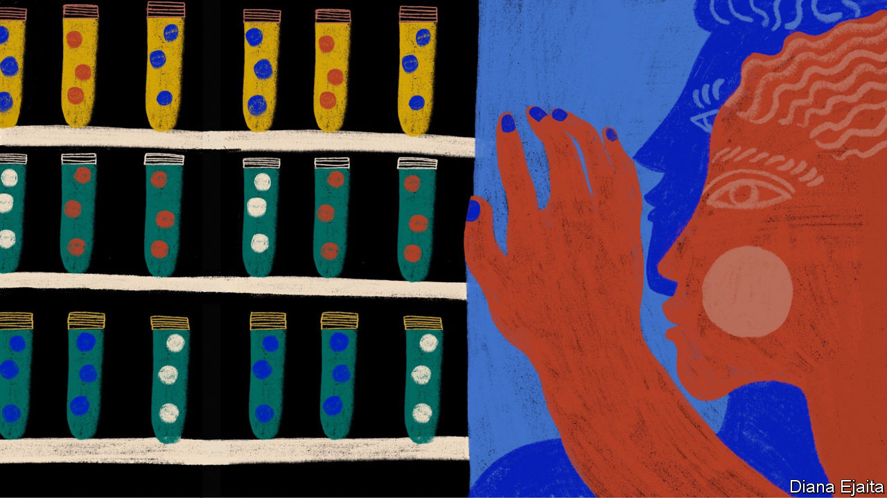
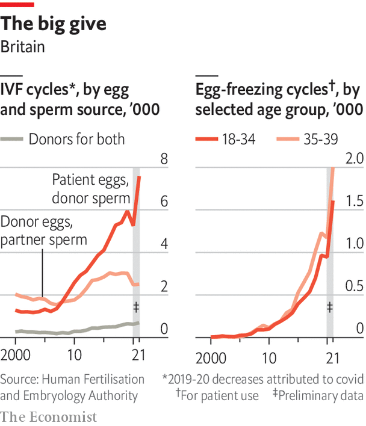

###### Eggs from elsewhere

# Some women need eggs from others, or from their younger selves 

##### Donation and preservation are becoming increasingly widespread 

 

> Jul 17th 2023 

“You will not have a child with your own eggs,” were the hardest words to hear. They were delivered late last year to one of your authors and her partner, after five years of failed IVF, by a doctor who quickly moved on to the remaining options: adoption or seeking the help of an egg donor. 

Coming to terms with the idea that you will not pass on your genes even if you do still bear a child is another of the strange new forms of loss that IVF has brought with it. It is possible to know that genes are not the essence of what it is to be part of a family—that step-children can be loved unconditionally, that people may bear scant, if any, resemblance to their genetic forebears—and still struggle to adjust to what can feel like a loss of parental identity.

The possibility of being an egg donor is also a historical novelty. That men might have children of whom they are unaware barely needs saying; that women can do so is new. It is also becoming increasingly frequent, partly because of growing demand from older would-be mothers. (The use of donated sperm is also rising in many places, but that is primarily because of demand from single women and same-sex couples.) Where it was once necessary for a donor to have her menstrual cycle synced with the recipient mother’s, and her eggs collected just before use, efficient egg freezing now means donors can stick to their own schedules and their eggs can be stored until needed. 

 


That hardly makes the process easy. Egg donation has all the hormonal helter-skeltering, internal monitoring and needles through the cervix of egg collection for IVF. Yet a sense that it is a way to make the lives of strangers better still moves some women to donate. Niamh, from the English city of Nottingham, donated her eggs for the first time when she was 20 after hearing an ad on the radio. “I thought ‘I’m not using my eggs, why not?’” she says, six years on. Learning that the first attempt to make a baby from them did not work triggered a feeling of disappointment. “I wanted it to work for someone.” So four years later she donated again.

Affective altruism

One of her biggest complaints is poor information. Although she knows that her first donation did not make a baby, she does not know the outcome of her second donation. “That is something I have a fundamental problem with,” she says. 

By unbundling aspects of parenthood that used to be all of a piece, assisted reproduction brings new types of relationships into the world just as it brings new babies and new sadnesses. Some donors want to know at least something about the children they have made possible; some want complete two-way anonymity. Some children want to know about their donors, or about the other children who received some of their genes from the same donor—“diblings”, as they are sometimes called. Others do not.


Then there is the relationship, or at least the flow of information, between donors and parents. The amount parents may want to know about donors will differ from couple to couple, and sometimes between two partners. Different countries give the different players different rights in all these regards.

Comparing Britain and Spain brings some of the issues to the fore. ivf with egg donation is an order of magnitude more common in Spain than any other country except America, where half as many such cycles are done. “It’s taken for granted that it’s an option,” says Sara Lafuente-Funes, a sociologist at Goethe University in Frankfurt who has studied egg donation in the country. She says the Spanish IVF sector has a particular focus on delayed reproduction, which economic uncertainty has made common in Spain: the average age of first-time mothers is 32. If delayed reproduction is the focus, donation is an obvious area in which to specialise. 

Its status as a donation hot-spot leads many British couples to investigate the possibility of a Spanish donation. To do so, though, means trade-offs, both for themselves and for their children. Parents choosing a donor in Britain can search a database like one at the London Egg Bank by eye or hair colour, height or education. They can even read a handwritten letter from the donor, if she has supplied one. In Spain they learn nothing about any distinguishing characteristics: the clinic will attempt to match the mother’s looks to the egg donor’s, perhaps using biometrics, but will provide no information about her. That devotion to donor privacy also means that, whereas a child conceived in the British system has the right to learn their donor’s identity when they come of age, a child born through the Spanish process does not. 

One thing that British and Spanish donors have in common is that the system in which they make their donations allows them to be compensated for doing so. In some countries, such as Italy, no money is allowed to change hands when eggs are donated. In most of the rest of the world the donor can be compensated for the travel, time off work, inconvenience and discomfort that donation involves. In Spain donors receive €800-1,300 ($890-1,450) per donation cycle. Britain caps compensation at £750 ($980) per cycle. 

Though in principle such compensation is not meant as an inducement, in practical terms it can serve as such, at least in part. Dr Lafuente-Funes says that compensation in Spain is set at a level that will enable clinics to recruit donors, young women who are normally less wealthy than the recipients. But that economic motive does not make donation simply a commercial transaction; the money “does not mean that the donors are not at the same time altruistic,” she says. 

In some regimes commerce has a much fuller role. In America, where compensation is not capped, online egg-banks can feel eerily like dating apps, but with far more information: tastes, hobbies, personality profiles, emotional-intelligence scores and baby pictures. Donor Nexus, an agency based in California, offers “premier” donors with “specific...desirable traits such as higher education, rare ethnicities, professional athletes, musicians or models”. 

The prices paid to donors—from a few thousand dollars to $10,000 or even much more, according to Diane Tober, a researcher at the University of Alabama—vary by region, agency and donor profile. Some firms pay more to donors with higher SAT scores. Ads in university newspapers reflect the fact that students are well suited to the market’s needs: typically young, presumably smart, relatively rich in free time and often conscious of the debt they are accruing. The fact that they can donate batches of eggs directly to the freezer makes the process inherently less personal. 

This commodification upsets many ethicists. Its commercial logic may also expose donors to harm. If the eggs themselves are valued, rather than the act of donation, the incentives to produce more eggs are increased. Anecdotally, egg donors report that they are likely to be given levels of hormones that put them at greater risk of complications than is normal in IVF. Research by Dr Tober supports some of these concerns. 

Increasingly, though, younger women have their eggs collected for another reason: to make them available to their older selves. Sophie, a 31-year-old British-born research fellow in Philadelphia, is a case in point. Many of her American friends were talking about having their eggs frozen; some had done so. So when a romantic relationship she was in ended abruptly she decided, “If I’m going to do it, I should do it now.” She flew home, where freezing was cheaper and her mother could administer the daily jabs, and was lucky enough to have 31 eggs collected. 


After collection, Sophie’s eggs were prepared for storage, something which involves dehydrating the cells and adding a “cryoprotectant” to them. If this is not done, ice crystals can grow in the cell’s watery cytoplasm and disrupt the cell’s internal structure. With ample cryoprotectant and the freezing done very quickly, the cytoplasm solidifies into a glass rather than an array of crystals. That preserves its structures far better. 

Having been plunged into liquid nitrogen at -196°C (-320°F) Sophie’s “vitrified” eggs are now safely tucked away in a freezer in Southampton. Studies suggest that, in a properly proficient lab, nine out of ten frozen eggs survive thawing. What is more, the length of time the egg remains frozen seems to have no impact on its future prospects. 

The cold never bothered me anyway

Before vitrification, egg-freezing was rare. Efforts to preserve fertility tended to focus on the freezing of embryos, which was more reliable because their cells are smaller. That made it mainly an option for women who already had partners or who used donor sperm. Now, thanks both to the new technology and the campaigners who have raised awareness of it, in many places it is routine for women facing, say, chemotherapy, which might harm their eggs, to have some frozen.

Two other groups have taken an interest in becoming their own future donors. The first, who tend to be older, would like to have a child right away, but are not in a position to do so, often due to the lack of a partner. The second, mostly younger, do not wish to have a child yet but want to give themselves every possibility of success when they do. The first group was initially bigger, but several clinics report the average age has been coming down. FertilityIQ, which provides courses to people considering assisted reproduction, reports not just that egg freezing is one of the most popular ones, but that the average age of those taking it has dropped from 38 to 32 in just six years. 

There are worries that some of the demand for elective freezing from younger women stems from a belief that it is fail-safe: that the egg in the freezer might as well already be a baby. @annelisejr, a TikTok influencer, reflected what many may feel when, having frozen 13 eggs, she posted: “It’s a relief knowing once I’m ready many years from now I will be able to have little Annelises.” She may well have increased the possibilities, but little ones are never a sure thing. What freezing offers is a slowing down of the rate at which the odds lengthen against you, should you at some point need IVF. 

In the largest American study so far 70% of a group of women who had started freezing their eggs before they were 38 and who thawed at least 20 eggs were able to have a baby. Good, but not perfect. Younger women may do better. That said, clinics without a track record piling into the growing market may make things worse. “If there’s a potential black eye for the sector down the road,” says Jake Anderson-Bialis of FertilityIQ, “egg freezing could be it.”


Sophie, who says she has always wanted a number of children, knows that freezing does not guarantee that she will get them. But £5,000 and three weeks over the Christmas holiday have brought her “a huge amount of peace” along with a new romantic freedom. The control over their fertility offered by the pill let women enjoy sexual relationships without worrying about getting pregnant. Egg freezing allows them to explore relationships into their 30s without worries about a lover’s suitability as a co-parent. “I just want to be able to date like a man,” says Sophie. 

Why would she not? Women are not delaying reproduction simply to concentrate on their careers. They are doing so because forming a relationship with someone with whom you want (and can afford) to raise children takes time, whether you are a woman or not. As Marcia Inhorn, an anthropologist at Yale, puts it in her recent book “Motherhood on Ice”, vitrification will not fix the issues driving women to have their children later. But the technology does offer them the hope of a “reproductive suspension bridge”.

What women like Sophie are choosing is a personalised version of what Dr Lafuente-Funes sees writ large in Spanish society: a transfer of reproductive capacity from younger to older women. Such transfers are often seen as a way to deal with a crisis in reproduction that does not address its root causes. But for some women the transfer is an unambiguously empowering expansion of her future options. And if, as is increasingly the case, women freezing their own eggs also donate some—perhaps immediately, to defray the costs, perhaps later when they have used those which they need—the benefits may be spread further.■

