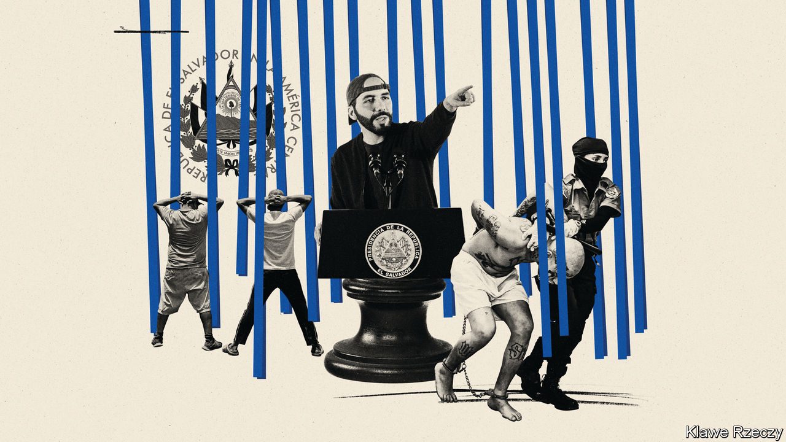
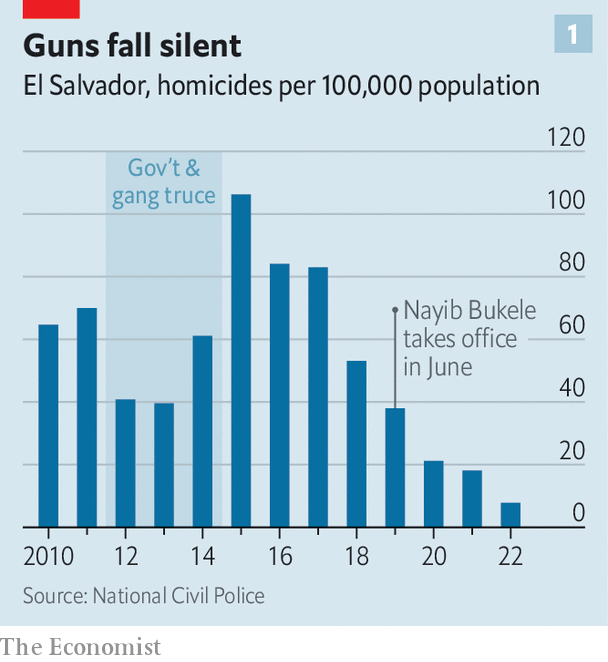
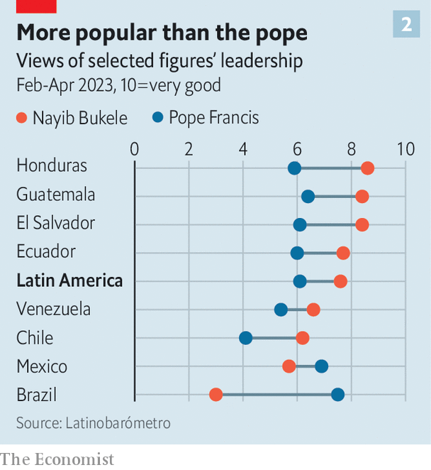
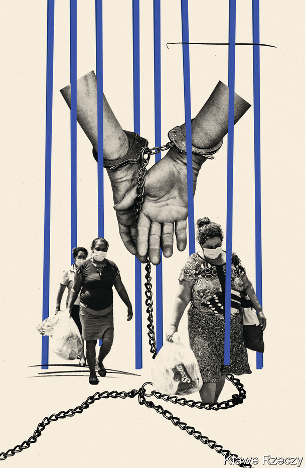

###### Terminator Salvador

# Nayib Bukele shows how to dismantle a democracy and stay popular 

##### Others will learn from El Salvador’s charismatic president 

 

> Jul 20th 2023 

To understand why El Salvador’s president is so popular—and why aspiring autocrats elsewhere are likely to copy his ostentatiously brutal methods—it helps to visit one of the neighbourhoods he has made safer. Until recently, criminal gangs controlled huge portions of this small Central American country of 6.3m, terrorising locals. A study by the central bank and the UN Development Programme in 2016 estimated that extortion payments added up to 3% of GDP, and the total annual cost of gang violence, including the lost income of people deterred from working or investing, was a staggering 16% of GDP. 

In 2019 Salvadoreans elected a then 37-year-old president, Nayib Bukele. Like most candidates, he promised to crack down on gangsters. Unlike his predecessors, he has done so on such a scale that most are either locked up or in hiding. He hopes to parlay that success into a constitutionally dubious second term. On July 9th his party, New Ideas, announced that he would be their candidate at elections in February 2024. His critics fear he is building a dictatorship—a notion he does not exactly dispel when he dubs himself “The World’s Coolest Dictator”.

The gang crackdown began in earnest in March 2022, after 87 people were murdered in a single weekend, apparently after a deal between gangs and the government broke down. Mr Bukele declared a “state of exception” (ie, emergency). He let the police arrest anyone they suspected of gang ties, even if the only evidence was a tattoo or an anonymous tip-off. More than 71,000 people—a number equivalent to around 7% of male Salvadoreans aged 14-29—have been rounded up and tossed into overcrowded jails. Human-rights groups are outraged, but most Salvadoreans are delighted. 

“Before, this neighbourhood was ruled by a gang, and you couldn’t leave it [without their permission],” says Miguel, a shop owner in Sonsonate, a small town 65km (40 miles) from the capital, San Salvador. Violence was routine. Three gangsters murdered Miguel’s sister because she broke off a relationship with one of them. Since Mr Bukele locked up the thugs, life has grown easier, he says. His murdered sister’s daughter, whom he adopted, can walk around without worrying. 

The state of exception was supposed to last 30 days, but has been extended 15 times. Prisoners will eventually have trials, the government says, but so far they have had only pre-trial hearings, where dozens or even hundreds appear simultaneously before a judge, sometimes by video link. Whole batches are charged with “illicit association”. This need not mean belonging to a gang. It could mean knowingly receiving a “direct or indirect benefit” by having relations “of any nature” with one. Mr Bukele has raised the maximum sentence for “supporting” a gang from nine years to 45. El Salvador now locks up a higher share of its people than any other country.

Of those arrested so far, 6,000 have been released, says Gustavo Villatoro, the security minister. Asked if any more of the detainees might be innocent, he says the police and prosecutors are working hard “every day” to gather the necessary evidence to determine who is guilty. Trials (which have not yet started) will be concluded within two years, he says. He adds that the crackdown will continue until every last gang member is locked up: there are, he reckons, perhaps 15,000 more to catch, many of whom have fled from the country. 

Tossing aside due process is an essential part of Mr Bukele’s strategy. Previously, when a gangster swaggered into a shop and demanded protection money, the owner knew that to refuse was to court death. He could call the police, but if he testified he would be murdered and if no one testified there would not be enough evidence to lock the gangster up. 

Now, if a gangster swaggers down the street, anyone can get him locked up with an anonymous phone call. This completely changes the balance of power in previously gang-dominated neighbourhoods. “Before, the good people were afraid. Now, the bad people are,” says Miguel. (However, he asks that  use a pseudonym.) 

 


El Salvador’s homicide rate was already falling: from 106 per 100,000 people in 2015 to 51 in 2018 (the year before Mr Bukele was elected) and 18 in 2021 (before the state of exception began). Nonetheless, it is almost certain that the crackdown contributed to a further halving (see chart 1). El Salvador had eight murders per 100,000 people in 2022, a rate only slightly worse than in the United States. 

 


This is such an improvement that, in a new survey from , a pollster, the share of Salvadoreans who think crime is the country’s biggest problem is just 2%. This helps explain why most polls put Mr Bukele’s approval rating above 80% and some put it around 90%. No other leader in Latin America comes close. Some of those polled in other countries like him even more than Salvadoreans do. He even beats the pope in much of the region (see chart 2).

Yet his war on gangs has three enormous downsides. First, many innocent people have been incarcerated. Second, it has given him an excuse to accumulate immense powers, and he is not finished yet. Finally, he has created a formula that political opportunists in other crime-ridden countries with weak institutions could copy. Call it: how to dismantle a democracy while remaining popular. 

Start with the innocents. Not far from Miguel’s neighbourhood, on a road to a prison, makeshift stores have popped up selling items for care packages. Families can buy underwear, soap and other basics to send to loved ones behind bars. Those captured under the crackdown receive 1,800 calories per day in prison, the government says—less than the 2,100 doled out to other prisoners. It suggests that families send $150 worth of supplies every two weeks. But many cannot afford it. Prisoners are rarely middle-class. Over half the population earns less than $328 a month. 

 


“Maria”, the mother of a young man who was arrested along with his wife last year, insists that both were blameless. “Someone denounced him. I don’t know who,” she says. Cops grabbed the couple, roughed them up and accused them of associating with MS-13, one of the country’s two main gangs. Maria learned about it when relatives showed her a picture of the pair uploaded to Facebook by the police. 

She says her son was given two hearings as part of a large group, but nothing resembling a proper trial. So far, he has been locked up for more than a year, and she has been given “no information at all” about his case. Maria’s husband makes $12 a day as a driver; she makes about the same amount, but only some days, working in a shop. At first they sent him care packages, but now they can no longer afford to do so.

As she talks, a truck rolls by, packed with young men in white T-shirts and handcuffs. A few minutes later, another truck passes with a similar load. Then another. From time to time, ambulances hasten in the other direction. Weeping, Maria says she has seen her son eight times since his arrest: usually no more than a glimpse as he is taken to a hearing or some other destination—she doesn’t know where. Once she visited him in hospital, but was not allowed to talk to him. He appeared malnourished, and with injuries that suggested he had been beaten. 

Ingrid Escobar, a lawyer who works to release detainees, describes prison conditions as “inhumane”. Mr Bukele does not try hard to rebut such allegations. On the contrary, he has posted pictures on social media of nearly naked inmates packed together like tattooed sardines. For the families of the disappeared, this adds insult to trauma. But many other voters are happy to see their former tormentors suffer. 

Mr Bukele is a talented showman. His father was a celebrity imam; his family owns an advertising business. He grew up steeped in the art of lively, emotive persuasion, not necessarily tethered to facts. On Twitter, Facebook, TikTok and YouTube he curates his image as the “CEO of El Salvador” and the “Philosopher King”. Shunning suits, he turns up to meetings in jeans and a baseball cap. He boasts of sharing a birthday with Simón Bolívar, the liberator of much of South America from Spanish rule.

Hard cell

When critics accuse Mr Bukele of flouting norms, he revels in his transgressions. For example, his government invests in cryptocurrency. The only public guide to how much it has bought is the president’s tweets. Sticklers for transparency complain. Mr Bukele boasts that he buys Bitcoin (with public money) on his phone, while in the toilet. He announces new policies via social media. State outlets amplify his message; paid trolls deride his critics, according to an investigation by Reuters. Amparo Marroquín of the University of Central America in San Salvador reckons that the president needs just 12 hours to have everyone talking about a topic. By contrast it takes the opposition 500 hours.

While dazzling voters with his charm, Mr Bukele has steadily removed checks on his own power. He won over the army and police with lavish benefits. Then he methodically asserted control over all three branches of government, wagering that the public wouldn’t mind ceding new powers to a man waging war on crime. In 2020 Congress refused to approve the hefty sums he wanted for his security plan, so he marched into the chamber with soldiers and accused lawmakers of thwarting the people’s desire for public safety. In 2021 his party won a super-majority. In June it passed a law to reduce the number of seats in the legislature from 84 to 60 and turn the country’s 262 municipalities into 44 districts. Critics say he has tweaked rules to benefit his own party. 

When El Salvador’s courts tried to restrain Mr Bukele, he first ignored and then gutted them. In 2020 the constitutional court ruled that emergency powers he assumed during the pandemic were illegal. He wielded them anyway. Once he had a majority in Congress, he pushed aside the judges of the constitutional court and the attorney-general, who was investigating Mr Bukele’s ministers for embezzling funds, replacing them with yes-men. He forcibly retired a third of the country’s judges and replaced them with yes-men, too. The way he did so was unconstitutional, says Antonio Durán, a judge. 

Mr Villatoro says the old legal system gave too much weight to criminals’ rights, and not enough to those of honest people. Another senior official observes that Mr Bukele’s crackdown would not have been possible without “many conditions”. Had he not got “rid of these judges...from the constitutional [court] in the past, all this state of exception would have been declared unconstitutional”. 

Go straight to jail

The war on gangs offers a handy excuse to intimidate journalists, too. A law passed in 2022 allows ten- to 15-year jail terms for those who transmit or reproduce messages “created or allegedly created” by gangs that could foster “anxiety and panic”. Independent media fear this could be used to lock away anyone whose reports annoy the government. Mr Bukele has suggested that certain reporters want his crackdown to fail. Those he singles out for criticism have received torrents of threats. Several reporters have fled from the country.

The next crackdown, Mr Bukele promised in June, will be on corruption. So far, not much has happened, besides the confiscation of an allegedly corrupt former president’s property. But the implication is plain. If people can be arrested for white-collar crimes as easily as they can be arrested for gang ties, the middle and upper classes had better watch out. Defying the government, or even refusing to pay bribes demanded by corrupt officials, could become dangerous. “There is no rule of law,” says a businessman. “They can take you for anything.” He says he wants to leave the country, “even if it means washing plates”. 

Celia Medrano, a human-rights activist who plans to run on an opposition ticket for the elections in February, frets that Mr Bukele is removing restraints on his power far more quickly than, say, the dictator of nearby Nicaragua did. “What took 20 years [there] is happening here in two years,” she laments. “He wants a one-party state,” says Ms Escobar. He also appears to be cultivating a family firm. Three of his younger brothers are his closest advisers. 

Some critics, from Crisis Group, a think-tank, to Colombia’s left-wing president, Gustavo Petro, say Mr Bukele’s crackdown is unsustainable. Previous  (iron fist) campaigns in Latin America have ultimately failed because they neglected to address the root causes of criminality. Gangsters grow hardened behind bars and cause mayhem when freed. 

This is true, but Mr Bukele’s crackdown is different. He has locked up much larger numbers of people, on flimsier evidence, and apparently plans to keep them locked up until they are old men. Mr Bukele has built a prison designed to hold more inmates than any other in the world, on 23 hectares of a 140-hectare site in the east of the country. Keeping that many people behind bars costs a lot—perhaps $1.5bn per year, according to Mr Villatoro. But Mr Bukele is saving money for the state by leaning on families to pay for inmates’ upkeep. And in the new mega-prison, inmates will have to grow their own food.

It is possible that Mr Bukele’s erratic economic management might derail his project. El Salvador’s government debts are an eye-watering 76% of GDP. The president often splashes out on popular things, such as a big pension rise and a hospital for pets. Measures touted as shoring up public finances have sometimes involved sleight of hand. The government blocked the IMF from publishing its most recent staff report on El Salvador, making foreign lenders nervous. But José Luis Magaña, a local economist, says Mr Bukele has such untrammelled control of the public finances that he can keep funding his priorities well beyond the next election. 

 


No country has yet adopted the Bukele formula in its entirety, but several have borrowed parts of it. In November Honduras declared a state of emergency to tackle gangs, and plans to build a prison on an island off the coast. Jamaica also declared one to crush gangs in its capital. In Guatemala a minor presidential candidate, Amílcar Rivera, copied Mr Bukele’s backwards baseball cap; a major one, Sandra Torres, vowed to build two mega-prisons. Backed by the Guatemalan establishment, she faces a run-off against a liberal opponent on August 20th—and the elite may yet block him from running. 

The Bukele formula is especially appealing to political insurgents. In Ecuador, which holds a snap presidential election on August 20th, one wildcard candidate is Jan Topic, a self-described former Foreign Legion sniper who rose from obscurity by promising to get tough on gangs. He tours the country in a helicopter to the soundtrack of “Top Gun”, wearing a camouflage jacket. Flying over a notoriously violent prison, he told inmates: “The party is over.” 

He praises Mr Bukele. Asked about allegations of human-rights violations in El Salvador, he responded: “It is possibly true, but I don’t know for sure. What I do know is that since Bukele came to power, the number of homicides per 100,000 inhabitants has dropped from 36 to zero.” Despite Mr Topic’s hyperbole, this is a message many Ecuadoreans want to hear. Polls suggest their biggest worry is crime. The homicide rate more than quadrupled between 2018 and 2022, to 26 per 100,000. 

Security without liberty

In Haiti Ariel Henry, the prime minister, signed an agreement in June for El Salvador to open an office in Port-au-Prince to help the Caribbean country tackle its gang crisis. One government prosecutor has been filmed shooting a gang suspect; he is touted as a potential next president.

A few foreign fans have reconsidered. One young Colombian who moved to El Salvador because he liked the sound of Mr Bukele was arrested on his first day in the country, with a friend who had been there a couple of months, after police found their tattoos suspicious. Their heads were shaved and they were crammed in a cell with 500 other men. Only when the men’s families kicked up a fuss in the Colombian press did the Salvadorean authorities let them go. Mr Bukele’s media team took them to a restaurant and a nightclub, filming them dancing and then persuading them to tell the camera that they had been held for breaking work-visa rules and it was all fine. The young men waited till they were home before giving the true account.

It is hypothetically possible that Mr Bukele is amassing extraordinary powers only temporarily, and plans to relinquish them when he thinks the gangs have been crushed. But it is hard to think of a leader anywhere who has swept aside term limits to keep himself in office—and then given up power voluntarily. 

Asked whether Mr Bukele might run for a (clearly unconstitutional) third term in 2029, a senior official says: “So far there is no way to have a third term.” The “world’s coolest dictator” may be planning to stick around. And he is only 41. ■

