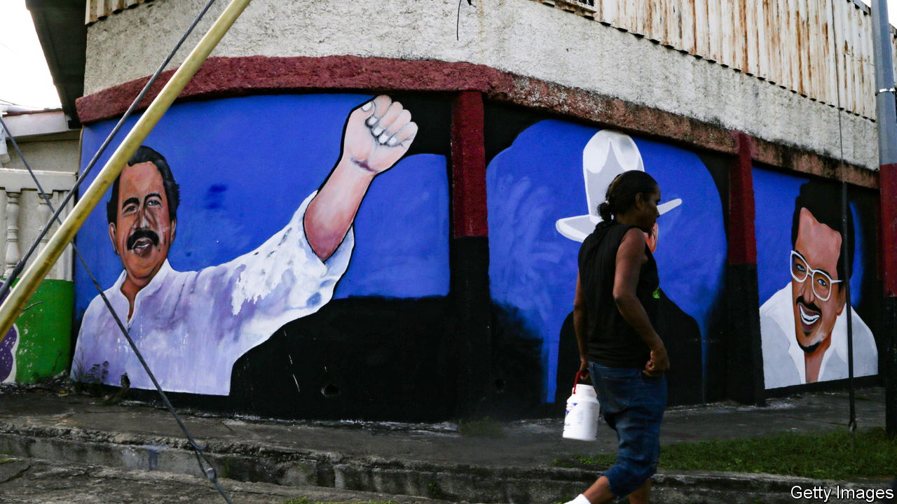
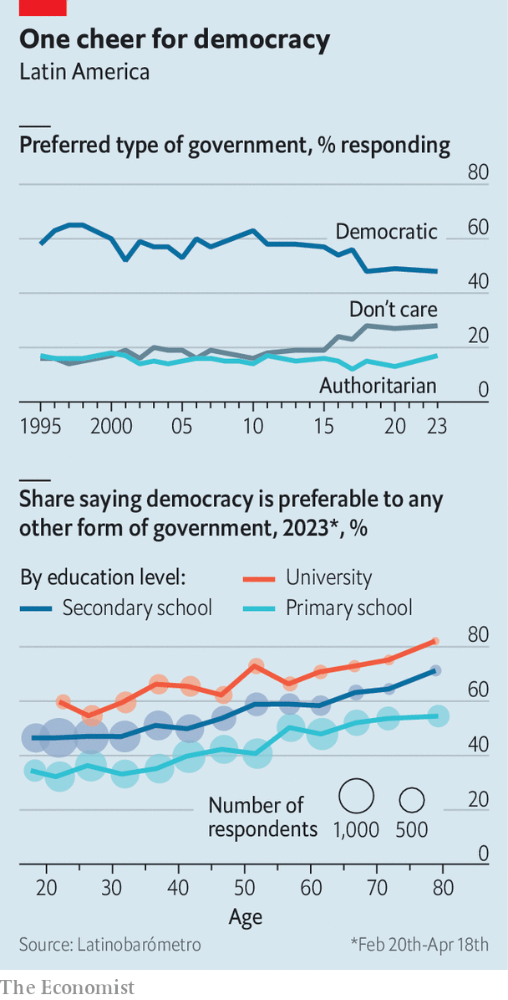

###### What Latin America thinks

# Young Latin Americans are unusually open to autocrats 

##### A new poll suggests a worrying regional trend 

 

> Jul 20th 2023 

In the latest edition of Latinobarómetro, an international poll in Latin America, respondents were asked to rate their approval of 17 named leaders on a scale of one to ten. In 15 of the 17 countries surveyed, Nayib Bukele, El Salvador’s populist, autocratic president, got the highest score—on a list that included Pope Francis and Volodymyr Zelensky, Ukraine’s president. Such broad international appeal has raised concern about the durability of liberal democracy in the region. Are Latin Americans outside El Salvador yearning for their own version of Mr Bukele?

First conducted in 1995, Latinobarómetro is a leading source of region-wide data on Latin American public opinion. This year’s poll, the first since 2020, was released on July 20th. Perhaps the most heartening result is that support for outright dictators remains scant. The two least-popular leaders in the survey were Nicolás Maduro of Venezuela and Daniel Ortega of Nicaragua, who have both banned political opponents and held power by force for more than a decade. And just 17% of the 19,000 respondents agreed with the statement that “an authoritarian government can sometimes be preferable to a democratic one”, a rate within the historical range of 12-19%.

 


However, such questions reveal little about elected autocrats like Mr Bukele, who maintain the trappings of democracy while hollowing out its substance. And although this slipperiness makes their political potential hard to gauge using polls, the overall pattern in the new data is that the region is indeed becoming increasingly fertile territory for such figures.

Two questions in the survey addressed policies often implemented by illiberal leaders. Although 61% of respondents disagreed with the statement that “in case of difficulties, it is good for the president to control the media”, the 36% who agreed marked a record high. In 2010 just 26% of participants did so. On the question of whether a “government with an iron fist”—a term that usually means heavy-handed security policies that lead to violations of human rights, such as Mr Bukele’s mass-incarceration strategy—can “solve our problems”, the liberal side were in the majority by an even slimmer margin. Just 51% agreed with a statement that such a government could not solve problems, whereas 46% disagreed.

Another set of hypothetical questions suggested that the poor approval ratings for Mr Maduro and Mr Ortega might have more to do with their weak performance in areas like the economy and public safety than with their subversion of democracy. The share of respondents agreeing with the statement “I wouldn’t mind if a non-democratic government took power, so long as it solved problems” has been rising steadily during the past 20 years, from 45% in 2003 to 51% in 2020. This year, it reached a new high of 54%. Another grim record was the 35% of participants agreeing that “I would support a military government replacing a democratic one if things got difficult.” The previous maximum, in 2020, was 31%.

These regional averages conceal variation between countries. Support for democracy and opposition to authoritarianism is highest in Argentina, Chile and Uruguay, all in southern South America. Conversely, it is lowest in Honduras and Guatemala, El Salvador’s Central American neighbours. On a related topic, in Ecuador, Guatemala and Paraguay, outright majorities of respondents said they could support a military government. These three countries are also among the five where participants thought a coup was most likely to occur in the coming years, along with Venezuela, which is already under dictatorship, and Honduras.

Perhaps the most worrisome finding in the poll is the age breakdown of views on democracy. Younger Latin Americans, with no memory of the region’s murderous military dictatorships of the 1970s, are the least likely to agree that “democracy is preferable to any other form of government”, whereas support is firmest among the old. Even when comparing people of the same sex and education level in the same country, the share of respondents committed to democracy is around 16 percentage points lower for 20-year-olds than for 75-year-olds. Unless the young of today change their minds as they age, average support for democracy will continue to decline as older generations die off. If Latin America’s remaining liberal leaders fail to improve their citizens’ lives, democratic backsliding is likely to metastasise into a grim regional trend. ■

