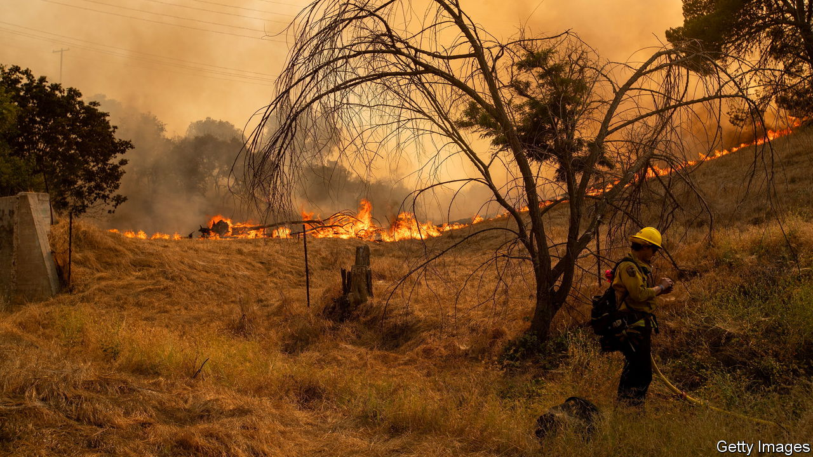

###### The Economist explains

# What happens when extreme weather hits several places at once? 

##### The effects of concurrent disasters can be greater than the sum of their parts 

 

> Jul 19th 2023 

BETWEEN JULY 10th and July 16th, more than 100m Americans were warned by their government of “potentially deadly” temperatures. Swathes of Asia and Europe are broiling. China’s temperature record was shattered; people sought relief from the heat in bomb shelters. Authorities in Athens shut the Acropolis after overheated tourists were taken to hospital; wildfires raged south of the city. Elsewhere, the heavens opened.  washed away cars, bridges and homes in northern India, shortly after Delhi recorded its heaviest day of rainfall in more than 40 years. South Korea scrambled to rescue people trapped by floods and landslides. Back in America Vermont was battered by storms, and roads in New Hampshire collapsed after torrential rain. 

Taken individually, such events would usually be notable in the regions where they occurred but largely ignored elsewhere unless they inspired particularly dramatic pictures. But seeing them all happen at once raises a global question. What happens when the world faces multiple climate-related disasters, in multiple places, at the same time? 

In its  of climate science the Intergovernmental Panel on Climate Change, a UN-backed body, noted that “compound events”—two or more climate-related events that occur simultaneously or in quick succession, including in different regions—can “lead to extreme impacts that are much larger than the sum” of their individual parts. The more disasters occur, it said, the harder it becomes to handle any of them. 


When extreme events occur in different places that are connected in some way—via agricultural supply chains, for example—the risks are particularly acute. In normal times damage to production in one agricultural area can often be made up elsewhere. Since early 2022, for example, Russia’s war has  from Ukraine, one of the world’s largest producers. But bumper harvests in Australia, Brazil and Canada ensured the ensuing shortages and price rises were not as severe as they might have been. 

That becomes harder when yields falter in several places at once. Long-running drought threatens yields in the American Midwest and Argentina. Thanks to too much heat in some areas and too much rain in others, China’s summer grain production has fallen for the first time in five years and its autumn harvest looks precarious. Rain has ravaged vegetables in India. Freakishly warm water in many parts of the ocean is likely to damage fish stocks. Benjamin Koetz, a scientist who leads a project monitoring land temperatures at the European Space Agency, has warned that this year’s heat is “severely” affecting food production. 

There is little precedent for this scenario. But the consequences of these concurrent events may be severe. A paper published in , a journal, earlier this month argues that most climate models underestimate the risks to global food security posed by simultaneous harvest failures. 

Sequential disasters can also reinforce each other. Heat, droughts and flooding are often connected: hot air picks up more moisture; dry out soil enough and water will run off it like concrete. The southern European countries now sweltering may be confronting such a scenario. Italy, where high-temperature warnings now cover 23 cities, suffered its worst flooding in a century in May—directly after the worst drought in 70 years. In spring 2021 Pakistan baked under a heatwave. By the end of the summer, after two months of record rainfall, one-third of the country was submerged by the . 

It is too soon to identify the mechanism behind this summer’s strange run of disasters. It could simply be a statistical inevitability: as climate change intensifies the frequency of extreme weather events, it becomes more likely that some will happen at the same time. Or there may be deeper chains of causation at work. What is certain is that by pumping greenhouse gases into the atmosphere, humans are warping the system in which weather operates. There will be more weirdness to come. ■


