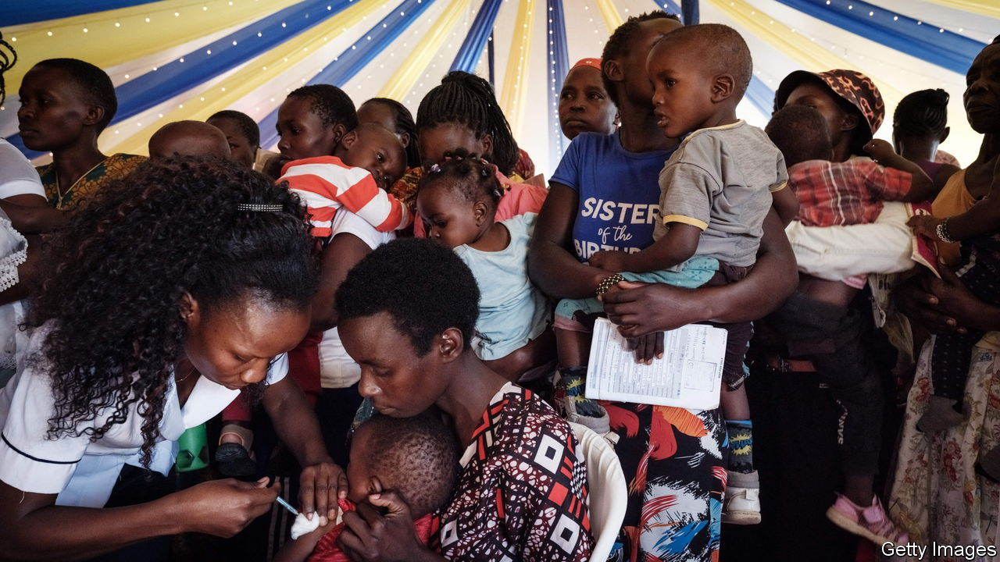
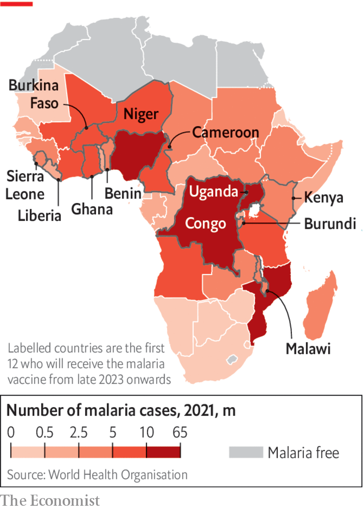

###### The Economist explains

# Why developing the world’s first malaria vaccine has taken so long 

##### The jab is expected to save tens of thousands of children’s lives each year 

 

> Jul 18th 2023 

ON JULY 5TH the World Health Organisation, UNICEF and Gavi, an organisation promoting vaccination, announced that 12 African countries would receive 18m doses of the world’s first malaria vaccine. Mosquirix, developed by GSK, a British pharma firm, will be deployed over two years with deliveries starting at the end of 2023. It is expected to save tens of thousands of lives each year, mostly of very young children. Around 95% of malaria cases and deaths are in Africa, and at least 28 countries there have expressed an interest in the new jab; by 2026 demand is expected to reach 40m-60m doses. Why has it taken so long to develop a malaria vaccine?

Malaria, a parasitic infection transmitted by mosquitoes, is one of Africa’s deadliest diseases. Although it is treatable, the infection must be identified and the patient attended to quickly. That is difficult in the continent’s many remote rural areas. As a result malaria kills nearly 500,000 children under the age of five every year. Hitherto the best option has been to try to prevent malaria with insecticide-treated nets and antimalarial drugs. But these efforts have been insufficient. Scientists have been trying to develop a vaccine for decades. Mosquirix had been in the works since the 1980s.

The development of an effective malaria vaccine has been a formidable scientific challenge. Normally, vaccines work by training the immune system to recognise antigens—typically proteins—that are found on the surface of the infectious agent. But targeting such proteins on the parasite that causes malaria has proven difficult. The parasite has a multi-stage life cycle, which presents different antigens at different stages, making it harder to pick the best target. It has also evolved ways of avoiding detection by the human immune system. For example, the parasite can turn off a protein on its surface, which allows it to travel undetected between blood cells. Once it has infected a new cell it switches the protein back on. All this means it has been hard to find the right antigen to flag to the immune system. But Mosquirix has managed to find a point in the parasite’s life cycle that is possible to target: the stage before it infects liver cells. 

 


Between 2019 and 2021 trials in 800,000 children in Ghana, Kenya, and Malawi found that inoculation led to a 30% reduction in severe malaria infections, and a 10% decline in mortality. Shortages of supply mean that the vaccine is for now being allocated to countries where the burden of malaria is heaviest (see map). 

Although the vaccine is a milestone in malaria treatment, more work is needed. Mosquirix’s efficacy is relatively low—particularly when compared with the 95% achieved by covid-19 vaccines. But a more effective jab, R21/Matrix-M, is in sight. Small-scale trials suggest it could have an 77% efficacy rate. Adrian Hill, director of Oxford University’s Jenner Institute, which developed R21, told the , a medical journal, that he hoped it would be possible to bring annual malaria deaths down to fewer than 50,000 globally by the end of the decade. Slightly behind R21 is an early-stage mRNA malaria vaccine developed by BioNtech, a German pharma firm. This innovation points to a future where malaria is preventable, and much less deadly than it is today. Some even hope that the disease will be completely eradicated. ■

