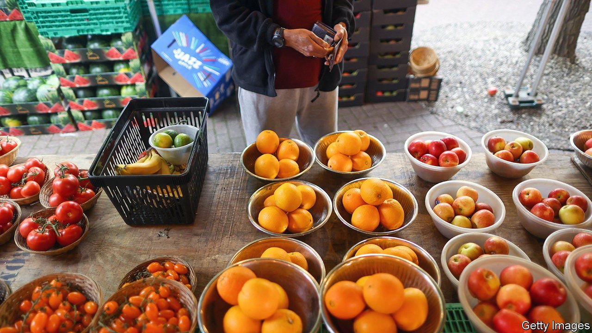
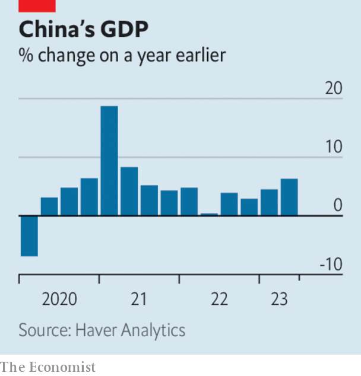

###### The world this week

# Business 

#####  

 

> Jul 20th 2023 

Britain’s annual rate of  stood at 7.9% in June, down from 8.7% in May, a bigger drop than had been expected. Transport costs fell in the consumer-price index, mostly because of cheaper fuel. Food inflation eased to 17.3%. Core inflation, which strips out energy and food prices, was 6.9%, down slightly from the previous month’s rate. The news was welcomed by the government. The Bank of England is still expected to raise interest rates when it next meets, but markets are now expecting a smaller rise of a quarter of a percentage point. 

A tale of two banks

 reported net income of $1.1bn for the April to June period, its lowest quarterly profit in three years. The bank booked charges related to its property investments and retreat from retail banking. Like some other big banks it also saw a slowdown in revenues from trading. Higher interest rates are helping to make up for that shortfall in revenue and boosting profit at other banks. At profit surged by 67%, year on year, to $14.5bn. 

 reported a strong net profit of $2.7bn for the second quarter, driven by a big increase in car sales during its price-slashing campaign. Tesla said that it was still on track to deliver 1.8m vehicles this year, though production would dip a bit this quarter. 

America’s Federal Trade Commission has reportedly opened an investigation into OpenAI, the  startup behind ChatGPT, for potentially violating consumer-protection laws. The regulator wants OpenAI to explain its policy on data privacy and how it trains the large language models behind its generative AI. 

 signed a deal with  that will continue to make “Call of Duty” available on Sony’s PlayStation once Microsoft takes over , which owns the video-game series. Sony had been the most vocal opponent of Microsoft’s acquisition, which a court in America recently gave the green light to. 

 


  grew by just 0.8% in the second quarter compared with the previous three months. It expanded by 6.3% over the same quarter last year, when lockdowns were in force, falling short of economists’ estimates for a stronger rebound. China’s property sector is proving to be one drag on the economy; investment has plunged and house prices have flatlined. This week , a property developer which sparked a crisis in the market when it defaulted on its debt, said it lost $81bn in 2021 and 2022. 

As much of Europe sweltered under heat domes, the International Energy Agency warned that “a cold winter, together with a full halt of Russian piped  to the European Union” could cause natural-gas prices to rise again. Prices have fallen sharply this year because a mild winter left gas stocks in good shape. The IEA thinks that “fierce competition for gas supplies could also emerge if north-east Asia experiences colder-than-usual weather.” 

Eli Lilly presented the full findings of the phase-three clinical study of its new drug to treat , which showed a significant slowdown in the progression of the disease in its early stages. Some patients did suffer side-effects, however, such as swelling and bleeding of the brain. Eli Lilly hopes that its drug, called donanemab, will be approved by America’s Food and Drug Administration by the end of the year. 

A crackdown on users sharing passwords paid off at , which saw its subscriber base increase by 8% in the second quarter, year on year, a faster rate of growth than in recent quarters. A year earlier it had lost 1m customers. Netflix now has 238m paid members, far more than the around 160m at Disney+, its closest direct rival. 

Quiet on the set

 stars (well, Susan Sarandon) joined the picket lines, after the union that represents film and television actors called a strike, joining screen writers who downed their pens in May. The actors and writers want the studios to limit the use of artificial intelligence in moviemaking, such as when it replicates an actor’s image or generates a story, and a bigger cut of the proceeds from streaming. The studios say the unions are being unrealistic. Film and TV production has now virtually ground to a halt.

 turned an annual profit last year for the first time since 2018, according to newly released figures from its owner, JAB Holding. The purveyor of sandwiches, salads and coffee is on track to operate 700 shops worldwide by the end of the year, most of them in Britain, and most of those in London. Pret has become so synonymous with office workers that Britain’s national statistics agency keeps a data set of transactions in its stores, indexed to January 2020, the start of covid-19, to track footfall. The index has risen faster in the suburbs than it has in the city. 

