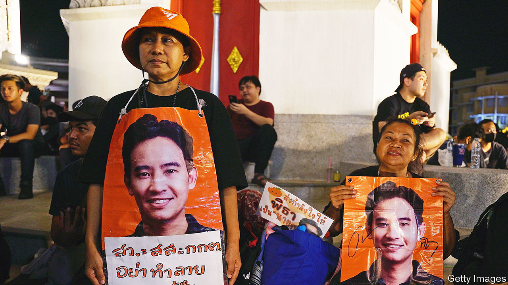
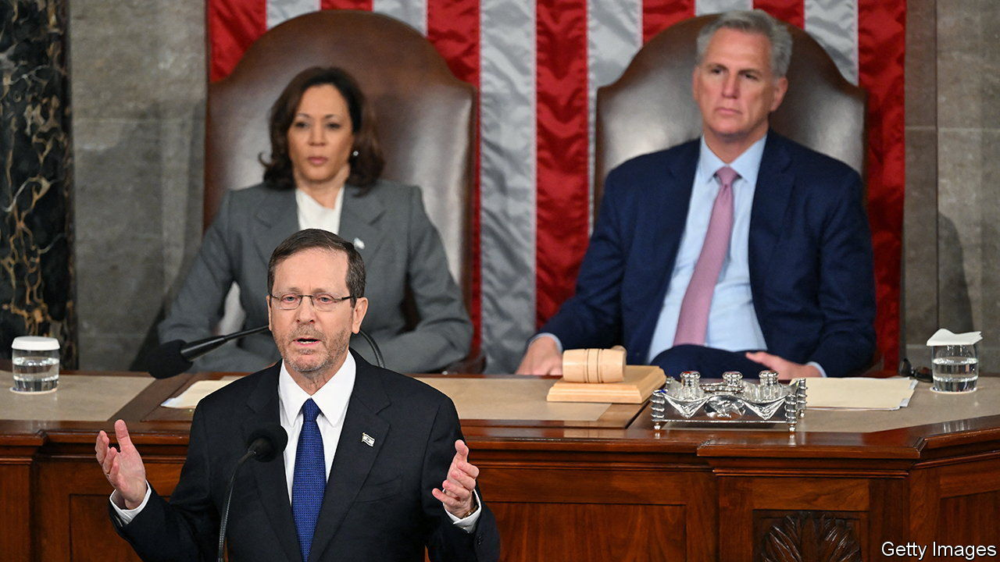

###### The world this week

# Politics 

#####  

 

> Jul 20th 2023 

 parliament again voted to prevent Pita Limjaroenrat from becoming prime minister. Coupled with a court ruling that suspended the opposition leader from the legislature, Mr Pita now has no chance of getting the job. Although his pro-democracy Move Forward party claimed the most seats in a general election in May, Mr Pita has been blocked by the upper house, which is stacked with parties aligned with Thailand’s conservative military elite. The Constitutional Court is even considering a complaint against Move Forward over its aim of reforming the country’s draconian laws.

A senior leader in  opposition alliance of parties, Perikatan Nasional, was charged with sedition. Muhammad Sanusi Md Nor is the chief co-ordinator of PN’s campaign ahead of forthcoming state elections. He was indicted under colonial-era laws for questioning decisions made by the king. 

In 26 opposition parties formed an alliance to co-ordinate their political strategy when they compete against the ruling Bharatiya Janata Party at next year’s general election. The Indian National Developmental Inclusive Alliance (INDIA) includes the Congress party, whose leader, Rahul Gandhi, has been convicted of defamation and barred from Parliament.

India launched its  on a mission to explore the Moon’s South Pole. If all goes well Chandrayaan-3 is expected to reach its destination on August 23rd or 24th.

An American soldier was detained in  after he crossed the border from South Korea. Travis King had been in jail for two months on assault charges and was due to be flown back to America when he absconded.

Rumours swirled around  foreign minister, , who has not been seen in public since June 25th. “Health reasons” were cited when the diplomat did not attend a summit earlier this month. Now, though, the foreign ministry says it has “no information” on his status.

The  that connects Russia with occupied Crimea was attacked again, this time by water drones. The bridge carries Russian supplies into contested areas of Ukraine. It will not be fully operational again until mid-September. Last October a fuel bomb on the bridge caused extensive damage. Ukrainian officials say the latest attack will disrupt Russian logistics. 

Russia carried out missile strikes on Odessa and other Ukrainian ports. Russia earlier pulled out of a deal that had permitted the safe passage of  from those ports across the Black Sea. As wheat prices rose, the UN, which helped broker the agreement a year ago, warned that it would be people in poor countries who pay the price. 

Afraid of a little competition

An American who had been selected to be the European Commission’s on competition issues declined the job following a political storm. Opposition to the appointment of  was led by Emmanuel Macron. The French president said he wanted a “great European” in the position, though he didn’t name one. 

Vladimir Putin pulled out of an economic summit in  in August, avoiding the possibility of being arrested by his host on a warrant issued by the International Criminal Court, which South Africa is obliged to enforce. President Cyril Ramaphosa said in a court filing that Russia had made clear the arrest “would be a declaration of war”.

Emmerson Mnangagwa,  president, signed legislation into law that could impose the death penalty for the vague offence of “injuring the sovereignty and national interest of Zimbabwe”. 

 


Isaac Herzog, the president, visited Joe Biden at the White House. He also gave a speech to Congress, where he said that criticising Israeli policy should not cross a line into concluding that Israel does not have the right to exist. Mr Biden also issued an invitation to Binyamin Netanyahu, Israel’s prime minister, to visit, and urged caution on the  that have provoked huge protests in Israel.

 morality police will resume patrols to enforce a dress code which says women must cover their hair. The decision comes ten months after large demonstrations were held following the death in custody of Mahsa Amini, who was arrested for not wearing a “proper” headscarf. 

 signed a deal with the  to manage “irregular” migration. Tunisia has become the main point of departure for migrants crossing the Mediterranean to reach Europe. Under the agreement the EU will give Tunisia €105m ($118m) for equipment and training to prevent migrants from embarking. Another €150m was also pledged for a variety of other things. 

A controversial Illegal Migration Bill was approved by the British Parliament. The government says the bill is essential to stop  carrying migrants across the English Channel. Opponents had hoped that a series of amendments would ditch bits of the legislation that they claimed would contravene human rights, but these were all eventually defeated. 

England’s court of appeal reduced the sentence of a woman who was found guilty of taking  pills outside legal limits to a 14-month suspended sentence. The original prison conviction had been widely condemned when it was imposed in June. 

A flair for troublemaking

At a summit of  leaders, Luiz Inácio Lula da Silva, Brazil’s president, said that the world was “tired” of the war in Ukraine. Lula, who has refused to admonish Vladimir Putin, also criticised Gabriel Boric, Chile’s president, for condemning Russia. 

Tens of thousands of people took to the streets of  to protest against the president, Dina Boluarte, who came to power only in December. She denounced the demonstrators as a threat to democracy. 

A former president of , Ricardo Martinelli, was sentenced to ten years in prison for money-laundering, which he denies. He had been considered the front-runner in a presidential election.

Scores of people were killed during severe flooding in South Korea. Many had become trapped in their cars in a tunnel in the city of Cheongju. It was one of many  events. Heat records were broken across Asia, North America and southern Europe. The temperature in  hit 53.3°C (128°F), though that was still short of the 56.67°C registered in 1913. 

