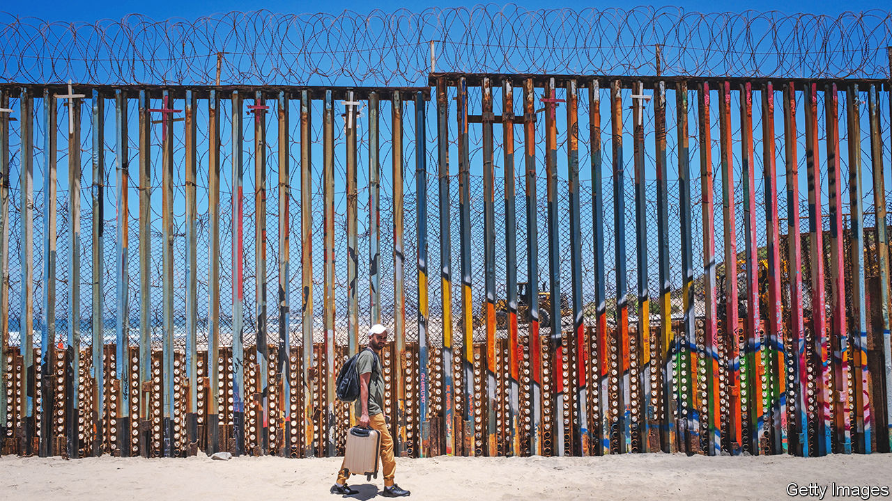
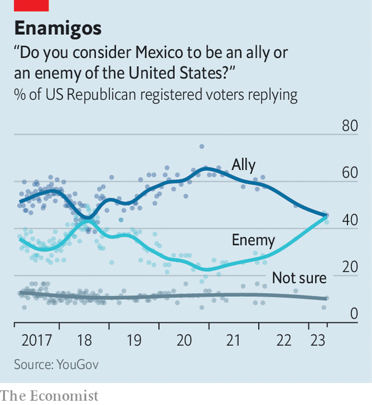

###### A new Mexican-American war

# How Mexico has become the “enemy” of America’s Republicans 

##### A growing number of them want to use military force against drug cartels 

 

> Jul 20th 2023 

More than once, as president, Donald Trump mused about firing missiles at the drug labs of Mexican cartels. “No one would know it was us,” he declared, before being talked out of the idea. Mark Esper, the then defence secretary, recounted the incident in his memoirs published last year, astonished that bombing a neighbour could be seriously thought of. 

Now the extraordinary is becoming more commonplace as Republicans argue that greater use of military force, or the threat of it, can help control America’s southern border and curb the smuggling of fentanyl, a synthetic opioid that is produced illegally in Mexico. 

One congressman, Michael McCaul of Texas, has introduced a bill to classify fentanyl as a “chemical weapon”. Lindsey Graham, a senator from South Carolina, is pushing one to designate Mexican cartels as “foreign terrorist organisations”. Dan Crenshaw and Mike Waltz, congressmen from Texas and Florida respectively, have proposed another that would authorise “all necessary and appropriate force” against foreign states, organisations or people linked to trafficking fentanyl.

Republican presidential candidates, too, are talking tough. Ron DeSantis, the governor of Florida, has suggested a naval blockade of Mexico-bound shipping to halt the import of fentanyl precursor chemicals from China. Nikki Haley, a former ambassador to the UN, has proposed sending in special forces with a warning to Mexico: “Either you do it or we do it.” Tim Scott, the other senator from South Carolina, declared in May, “I will allow the world’s greatest military to fight these terrorists.”

Tucker Carlson, a former Fox News host beloved by America’s hard right, goes further, regarding Mexico as an outright foe. On July 14th, while interrogating Republican presidential hopefuls (minus Mr Trump) at the Family Leadership Summit, a gathering of religious conservatives in Iowa, he grilled Mr Scott about his support for Ukraine: “No Americans killed by Russia. Hundreds of thousands killed by Mexico. But Mexico is our ally and Russia is our enemy—how does that work?” Mr Scott did not demur from the idea that Mexico was an enemy, but said America could deal with Russia and Mexico simultaneously.

Many Mexicans feel they are again the  of America’s election season, freely beaten by any politician. Earlier this year Mexico’s president, Andrés Manuel López Obrador, a left-wing populist who got on with Mr Trump, took issue with the militarist talk, saying: “In addition to being irresponsible, it is an offence to the people of Mexico, a lack of respect for our sovereignty.” He warned that he might urge Mexican and Hispanic voters not to cast their ballots for Republicans. 

 


The anti-Mexican mood on America’s right is hardening, moving beyond Mr Trump’s cheap shots against migrants in 2015, when he said “they are bringing drugs, they’re bringing crime, they’re rapists.” According to tracking polls by YouGov, Republican voters are fast turning against Mexico. Roughly as many think Mexico is now an “enemy” as consider it an “ally”, with about 45% supporting each proposition (see chart). Democrats are largely unchanged, with about 70% regarding their southern neighbour as an ally. The Republican disenchantment has grown in the past year. 

At least three factors may be at play. The first is frustration over fentanyl-related deaths, which rose sharply in 2020 and 2021. The drug has become the biggest killer of Americans aged 18-45, responsible for most of the 70,000 deaths from overdoses of synthetic opioids in 2021. Second, suggests Mark Jones of Rice University, the defeat of Mr Trump “unshackled” Republicans, freeing them to denounce President Joe Biden for his handling of the border. “There is no better issue for Republicans,” he says. “It mobilises their base. And it splits Democrats: whatever Joe Biden does will seem too fascist by the left and too permissive by centrists.”

A third factor, adds David Frum, a writer and former speechwriter for President George W. Bush, is the war in Ukraine. Given the MAGA movement’s hostility to Ukraine and sympathy for Russia—a position that runs against many voters’ views—denouncing Mexico allows them to cast themselves as “guardians of the country”.

Such policies are gaining an intellectual underpinning through a network of Trump-leaning think-tanks preparing for a future administration. A paper by the Centre for Renewing America, entitled “It’s time to wage war on transnational drug cartels”, is reported to have caught the attention of Mr Trump, among others. Its author, Ken Cuccinelli, argues that America should be free to take military action in Mexico given that its government does not fully control its territory. Never mind that it would stir deep anti-Americanism, or that treating Mexico like a failed state might turn it into one. “Mexico is not a friend. It is complicit in the drug cartels,” says Mr Cuccinelli. “It’s time to acknowledge that the relationship has changed.” ■


