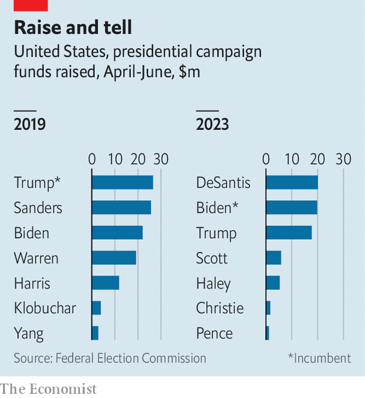

###### Big-donor populism

# Ron DeSantis is relying on big donors and his super PAC 

##### The latest campaign-finance disclosures look good for him but disguise a flaw 

 

> Jul 20th 2023 

For Ron DeSantis, whose presidential campaign began in earnest eight weeks ago on a glitchy Twitter live-stream, even good news seems to be bad news. Newly released data from the Federal Election Commission (FEC) show the Florida governor outraised Donald Trump during the second quarter and raised some 43% more than his competitors Nikki Haley, Tim Scott, Chris Christie and Mike Pence combined. But these splashy fundraising numbers disguise a looming problem for Mr DeSantis: an overreliance on big-dollar donors.

From May through June Mr DeSantis raised $20.1m and spent $7.9m, a burn rate of 39%. Compared with the same period during the 2020 election cycle, this seems modest. During the second quarter of 2019, Mr Trump’s campaign had a burn rate of 40%, and then-front-runners of the Democratic primaries Bernie Sanders and Joe Biden both slightly exceeded 50%.

 


But those fundraising juggernauts, unlike Mr DeSantis, relied heavily on small-dollar donors—individuals who pledge less than $200 to a campaign. These contributions matter not only because they help line campaign coffers, but because smaller donations from more people suggest greater enthusiasm for the candidate. During the second quarter of 2019, 70% of Mr Sanders’s fundraising came from small-dollar donors compared with Mr DeSantis’s 14% during the same period this year. 

A reliance on big-dollar donors can be hard to sustain. Fewer people have lots of money to give and campaign-finance law caps individual contributions at $3,300 per candidate per election. Nearly 70% of donors to the DeSantis campaign have already reached this limit for the primaries. Mr DeSantis can use future donations from these individuals (up to an extra $3,300) only on his general-election campaign, should he make it that far. But some of his big-dollar donors have already hit both caps: $3m of his remaining $12.2m funds are reserved for the general election. 

Under his campaign’s current weekly spending rate ($1.5m) Mr DeSantis will need to raise around $33m during the remainder of 2023 if he hopes to reach the Iowa caucus with cash in hand. His campaign has already laid off some staffers in order to rein in spending.

The next few weeks could bring the DeSantis campaign worse news still. Though Mr Trump’s FEC filings report fundraising of $17.7m, the former president claims he has raised $35m in the second quarter, 75% more than Mr DeSantis. Because Mr Trump relies on a fundraising committee with different reporting deadlines the true number won’t be revealed until the end of July. 

The DeSantis campaign’s financial state will become clearer then, too. Super PACs—which can take unlimited donations from undisclosed donors on behalf of campaigns so long as they do not co-ordinate with them—have the same July 31st filing deadline. “Never Back Down”, a DeSantis-aligned super PAC, is allegedly flush with cash. But without co-ordination between the campaign and super PACs, efficient use of these funds is tricky. And come January, it will be the individual donors, not the super PACs, who shuffle into ballot boxes to decide their 2024 Republican nominee. Mr DeSantis would do well to woo them even if their wallets are slimmer. ■


