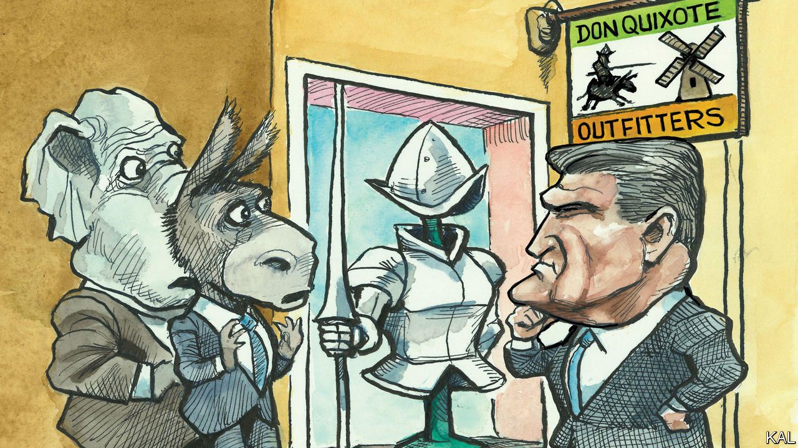

###### Lexington

# The case for a third-party campaign in 2024 is actuarial, not ideological 

##### No Labels wants to be political insurance for the democracy, yet may doom it 

 

> Jul 20th 2023 

Nothing in American politics is more quixotic than a third-party presidential campaign. Thus, to political insiders, nothing is also more pathetic or else more cynical: in the best case, the campaign is detached from reality, and in the worst (and, to insiders, the more probable case, since this is politics for God’s sake) it is serving some hidden motive, some interest in the shadows. 

Yet, because nothing is more quixotic than a third-party campaign, might it not actually be the most idealistic expression of American politics? Americans may have elected only one candidate to the presidency from a third party, but he was Abraham Lincoln. And good third-party politicians always seem so pure. They know the odds are stacked against them, but they also know Americans yearn for something different, for big ideas and hard truths. It sounds good to anyone who is in fact yearning for something different, which is pretty much everyone who is not an insider. 

Enter Senator Joe Manchin, Democrat of West Virginia, one of the more cynical American politicians or possibly one of the more principled, weighing a third-party bid in the latest twist of a presidential melodrama no strike-breaking screenwriter could pitch with a straight face. Whatever further criminal indictments, mislaid cocaine, unacknowledged grandchildren, unvaccinated Kennedys, old-age pratfalls or attempted Russian coups may yet await, Mr Manchin’s eventual choice could prove decisive. 

Craggy and folksy, Mr Manchin has won in a state Donald Trump carried twice by about 40 points, but by casting votes that made progressives despise him. What Mr Manchin has seen as wise positions for an old-school blue-collar Democrat from coal country, they have seen as evidence of racism, truckling to special interests and egomania. As the spotlight of presidential speculation shines upon him, Mr Manchin is doing nothing to dispel that last suspicion. A fellow Senate Democrat, Dick Durbin of Illinois, recently called him “America’s biggest political tease”.

If Mr Manchin runs for president, he would do so as the candidate of No Labels, a centre-left organisation that argues Americans are dissatisfied with their emerging choice, between President Joe Biden and Mr Trump. The group intends to raise tens of millions of dollars and petition its way onto the ballot in every state. On July 17th, in the early primary state of New Hampshire, Mr Manchin appeared at a town-hall meeting organised by No Labels alongside a Republican, Jon Huntsman, a former governor of Utah, ex-ambassador to Moscow and Beijing, and past presidential candidate.

“I truly believe that all 435 people elected to Washington want to do good,” Mr Manchin said when asked about a radical House member. But the “business model” of both parties leads politicians to motivate supporters by creating or exaggerating division rather than compromising. Through No Labels, he said, “We can talk about the real problems. We don’t have to villainise the other side just because they might think different than I do.”

All of this is driving some Democrats crazy. The more sensible a No Labels candidate sounds, they fear, the more he will undercut Mr Biden’s advantage among sensible people. They argue that polling shows more Republicans identify with their party’s extreme than Democrats do with theirs, meaning a centrist candidate will take fewer votes from Mr Trump. 

No Labels insists its polling shows it would hurt Mr Trump at least as much. It says it will field a candidate only if, after the Super Tuesday primaries next spring, the choice does come down to Mr Trump and Mr Biden, and only if the No Labels candidate has a clear shot at winning. “Those are deeply subjective judgments,” warns Matt Bennett of Third Way, a centrist Democratic group organising against No Labels, “and so far at least we have no faith they are making those judgments correctly.” The day Mr Manchin turned up in New Hampshire, some political luminaries opposed to Mr Trump launched Citizens to Save Our Republic, a super PAC dedicated to fighting No Labels. The Arizona Democratic Party is suing to keep No Labels off the ballot there. 

Unfortunately for those opposed to No Labels, such machinations are classic grist for the third-party idealism mill. In New Hampshire Mr Huntsman remarked that he had previously heard only Russian and Chinese officials discourage more political participation. Mr Manchin argued that fear of No Labels would force the Democratic Party to embrace more centrist positions. “Why are they scared that they may be threatened to do the right thing?” he asked. “Why are they scared to say, ‘Hey, you’re too far to the left and it doesn’t make any sense’?”

Better angles

Yet No Labels is also playing games. As a non-profit organisation, it is not obliged to disclose its donors and it does not. Struggling to defend that practice, Mr Manchin fell back on saying that Republicans and Democrats also benefited from “dark money” and that he would vote, if given the chance, to do away with it.

There is no reason to doubt the sincerity of Mr Manchin or No Labels in seeking more public debate about the national debt, the need for national service or the decline of patriotism. But after the attack on the Capitol, only cynical political calculation could pinpoint the sensible centre of American life as equidistant from both parties. A party in thrall to Donald Trump is dangerous in ways a party resigned to Joe Biden is not. 

In fact, some of his Democratic colleagues acknowledge, Mr Manchin deserves credit for blocking Mr Biden from moving farther left in the heady years when Democrats had majorities in both chambers, and for helping achieve landmark bipartisan legislation. Partly thanks to Mr Manchin, Mr Biden can justly claim to be the centrist’s alternative to Mr Trump. Only should Mr Biden’s health fail might Americans be lucky to have No Labels on the ballot (though Mr Manchin is 75). That is the only real argument for this third party, and it is the most cold-blooded one imaginable. ■ 


