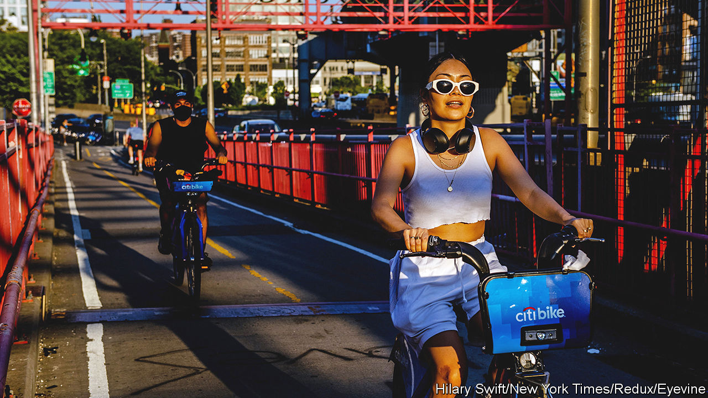

###### Slow puncture

# What America’s bike-share schemes tell you about venture capital 

##### A highly visible indicator of market conditions 

 

> Jul 20th 2023 

Over the past decade not many cities in America have won as many plaudits for investing in bike infrastructure as Minneapolis. Thanks to its extensive network of bike lanes, in 2015 it became the first (and so far only) place in America to win a place on the Copenhagenize Index, a list of the world’s 20 most bicycle-friendly cities. Yet that was not enough to save the city’s 13-year-old docked bike-share system. In March Lyft, the taxi firm which operated the scheme, known as Nice Ride, announced that because a sponsor had dropped out, it would close, and that they would begin removing the equipment.

Cycling is booming across America. Bike-share schemes, too, have been thriving. According to the Bureau of Transportation Statistics, usage of six of the largest docked systems nationwide increased by 42% from March 2020 to March 2023. Last year New Yorkers took just under 30m rides on the Citi Bike scheme there; in Chicago, the Divvy scheme had 6.3m riders, up nearly 40% on 2021. And yet many schemes, like that in Minneapolis, are closing. In 2019, 109 cities were served by a docked-bicycle-hire scheme; that has now fallen to 56. What is going wrong?

The basic problem, says David Spielfogel, the chief business officer of Lime, which operates dockless bikes and scooters, is that the boom, funded by venture capital, is deflating like a punctured tyre, and too many operators “haven’t figured out how to run a profitable business”. Dockless-bike firms (Lime aside) were the first to go. But docked schemes are now suffering too, especially outside the biggest cities. In Minneapolis, the fact that the bikes did not function during winter may have contributed to the system’s demise. Lime, which is profitable, is one of the firms filling the void.

Schemes like New York’s or Chicago’s are not at risk of closure. But bike advocates accuse Lyft, which runs those two systems, of not maintaining non-electrified bikes in order to push riders onto pricier e-bikes. For non-members, hiring an e-bike can rival the cost of a taxi (members who pay an annual fee get cheaper rides). While demand stays high, that might sustain networks. But it will hardly accelerate the boom.■


