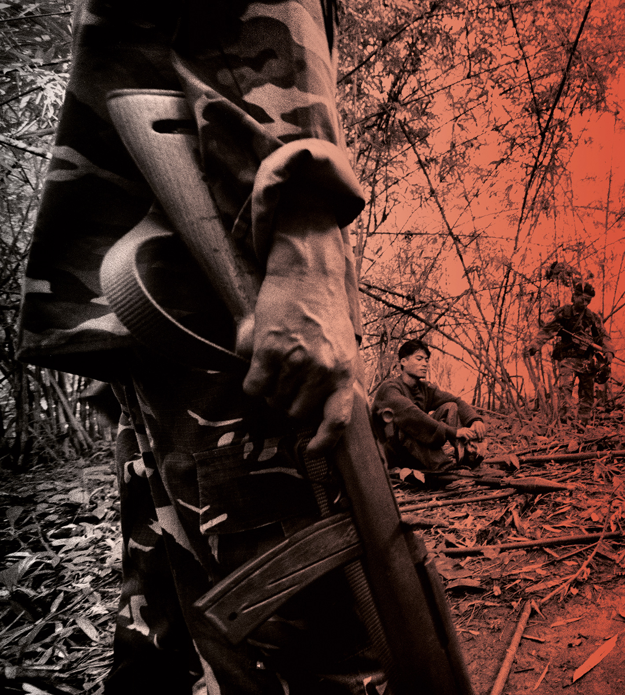
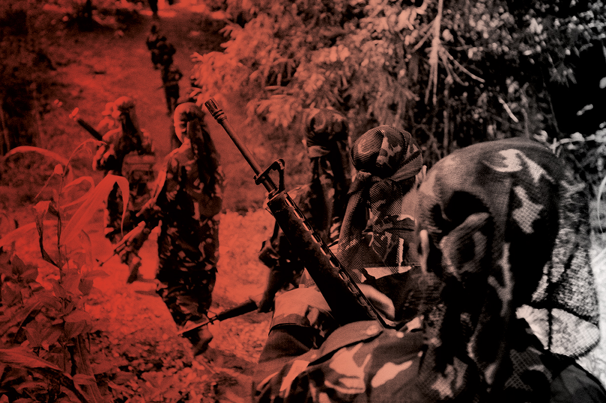
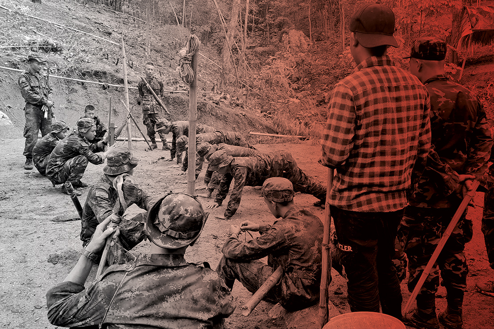

###### Myanmar

# Rum and coke and automatic rifles: Myanmar’s Gen Z guerrillas 

##### Young soldiers have buoyed the country’s fight for freedom, but at great cost. Irena Long meets them in their jungle hideout 

 

> Jul 27th 2023 

On a sweltering afternoon in March, three recruits to the Albino Tiger Battalion – a paramilitary group resisting Myanmar’s junta regime – were studying the rules of war. Resting their dummy rifles made of wood and bamboo against their legs, they sat on a fallen tree in the shade of a rubber plantation at the edge of the rainforest. The group was only a few days from finishing six weeks of basic military training; the notebooks in their laps were crammed with diagrams of attack formations and rules of engagement. 

Their instructor called out: “To win the revolution we have to be good soldiers, you agree?” 

“Yes! Yes!” the group replied.

“Bravery is not about killing people or destroying things or burning down houses,” he told the students. “Bravery is about sacrifice, about giving yourself for others, about doing what you have to do under very difficult circumstances.” 

The 99 young soldiers who make up the Albino Tigers – most of whom are between the ages of 17 and 28 – understand that their circumstances are tough. The battalion is part of the  (PDF), a resistance army formed by the National Unity Government (NUG), a coalition of politicians, ethnic and civil-society leaders who oppose  staged by Myanmar’s military generals in 2021. For the past two years, the resistance has been fighting . Its goal is to force the army – which has ruled Myanmar for most of the past 60 years – out of politics permanently. It also hopes to ensure that the country becomes a federal democracy with equal rights for all, including women and ethnic minorities, who have long been brutally repressed. 


The resistance has been surprisingly successful – it enjoys popular support and claims that, together with militias established by Myanmar’s ethnic minorities who have been resisting the central government for decades, it controls half of the country. But because the PDF does not receive any foreign aid, its access to weapons and basic resources is limited. The communities that sustain its needs have been battered and impoverished by the military regime, and are themselves in desperate need of humanitarian assistance. 

Feeling that the rest of the world was forgetting their struggle, resistance leaders invited me to stay with the Albino Tigers for five days this spring. I became the first Western journalist to visit this stretch of the front line, near a vital motorway that connects Myanmar to India and Thailand. The Albino Tigers and other resistance forces have frequently carried out attacks on the junta here, even temporarily occupying strategic towns. The army has retaliated with fighter jets and helicopters provided by Russia and China, and heavy weaponry. It often commits atrocities, such as raping, dismembering and disembowelling civilians.


For six hours I travelled with Captain Thu Saw, the gregarious leader of one of the three Albino Tiger companies, through rugged mountains contested by the junta and ethnic militias. Despite the dangerous surroundings, I found Thu Saw’s camp – in territory controlled by the Karen, an ethnic-minority group – surprisingly peaceful. In the shade of tamarind and mango trees, the afternoon heat lingered, drawing crickets into song. Tiger-striped dogs lazed around, too hot to bark. In the valley, cream-coloured cows grazed on the dry stubble of last year’s rice harvest. A soldier was tending a fire under a bubbling cauldron of rice while another chopped onions for a pumpkin curry. Off-duty soldiers washed clothes and oiled guns; some swung in their hammocks reading novels or watching Korean soaps on their phones. But the imprint of war was everywhere. The junta’s mortars and airstrikes had snapped mature trees in half. The soil was pockmarked with craters and the remains of a bomb lay near the dug-out the fighters used as an air-raid shelter.

Our safe arrival merited celebration. Thu Saw mixed rum with local cola and fetched his guitar. Under a solar-powered light he started playing “Kabar Ma Kyay Bu” (“Till the End of the World”) – the anthem of the uprising against a previous military dictatorship in 1988, which was violently suppressed. During the subsequent decades, the song was censored, but everyone in the group knew the words: “Do not waver,” they sang. “Just like our fallen heroes, who fought for democracy…Let us stand strong in the revolution and resist…The blood in the streets has not dried.” 

 


 


 


 


War seemed far away: the atmosphere was almost carefree, filled with Thu Saw’s jokes and his soldiers’ laughter. Cups were topped up and a pack of cards was produced. Suddenly, Thu Saw jumped up. He had heard a distant crackling sound – possibly one of the junta’s mortars, which would mean that we had only about 30 seconds to make it to the shelter. Only two weeks earlier a bomb had landed 50 metres away from where we were sitting. 

Thu Saw grabbed his walkie-talkie in case there was any information, but it remained silent; I listened carefully but heard only rolling thunder. Then raindrops started to fall – the first storm of the season. Attacks from the air are less likely when it’s thundering. “A good omen,” said Thu Saw, chuckling, as his soldiers sighed in relief. 

Myanmar’s youth – particularly students – have a long history of leading revolutionary movements, both through peaceful protest and military action. Yet the current generation of young resistance fighters is different. Their families had suffered for half a century under military rule. But in 2011 a decade-long experiment in hybrid democracy began and, for a time, Aung San Suu Kyi, a charismatic democracy activist, led the country. Generation Z grew up thinking non-violent resistance – promoted by Suu Kyi and other leaders in a bid to prevent further bloodshed – could bring about social change. Unlike previous generations, Gen Z also grew up with mobile phones and the internet. The political situation was far from perfect – especially for members of  – yet many were filled with hope for the future. Universities flourished again, after years of closure. Those who had been exiled returned with new ideas and money.


The coup in 2021 ended young people’s dreams of a better life. Gen Z, especially women, spearheaded the protests. The army’s crackdown forced those who managed to evade death or jail to flee for the border areas controlled by ethnic-minority militias allied with the resistance. Tens of thousands of young people then signed up for the PDF; many of the Albino Tigers told me they were motivated to fight after seeing their comrades die in front of them on the streets. Unlike their parents and grandparents when they were young, Gen Z has actually tasted freedom, and they are determined to get it back – at any cost.

Thu Saw has found it difficult to rein in his young fighters’ battlefield ambitions. He is only about a decade older than most of his soldiers, yet has a markedly different outlook: “The only way to win is in a political way” – meaning at the negotiating table – “not an army way.” 

Although Thu Saw had always opposed the junta – he was once arrested for taking part in a satirical poetry recital in which he made fun of the generals – he was wary of fighting. Formerly a labour activist, he quickly organised a strike in protest at the coup. Forty young resistance activists then came to his door, begging him to join them, but he hesitated: “I never wanted to be a soldier, shoot people, kill people. Then I saw a protester shot right beside me and I felt I had no choice. I have to defend my people.” 


After five months of hiding in the jungle, Thu Saw made his way to the PDF’s main training camp, disguised as a snack vendor. “When I arrived, I was amazed. It was so crowded – so many young people. In the forest, I had got used to keeping my voice down. Here…they were even playing guitar and singing.” He was put in charge of a company of Albino Tigers, whom he marched over the mountains and into the river valley (where I later joined them).

Ko Moustache – a lieutenant nicknamed for his facial hair – remembered that hazardous trek. “We had to walk day and night with very little food. Just some rice and fish paste, sometimes mushrooms we found in the forest.” At 25, he was one of the older recruits; soon he was given charge of a platoon of 14 commandos. On one of their missions, Ko Moustache misjudged an attack on an army post and was shot and injured. “When I realised that I was hit I ran as fast as I could down the mountain,” he recalled. “I left everything behind – my phone, the car, even love letters from my girlfriend.” Afterwards, nearby villagers bought the resistance new mobile phones. The army also sent the Albino Tigers some old hunting guns with a sarcastic note thanking them for the valuable supplies they left behind – making clear that the junta does not see the resistance as a threat.

 


 


 


 


Ko Moustache used to work as a barista in a coffee shop; like most of his fellow soldiers, he is from one of Myanmar’s cities. He dreamed of buying a house and starting a family. The coup dashed these hopes of a normal life. But though he had the opportunity to join his sister in England, leaving Myanmar was not an option: “My parents and grandparents lived many years in darkness and fear. I don’t want this for myself and our future generations. I have no choice but to fight.” His commitment is sometimes tempered by depression – he says he feels “lost” when he thinks about his future – but he is able to commiserate with his comrades, who “have become my second family. We can help one another.” 

Ko Moustache’s girlfriend is also an Albino Tiger, and they often talk when they are both at the rear. War has given women a chance to challenge social expectations; PDF battalions include women not just as medics and admin staff, but as fighters. Ma Yu, a sniper in her 20s and a member of the Albino Tigers’ ten-strong women’s squad, told me, “Before they joined, some women had never worn trousers, only a  [a traditional sarong].”

Not all the Albino Tigers I met had wanted to become fighters; some had joined the PDF primarily for their own safety. At one point a soldier called “Comrade Federal” gave me a cartoon he had drawn showing demonstrators in a city holding a flag emblazoned with “Gen Z” and a three-finger salute. (The symbol comes from the film “The Hunger Games”, in which it is a sign of solidarity with the rebellion.) A ladder stretched from the city to the mountains, where soldiers were waving a PDF flag. Yet the ladder was broken – seemingly showing that, in Comrade Federal’s view, there was no way for fighters to go back to their urban lives. I could sense that he struggled to put into words his feeling of being trapped. As a student-union leader at a major university, he felt he had no choice but to seek refuge with the PDF. All he really wanted was to finish his studies and return home to take care of his widowed mother. 


Thu Saw was acutely aware of the stresses that his soldiers were under, and understood their doubts. He has already lost three Albino Tigers in battle, and knows that his jokes may not be enough to boost his soldiers’ spirits. “If they want to go back to their families I will let them,” he told me. “They are young, they don’t want to kill people. My nightmare is that the PDF fighters are getting too used to carrying guns, to kill, to wound.” (Indeed, there are cases of PDF groups going rogue and murdering civilians.) Thu Saw wondered, “What will the country be after we have won and bands of these guys are running around with guns?”

One morning I woke up early to soft chatter and strange rasping noises. Thu Saw was still asleep, rolled up in his hammock with his automatic rifle in his lap. I sneaked past him to see what the sound was. A family was scraping the skin off a large pile of sugarcane; one member was dragging a cane press through the camp’s gate. At noon they offered buckets of sweet, foamy juice to the soldiers. 

Thu Saw later explained that villagers, grateful for the Albino Tigers’ protection, “bring us everything: rice, oil, vegetables, fruit. From the money I save, I buy weapons.” At the beginning, his troops had only two guns between them; now they have 27. They often crowd-fund to buy guns on the black market. For other weaponry, they rely on Gen Z’s ingenuity, adapting drones to drop bombs, and building mortars and grenade launchers, which, they boast, have resulted in hundreds of junta casualties. 

The resistance wants to ignite a countrywide uprising later this year – “before everyone gets too tired of the revolution”, as one PDF commander told me. But no one seemed very optimistic about the resistance’s chances in open battle, which would probably result in a bloodbath for both fighters and civilians. Even if the resistance triumphs, it will still face the immense task of repairing a country devastated by tyranny and war.

Confronted each morning with the possibility of death, many PDF soldiers seemed truly prepared to sacrifice themselves for their cause. But I thought of something Ko Moustache had told me: “I live day by day. After some time I realised that thinking about the future is of no use. The future will bring what it will bring.” ■

 is an investigative journalist, broadcaster and photographer

images: Alvaro Ybarra Zavala, GETTY, REUTERS, STR, AFP

