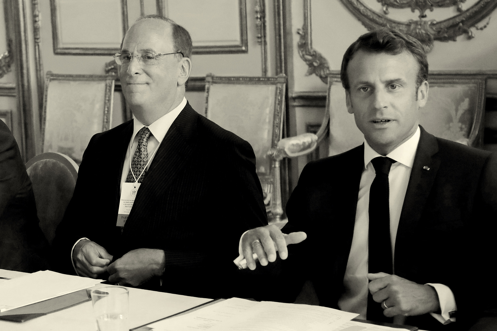

###### Finance

# The demonisation of BlackRock’s Larry Fink 

##### All he wanted to do was save the planet while making his firm a fortune. Henry Tricks meets the face of woke capitalism 

 

> Jul 27th 2023 

In early 2022 New Yorkers encountered the sight of black trucks driving around Times Square displaying a peculiar billboard. It showed a balding man dressed in a dark business suit, bearing a Dr Evil stare. A columnist for the  wrote, tongue-in-cheek, that “it made me wonder whether this dude was about to assign a hit squad to come to my house.” Beneath the advertisement was a question and a website URL. Both asked “Who is Larry Fink?” 

Whoislarryfink.com accuses Fink of being enamoured of China and exploiting those in financial misfortune, but it doesn’t mention the most salient facts. He is the 70-year-old chairman and chief executive of BlackRock, the world’s biggest asset manager. It invests trillions of dollars on behalf of its clients, which include pension funds, mutual funds and insurance companies. The firm, with a market value of about $100bn, is the world leader in innovative low-cost investment funds. Its assets under management, valued at $9.4trn, include stakes in about 18,000 listed companies across the Western world. When Fink talks, people listen – and Fink certainly likes to talk.

The advertising trucks were paid for by Consumers’ Research, a group that describes itself as America’s oldest consumer-protection agency. These days though, it looks more like a hit squad for a clique within the Republican Party. Historically, Republicans have allied themselves with business to oppose government regulation and promote free enterprise. But  a faction has remonstrated against firms that speak out on issues like climate change, LGBT rights and other subjects that they consider “woke”. Ron DeSantis, the governor of Florida and the leading challenger to Donald Trump in next year’s Republican presidential primary contest, .

One of the main targets of this vituperative cabal is ESG: environmental, social and governance investing. . The theory behind it suggests that you can measure companies’ performance on metrics other than financial returns, though the scoring systems are subjective, inconsistent and often set goals that conflict with each other. Less than 3% of BlackRock’s investments in America are ESG-related, but Fink has made himself the face of the movement since 2016, when he began urging the chief executives of the companies in BlackRock’s portfolio, in increasingly strident terms, to make their businesses more sustainable.


Consumers’ Research and other well-funded right-wing organisations have formed a powerful lobby transmitting the message deep into Republican-governed states that  and dooming fossil-fuel production, on which many rely for jobs and tax revenue. This year alone, Republican lawmakers in 37 states have proposed at least 167 laws targeting ESG (most have not passed). Some states have blacklisted firms like BlackRock from handling their investments. Call it defunding the climate police.

Fink has become the right wing’s . This was made clear last year when Peter Thiel, a venture capitalist and conservative rabble-rouser, attacked ESG at a Bitcoin conference in Miami, as Fink’s face stared out of the screen behind him. “ESG is just a hate factory,” he said. BlackRock’s attempts to dampen the ire of the right have earned it the wrath of the left – as it counters criticism that it is doing too much to save the planet, the other side attacks it for doing too little.

When I met Fink at his bucolic farm an hour from New York City, he was determined to show that he had put all this furore behind him. He is an ebullient conversationalist, rhapsodising about the catch of a lifetime in March while fly-fishing in Mexico. Yet when I asked him if he would have done anything differently to avoid the backlash, he ducked the issue by questioning the value of counterfactuals. Some in his orbit told me he struggles to admit he is wrong. “Everyone asks me what are the things in life that I would do differently. And I would say nothing,” Fink said. 

Still, the demonisation has taken a toll. One former colleague, usually in awe of Fink’s energy, was shocked to find him looking “sad, tired and older” last year as the campaign against him heated up. Another close observer likens the treatment of Fink to that of Emmanuel Goldstein, the enemy of the state in George Orwell’s “1984”, whose image is shown on a screen and abused by viewers during a daily ritual called the “Two Minutes Hate”. 

Fink receives sinister emails every day. Some include death threats, many spew anti-Semitism. “It’s insane,” he said. Last year, BlackRock’s board authorised the firm to provide him with bodyguards. For safety’s sake, it obliges him to use a private jet (which he frequently did anyway, even as he promoted sustainable investments). Security cameras were installed on the farm where we met. 

BlackRock’s success has been built on a rigorous approach to risk management – a lesson Fink learned after a career-defining mishap on Wall Street. The company has built sophisticated computer systems to analyse the exposures of its clients’ assets. You might expect the person who has led such a firm since its founding to be cool, methodical and unemotive. Yet Fink couldn’t be more different. One former employee called him “exceptionally intuitive”. He loves shooting the breeze on the phone – he calls his wife multiple times a day – and improvises in meetings with global poobahs. Another former employee once sent Fink a text message saying he’d rather be loved than respected. Fink replied, “We all would.” 

 


 


His yearning for admiration can make him thin-skinned and conscious of his status. In recent years, as he has jetted around the world to chew the fat with corporate clients, prime ministers and central bankers, he seems to have enjoyed his job as much for the platform it gave him as for the money it generates. Raising the banner for ESG seemed to offer the opportunity to cement his importance as a financial statesman – and for BlackRock to make a killing at the same time. Instead, the experience has been chastening. To understand Larry Fink, you need to understand what went wrong.

I first spoke to Fink via a video call in February, as he sat in his office in a converted barn on the farm, where he spends the weekends. Even on screen, he is an imposing presence. His voice booms as he expresses his reluctance to be profiled. “My biggest issue is that I’m overly exposed,” he says. Still, he can barely stop himself talking. I am calling him from Los Angeles, the city where he was born and lived for the first 23 years of his life. Within minutes, he is telling me in vivid detail about growing up in California “amid orange groves and tumbleweed”.

Fink was born in 1952 to a Jewish family in Van Nuys, a sprawling suburb. His parents were Democrats – his father ran a shoe shop and his mother was a university professor. He went to state schools, which, he says, made him the person he is. His entrepreneurialism started young. The family would visit the Mojave desert, where Larry would collect snakes (conventional pets were not allowed at home because his mother was allergic to animal hair). He developed a small business dealing in them and would post his haul to collectors across America – until some slithered out in transit. When he was 12 or 13, the FBI showed up at his parents’ door. Despite the scolding, his passion for snakes continues. He can still identify a venomous one at a glance.

Fink imbibed the free-spirited atmosphere of the west coast in the 1960s. He wore his hair long and, he claims, once served George Harrison while working as a waiter during his teens. At university he developed an interest in real estate. To this day he can reel off the square footage of the house and holiday home he grew up in.

But in the 1970s, Wall Street offered more excitement than selling property. Michael Milken, an earlier graduate of the same secondary school as Fink, was innovating in risky high-yield bonds. The first private-equity firms were beginning their corporate raids. Fink abandoned his early passion and joined First Boston in New York, an investment bank with a WASP-y reputation. “I was a freak,” he tells me, chuckling at the memory. “I was told I was hired because I was Jewish and Jews were smart. But it was a meritocracy.” 

Fink’s property experience landed him a job as a mortgage trader, a much lowlier position than the plummy investment bankers doing mergers and acquisitions. Despite a surge in homeownership during the 1970s, the market in mortgages barely existed, as they had been considered too fiddly and opaque for Wall Street to dabble in. 


But in the early 1980s, trading took off. Fink set his sights on toppling Lewis Ranieri, a bond trader who had worked his way up from the postroom to lead Salomon Brothers to pre-eminence in the mortgage market. Henry Fernandez, CEO of MSCI, a provider of investment indices, watched in awe from the sidelines as Fink single-handedly sought to dethrone Salomon. “Larry was in his early 30s,” he says. “Imagine a guy of that age joining a genteel firm and building its mortgage business from scratch. The partners were bankers, not traders. You can imagine the force of personality he needed.” 

As the competition between him and Ranieri brewed, Fink loaded up on mortgages that led to cratering losses when interest rates unexpectedly fell. He went from being the wunderkind who had brought in $1bn in the space of a few years to the pariah blamed for losing $100m in a quarter – a staggering loss at First Boston. Suddenly he was treated like a “leper”, he recalls. When we talk, it’s clear he still ruminates on his failure.

The experience gave him a life-long obsession with risk. Stung by the trading debacle, Fink and seven partners co-founded an asset-management company a year and a half later in 1988. Its main business was investing money from pension funds and other long-term asset holders in bonds. From the inception, Fink put risk management at its core, bringing in mathematical experts and computer whizzkids to calculate the repayment probabilities of individual loans in a bond portfolio and assess how their value would be affected by changes in interest rates. Eventually, the software would be so successful that BlackRock would license it to 130,000 financial-services firms.

Initially, the firm was called Blackstone Financial Management since Blackstone, a private-equity firm, took a half-stake in the project. The two firms were united for seven years until Stephen Schwarzman, Blackstone’s co-founder, rebelled after finding out that Fink and the other founders were diluting everyone’s stakes by issuing stock options to new joiners. After a row with Fink, he agreed to sell his shares. The liberated firm was renamed BlackRock.

BlackRock’s central nervous system may be attuned to risk mitigation, but its culture is far from bloodless. Co-founders and former colleagues say that, from the start, Fink behaved as though the firm were a kibbutz or a family – clan-like, energised, argumentative. Hugh Frater, one of the co-founders, concedes that Fink was a “bit of a yeller” in the early days, but also recalls how he would ask, “Do you want a bagel?” as a peace offering. He can be solicitous. Ex-colleagues say he has helped to arrange hospital treatment for their family members, supported their book projects and provided money for their startups. Barbara Novick, one of two women co-founders, says Fink was “very supportive and open” about maternity leave before it was customary. But the informality could also become incestuous. For years, several people say, the company turned a blind eye to office romances, even those between bosses and their subordinates. (In 2019 two senior executives were fired for having affairs.) “It is a very melodramatic firm. It’s like being in an Italian opera,” says one former executive. 

 


 


To this day, Fink is the undisputed patriarch, setting long-term strategy. His own contribution is more charismatic than forensic: he charms clients on board, immerses himself in leadership development and gossips with influential contacts about the state of the markets. He leaves the dogsbody work of running the firm to others. Colleagues recall withering put-downs if he feels they are being complacent. “You guys have got to stop dragging your dicks across the floor,” one remembers him shouting at a group of BlackRock employees, women among them. Yet he has managed to instil loyalty in his colleagues and cultivate a sense of camaraderie. Many of the co-founders remained at the firm for years. The old-timers formed a court around King Larry from which more recent joiners could feel excluded. 

Like many heads of family businesses, Fink cares more about the health of the firm than what he can extract. His stake in BlackRock today is a relatively modest 0.3%; he has frequently reduced his shareholding as the firm has grown and is considerably outearned by his fellow plutocrats. According to , he’s worth $1bn; Schwarzman’s net worth is about $30bn.

Fink may not measure himself by the billions in his bank account, but he has other ways of valuing his self-worth. One is BlackRock’s continued growth. The other is his personal standing. Both were hugely bolstered by the global financial crisis of 2007-09. Fink had three traits – his understanding of mortgages, his stomach for big wagers and his clubbable ease with the titans of Wall Street and Washington – that swiftly catapulted him and his firm to prominence.

Fink has a passion for fishing in remote places. He takes a trip each year out west or to Alaska or Mexico. Many members of the party will be clients or colleagues, but he also takes along Kenny Smith, an instructor who gave Fink his first fly-fishing lesson 25 years ago. They have been friends since then. They make a strange pairing: a Coloradan from the boondocks and a billionaire raised on one coast and made on the other. On the river bank, the deference towards Fink falls away. One participant says they all “take the piss out of each other”. Everyone slums it: sleeping in tents, digging latrines and chowing down on gas-station burritos. Smith notes the patience with which Fink pursues his catch. He is “analysing all the time he’s out there,” Smith says.


Fink has stalked the acquisitions which have turned BlackRock into a financial leviathan with similar circumspection. He says he backed away once before buying Merrill Lynch Investment Management, an asset manager that specialised in global equities, in 2006. The purchase in 2009 of Barclays Global Investors (BGI), the world’s biggest seller of low-fee passive funds, was Fink’s second attempt at buying the firm. 

Even then, the deal almost fell apart at the last minute, because of Fink’s concerns about the provenance of some of the finance for the transaction. At the time, he recalls, one of his grandchildren had just been born. The situation was so tense that, rather than staying with his family, he returned to the office and hammered the phones all night trying to raise alternative sources of cash. Robert Fairbairn, a vice-chairman of BlackRock, remembers how winningly blunt Fink was about his predicament as he called in favours. “I’m in a bind,” he confessed to his potential rescuers. “We’ve got this incredible deal. If we don’t get there, you know, we’re not going to make it happen…I’m going to work tirelessly to get it back.” With support from sovereign-wealth funds, including those in Singapore and China, he reeled in the deal the next morning.

The merger transformed BlackRock into the world’s biggest asset manager; the money it managed more than doubled to $2.7trn. For the first time, Fink brought two conflicting investment strategies under one roof: active management, led by specialists charging fat fees for their supposed clairvoyance in picking stocks; and low-fee passive investing, in which funds buy the entire index on the assumption that the market always wins in the end. Today BlackRock manages $6.2trn in index funds and other passive-investment vehicles – 65% of its portfolio. Fink’s bet on BGI helped slash the investment costs for millions whose retirement savings are invested via BlackRock. It also reflected a shrewd insight he developed early in his career: that as the capital markets became cheaper and easier to access, people would increasingly save by buying stocks and bonds, rather than by stuffing money into bank deposits. 


The BGI transaction coincided with Fink’s growing stature as a financial Mr Fix-it. During the financial crisis, he provided vital assistance to America’s Treasury and the Federal Reserve Bank of New York by selling or rescuing distressed financial firms such as Bear Stearns and AIG. BlackRock’s risk-management algorithm allowed him to analyse their exposure as few others could. 

His rescue work spread to Europe, where the banking systems in many countries were struggling with their own mortgage-related meltdowns. As markets sank, Fink frequently acted as a conduit of information between officials and Wall Street’s masters of the universe – eventually he picked up lots of business for BlackRock selling off troubled assets on behalf of the government. 

Some who know him say that his bolstered stature fed a psychological need to be the centre of attention. A former employee there at the time says Fink used to talk in private about his childhood dream of becoming a rock star, though he confessed to them that he was not good-looking enough. (Talk Talk, a beguiling British act from the 1980s and 1990s that mysteriously fled from fame, is his favourite band.) 

The acquisition of BGI gave Fink a platform from which to pontificate. If you owned the index, you owned slivers of every company within it. Fink swiftly exercised his clout. In 2012 he began a tradition of writing “Dear CEO” letters to the bosses of the firms in which BlackRock invested. This allowed him to indulge a streak of sanctimony that, at times, could make him sound like the Bono of the bond markets.

 


 


The man who had once shunned the annual glad-handing of the financial elite at Davos as “a waste of time”, started to become a regular. Rumour has it that during President Barack Obama’s second term he was approached to become America’s treasury secretary, a post that some of his friends say he covets dearly – though Fink demurs when asked about it.

Instead he became a financial diplomat. BlackRock’s increasing size gave him access to the world’s financial capitals. He hit the skies in one of the firm’s two Gulfstream private jets, schmoozing international clients, the bosses of big companies, presidents, prime ministers and central bankers. Besides winning new business, he uses his travels to gauge what is on the mind of his interlocutors and test out ideas. Those around him say these trips are exhausting, if exhilarating; despite his age, Fink is always pushing for more meetings. He fancies himself able to get an audience with almost anyone. “It’s a bit like the Rolling Stones on tour,” says Philipp Hildebrand, another BlackRock vice-chairman and frequent travel buddy.

His travels also allow Fink to indulge his passion for name-dropping, which he does more to gossip than brag. You might hear him relate how he has discussed Brexit with a British prime minister, or struck up a personal friendship with Andrés Manuel López Obrador, Mexico’s strongly anti-elite leftist president. Fink is not picky about whom he gets close to. He was one of the first New York financiers to declare he wasn’t cutting ties with Saudi Arabia after the murder of Jamal Khashoggi, a columnist for the . “The last thing he will do is stop talking to people, even when it’s uncomfortable,” says Fairbairn. David Rubenstein, co-chairman of the Carlyle Group, a private-equity firm, says Fink’s stature in global financial circles is greater than that of many government ministers. “He’s effectively become global secretary of the Treasury without the official title,” he quips. 

Fink’s farm is in a wealthy part of New York state that is so horsey the local coffee shop has free carrots as well as dog treats on the counter. In 2003 he bought the house and outbuildings, which were built in the 18th century, from the actor and film-maker Stanley Tucci. They were in a dilapidated state and he has since restored them. He also expanded his domain by buying land from a neighbour who lost a fortune after investing with Bernie Madoff. 

It is a world away from life in the fast lane of global capitalism. Over two decades, Fink and his landscapers have turned the property into a wildlife sanctuary. They’ve ripped out invasive species, such as Japanese barberry, and seeded vast meadows with indigenous flowers – milkweeds, echinacea and Indian paintbrush – creating a haven for birds and insects. So devoted is Fink to rewilding that he once harangued a colleague who became a beekeeper because honey bees are “non-native”. (She eventually convinced him to keep her bees on his property.) 


From the mid-2010s onwards, Fink started to display some of the same zeal about environmental matters writ large. Climate change presented a clear business opportunity for BlackRock. Its clients, especially those in Europe, were starting to take it seriously. BlackRock held assets on behalf of pension funds, which wanted stable returns that would accumulate over decades. Fink’s background selling mortgage bonds disposed him more than other financiers to worry about the state of the planet in 30 years’ time. He saw that the push to decarbonise the world’s energy infrastructure would require huge new investments that his firm could help finance.

Many of Fink’s clients – especially younger ones – welcomed him taking a stand. Moreover, like the global financial crisis, climate change was a problem that politicians were failing to solve. Fink felt it posed a risk that chief executives had a responsibility to tackle.

Climate change wasn’t just a sound financial concern: it gave Fink an unparalleled opportunity to grandstand from what one former colleague calls the “bully pulpit” that BlackRock offers. None of his peers had such a cause to trumpet. His annual letters to CEOs of firms in BlackRock’s portfolios – which because of their size meant almost all of the big ones – attracted widespread media attention. The dominant theme was sustainability: how companies improve their chances of long-term success by considering their environmental and social impact. The tone increasingly became that of an advocate as well as of a fiduciary of BlackRock clients’ money. Months after the Paris agreement in 2015, in which governments committed themselves to limiting global warming to less than two degrees above pre-industrial times by 2100, Fink used his annual letter to invoke ESG for the first time, saying BlackRock expected companies to incorporate environmental and social considerations into their discussions with boards. (However the preponderance of index funds in BlackRock’s portfolio reduces its leverage over the companies it invests in, since the firm is required to own them come what may.)

Though Fink continues to deny to this day that he was on a crusade, and that he was simply looking after his clients’ long-term interests, he sounded more evangelical with each passing year. He began to argue that business must address the most pressing economic and social issues amid “wrenching political dysfunction”. His letter in 2020 was pivotal. In it he wrote that climate change had become “a defining factor in companies’ long-term prospects”. He announced BlackRock’s aggressive new ESG strategies, such as divesting the shares of large coal producers from its active funds, as well as offering funds that screened out fossil-fuel producers altogether.

Although Trump, who took office in 2017, had pulled America out of the Paris agreement, it was a time of widespread euphoria about ESG investing. From 2018 to 2022, BlackRock’s sustainable assets grew from less than $4bn, or about 4.4% of similar assets, to almost $60bn, or about a fifth of the market. ESG products account for only a fraction of BlackRock’s assets under management, but in America it is the leader in the field by some distance. 

 


 


Fink, who has a salesman’s knack for seeing which way the wind is blowing – quite literally, he has a collection of antique weather vanes at his farm – was quick to spot the potential for growth. During the pandemic, BlackRock’s assets under management soared to $10trn, partly because the value of many of the low-carbon firms in its portfolios, especially the tech giants, were booming. “Larry has an incredible nose for the trends that are coming down in the industry,” says Robert Kapito, BlackRock’s president and Fink’s partner for 40 years. Tariq Fancy, former chief investment officer for sustainability at BlackRock, who, after quitting, wrote a lengthy critique of ESG, says Fink was quick to seize on the chance to turn BlackRock into a sustainability champion, though with the bottom line in mind. The view of the firm was, according to Fancy, “If we could save the world and it doesn’t cost us a cent, we’ll do it. But if it comes at a cost, that’s another thing.” (Many of BlackRock’s pension-fund clients are holding money on behalf of left-leaning public-sector workers who want green investments.)

Regardless of the actual extent of Fink’s fervour for sustainable investment, there was growing concern within parts of the firm that he risked overstepping the mark. “Once you opine on these political issues, you expose yourself to the same campaigns as a politician would,” says one former colleague who took part in the discussions. Another saw “a lot of people tell Larry we don’t need to be vocal about this. But Larry was absolutely at the forefront of it.” Not everyone has toed the party line. According to one senior Republican official in a red state, “If you talk to his employees, they go: ‘Oh don’t worry about what Larry says. That’s not what we’re doing.’” He adds, “I cannot tell you how many conversations we’ve had where [employees] said: ‘We’d get rid of him too, but, you know, we can’t.’” Some CEOs also began to express concerns that Fink had grown too big for his boots. “I think the world of Larry Fink, but I’m not sure I want him to be my emperor,” said Charlie Munger, Warren Buffett’s business partner.

Fink says he doesn’t recall any colleagues telling him that his letters were too political. But that suggests another potential problem: those who have worked at BlackRock describe him as a difficult person to contradict. He still dominates the firm and has a fearsome temper. More than one person described him to me as a narcissist. His reputation may explain why a firm renowned for its risk-management machinery managed to overlook the political backlash against ESG. “These are very sensitive political topics, and we ran into stronger and more opposing views than we had talked about,” admits Mark McCombe, another vice-chairman. The pushback emerged chiefly from a group of politicians with whom the firm had almost completely lost touch as Fink swanned around the globe: Republicans in America’s heartland. 

According to Fink, the trouble came to a head in the run-up to Russia’s invasion of Ukraine in 2022. The rocketing price of oil and gas started to crimp returns for those who had bought ESG investments in the belief that the fossil-fuel era was coming to an end. That soured some of the positive sentiment towards sustainability. Higher oil prices also gave an excuse for opponents of decarbonisation to counter-attack. Texas senator Ted Cruz blasted Fink on television, accusing him of contributing directly to petrol-price rises by allegedly dissuading companies from investing in fossil fuels. He called it the “Larry Fink surcharge”. Fink was horrified at how quickly the attacks became personal, especially as he had never insisted on divestment.


BlackRock also felt the heat. In August 2022 it became the first American company to be put on a blacklist by Republican-led Texas, which barred the state’s public institutions from investing money with asset managers that “boycotted” energy companies. That summer 19 Republican attorneys-general threatened legal action when they wrote to BlackRock and questioned whether the company was focusing solely on financial returns, as their state laws require. 

In letters to the attorneys-general and in a defence published on its website called “Setting the record straight”, BlackRock shot back. It insisted that it was actually one of the world’s biggest investors in fossil-fuel companies and had put $170bn into American public-energy firms. BlackRock’s participation in ESG initiatives, it argued, was entirely consistent with its fiduciary duty to clients, because companies that consider climate risk would make better long-term investments. 

BlackRock’s rebuttal not only failed to satisfy its Republican detractors but caused further problems at the other end of the political spectrum. Brad Lander, a Democrat who scrutinises the New York City budget in his role of comptroller and is a trustee of three public-sector pension funds, fired a letter off to Fink arguing that BlackRock, in recognising its fossil-fuel investments, was effectively abdicating responsibility for reducing carbon emissions to net zero by 2050.

Fink acknowledges that BlackRock’s political antennae malfunctioned during this saga. It communicated poorly with state governments before the backlash. “I take that as a responsibility,” he says. “We’re doing quite a bit of introductions and relationship-building.” The firm has stepped up lobbying operations in state capitals. 

Fink also confesses to having been blindsided by the angry response to his letters. If they had been more nuanced, he says, he might have had fewer headaches. He insists his words were taken out of context, though now he talks more carefully about the concept of ESG. “We don’t use the word ‘ESG’ anymore,” he says. Instead BlackRock uses words like “sustainability” and “decarbonisation”. “In my last letter I didn’t mention ESG,” he points out. “I did that [on purpose] because that phrase has been weaponised.” Recently, BlackRock appointed Amin Nasser, the chief executive of Saudi Aramco, the Saudi state oil company, to its board. 

His regrets may be deeper than he is willing to admit. He says one of his employees recently exclaimed to him: “God, I don’t even know how I would ever want to be a CEO watching what’s going on with you and all this.” Frater, one of his co-founders, told me, “If I faced these deeply personal attacks the phrase going through my mind would be ‘I don’t need this shit.’” 

 


 


Fink consoles himself with the knowledge that the brouhaha has not stopped clients from pouring money into the firm. In the first half of this year it attracted $190bn of net inflows, an improvement on the same period in 2022. “The numbers speak for themselves,” he says. “It is working out.” But the experience has caused Fink to rein himself in. The man who aspired to be the plenipotentiary of American finance has been reminded, for the second time in his career, that tall poppies risk being scythed down.

These days Fink has worries that are closer to home. Minutes after meeting me, he reveals that just over a month before, he had suffered a severe illness. On a work trip to Spain in mid-March, he began to feel stomach pains and was rushed back on BlackRock’s private jet to NYU Langone, a New York hospital on whose board he sits. While crossing the Atlantic, he spent the whole time “throwing up”. In New York, his doctors diagnosed a perforated appendix. It later burst, giving him peritonitis, a type of blood-poisoning. After a painful period in hospital, he recovered. Not long afterwards, the  published a front-page article on the five people the paper considered contenders in the “great race” to succeed him. 

Fink looked fit when I met him. He was tanned and had a youthful zest that belied his age. He repeatedly scanned his phone to see if the results of his latest blood tests had come in – not out of any apparent concern for his health but because he wanted to get the all-clear to fly the following day to Japan and Australia (the doctors gave permission). Succession was top of his mind during his convalescence, though he says he has no imminent plans to step down. We discussed it as we sat under the trees eating sandwiches. He told me he was looking forward to retirement so that he could spend more time at the farm and fishing. “When I leave BlackRock, I’m leaving BlackRock,” he said, not entirely convincingly. Not long after, he modified his position slightly, mooting the possibility of staying on for a short while as chairman if the board and the next generation of leaders ask him to. That may suggest he feels no one is as yet ready to step into his shoes. An ex-colleague recalls a time when BlackRock’s management team carried out a survey of their strengths. Fink was the only one who felt he merited top marks on all counts. Fink disputes this and leaves little doubt he is taking a thoughtful approach to succession. He told me he has strived to develop a strong bench of potential CEOs who will stay even if they are not picked to lead the firm. 


Despite his own buffeting, Fink remains optimistic about BlackRock’s future. “I am more bullish…than I have been in ten years.” The influx of money is proof that BlackRock is still on the right “mission”. He adds: “Coming with the mission is the noise. Is that now a permanent feature of running a big, visible company?”

Fink’s bruising encounter with the ESG vigilantes is unlikely to define his legacy. From his early days at First Boston, he identified the growing power of the financial markets to wrestle savings away from the banking system. More than most firms of its era, BlackRock has contributed to that trend by making low-cost savings products available to the masses. 

But BlackRock’s size makes it an easy target. Its influence – and those of similar behemoths – over large swathes of corporate America make it simple to demonise as a throwback to the gilded age of the late 19th century, when giant monopolies straddled America.

Yet the Rockefellers and other robber barons of that era were purely exploitative. The leaders of today’s corporate giants live in a time of climate change. Some of them are trying to do the world a good turn, however imperfectly and with due concern for the bottom line. This heightened consciousness might be good for business, if it attracts like-minded customers and motivates employees. It might be good for the planet if it rouses companies to consider long-term threats. It may also anger millions of Americans who think differently. 

Fink himself is neither hero nor villain: he is a businessman, by all accounts an exceptionally intuitive one. After spending time with him and talking to many of his associates, what is striking is how uncalculating and loyal he is in his personal life. As a boss he often shoots his mouth off, is irascible and covets acclaim. But in person he is not boorish. If anything, he is refreshingly chatty and down to earth. Our last conversation ended with him telling me of the need to remain true to oneself, however successful you are: “People thought of me as a turd 30 years ago. I hope they still think of me as a turd today.”

In a polarised political environment, it is dispiritingly easy for those on the extremes to traduce financiers, especially Jewish ones, as distant controllers of global markets, determining people’s financial futures without any accountability. Fink waded into political territory, despite warnings about the risks involved. In business terms, ESG was a success for BlackRock and, had Fink been a politician to his bones, he might have toughed it out as the face of virtuous investing. But he did not have a thick enough hide to tolerate the backlash. That is not the worst human failing. ■

 is The Economist’s Schumpeter columnist.

, a Magnum photographer, was commissioned by  to photograph Larry Fink

Additional images Courtesy of Larry Fink, Getty, Redux / Eyevine

