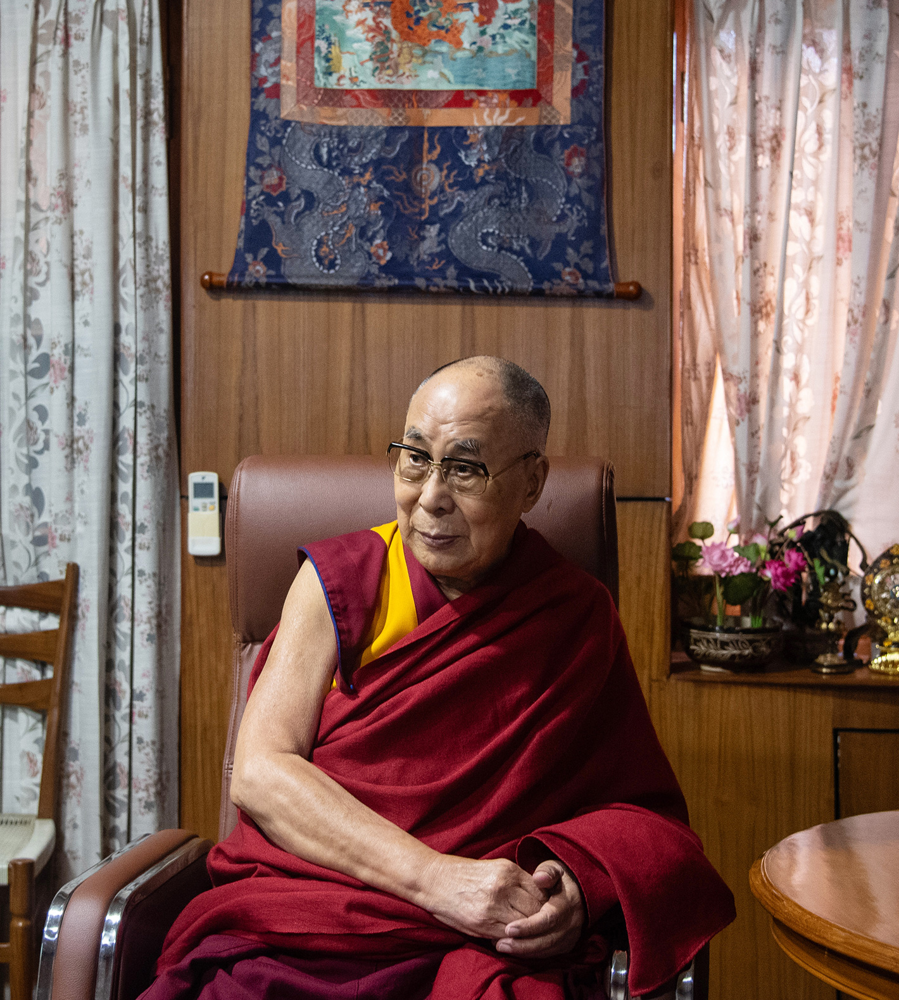
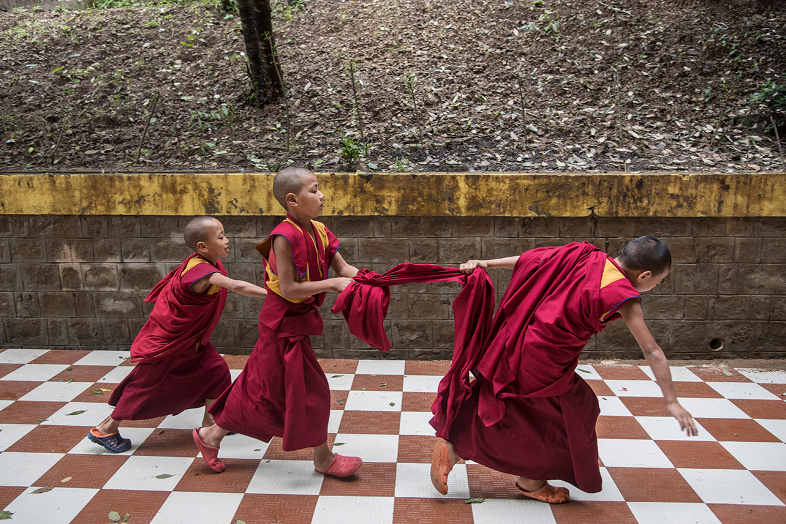
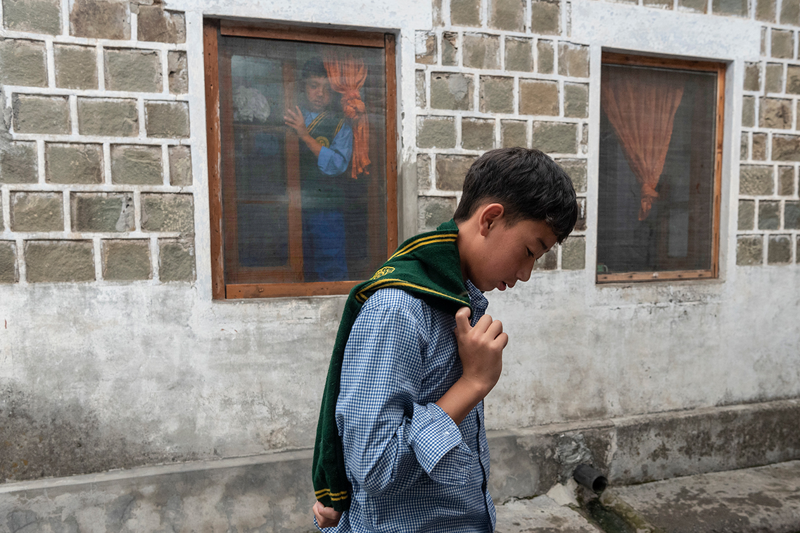

###### Tibet

# Who will succeed the Dalai Lama? 

##### As rival candidates are lined up, the Tibetan spiritual leader tells Brook Larmer what he really thinks of China 

 

> Jul 27th 2023 

The boy’s existence had been little more than a rumour. When he appeared during a ceremony in March on a small throne below the Dalai Lama, the ageing leader of Tibetan Buddhism, the monks and nuns in the audience didn’t seem to recognise him. The boy, about eight years old with short black hair, wore a copper-tinted robe with oversized cuffs covering his hands and – as if to add to the mystery – a white mask over his face.

Midway through the ceremony, held in Dharamsala, the north Indian refuge for Tibetan exiles, the Dalai Lama paused and gestured nonchalantly toward the boy: “We have the reincarnation of Khalkha Jetsun Dhampa Rinpoché of Mongolia with us today.” This was, in the world of Tibetan Buddhism, a mic-drop moment. The last Jetsun Dhampa – one of the religion’s most important figures – died in 2012. But the significance of the announcement was not only religious. The Dalai Lama had managed to outmanoeuvre China in .

Seven years ago, the Dalai Lama told a press conference in Mongolia that he was convinced Jetsun Dhampa’s reincarnation had been born in the country. “However, the boy is very young right now,” he said, “so there is no need for haste in making an announcement.” The Chinese government, which claims sole authority over all Tibetan Buddhist reincarnations, was incensed. It closed its main border crossing with Mongolia and delayed loan negotiations with the cash-strapped country.


Then there was silence. Under Chinese pressure, Mongolia, which along with Tibet is a centre of Tibetan Buddhism, banned the Dalai Lama from future visits. To stiffen the Mongolians’ resolve – and embolden the boy’s reluctant parents – the Dalai Lama sent in one of his most influential spiritual advisers: a monk named Thubten Ngodup. Thubten is the medium of the state oracle of Tibet, whose visions have guided the decisions of the Dalai Lama and his predecessors since the 16th century. He met in secret with the boy and his parents, offering reassurances and counselling patience. “The family was a little nervous, uncomfortable, but slowly, slowly, they came to accept their fate,” Thubten told me. “We still had to keep it secret because we didn’t want China coming up with their own fake Jetsun Dhampa.”

When the Dalai Lama introduced the boy in March, Tibetan Buddhists were thrilled at the audacity: not only had the Dalai Lama found the reincarnate lama beyond China’s grasp, he had managed to pull it off in secret. What’s more, the boy had been born in Florida, giving him the added protection of a passport from a government that has staunchly defended Tibet’s right to choose its spiritual leaders. With a single revelation, the Dalai Lama had created a possible template for an even more important reincarnation to come: his own.

Reincarnation might seem like an esoteric subject for 21st century geopolitics, especially for a secular state like the People’s Republic of China. But the Communist Party’s efforts to manage the transmigration of Buddhist souls are part of a contentious,  to absorb Tibet into China and control Tibetan Buddhism. In this existential contest, the reincarnations of the senior monks known as lamas have become a battleground for the future of Tibet. And no reincarnation is more consequential or volatile than that of the Dalai Lama himself. 


At 88 years old, the Dalai Lama is frail enough that three monks assist him – one on each arm, one girding his waist – as he shuffles across the grounds of his monastery in Dharamsala. For more than six decades, ever since he escaped across the Himalayas from invading Chinese forces in 1959, the Dalai Lama has sustained and unified his people, elevating their struggle into a global cause. China claims sovereignty over Tibet, and insists that its forces liberated Tibetans from poverty and slavery. In response, the Dalai Lama has single-handedly spread a counter-narrative of his homeland as non-violent, noble and unjustly oppressed. It is almost impossible for Tibetans – and the world – to imagine a Tibet without him. 

But the Dalai Lama is approaching his final years at a time when China has never seemed stronger – or Tibet more vulnerable. The 6m-7m Tibetans still inside Tibet live under increasingly harsh Chinese rule. Billions of dollars in Chinese investment have been accompanied by a systematic weakening of Tibetan religion and culture, along with tight restrictions on movement and communication. An estimated million Tibetan schoolchildren are now compelled to attend Chinese-language boarding schools away from their homes, raising fears that their own language will soon disappear. Meanwhile, the estimated 150,000 Tibetans in exile, scattered across the globe, are at risk of losing their identity and unity as another generation comes of age with no memory of their homeland. “Tibet is dying a slow death,” Penpa Tsering, the president of the government-in-exile in Dharamsala, told me. “China is slowly, slowly constricting us like a python.” 

 


 


 


 


Many Tibetans have tethered their hopes to the Dalai Lama. He is the 14th human incarnation of the first Dalai Lama, who was born in 1391 and considered the reincarnation of one of the most enlightened beings in Tibetan Buddhism, Avalokitesvara, the  of compassion. He has led his people through 15 American presidents and all 74 years of the People’s Republic. Through his reincarnated lineage, he connects Tibetans to the bedrock of their history. 

But what will happen when the Dalai Lama leaves this world? As a spiritual adept who wishes to continue helping others achieve enlightenment, the Dalai Lama is believed by Tibetan Buddhists to have the ability to choose the body into which his soul transmigrates. The Chinese government, however, has other ideas. Tibetans are now bracing for the emergence of two Dalai Lamas – one chosen by China, the other by the Dalai Lama or Tibetans close to him. Faced with this bizarre scenario, the Dalai Lama has been playful and elusive about his intentions. He has suggested, at various times, that the next Dalai Lama could be a girl, an adult or nobody at all. He might opt for an “emanation” – choosing someone while he is still alive – rather than a “reincarnation” after his death. The only certainties the Dalai Lama offers are that his successor will be born in a “free” country – not Tibet – and that he alone has the power to decide. “This is a religious matter,” he says. “As far as my own rebirth is concerned, the final authority is myself…obviously, not Chinese Communists!”


China’s attempts to justify its role in choosing the next Dalai Lama feel like an admission that six and a half decades of economic development and harsh repression have not won the loyalty of all Tibetans or shaken their devotion to their spiritual leader. For that, China seems to need a Dalai Lama of its own. And yet, its intervention in that process could produce more chaos than control. China will cajole other nations – and Tibetans themselves – to publicly recognise its state-approved selection, seeing this as the ultimate step in the long march to assimilate Tibet into China. But the Dalai Lama still has a reserve of moral legitimacy and international influence. America is already backing the Dalai Lama’s right to choose his own successor, even threatening to sanction Chinese officials who try to meddle in the process. 

In April I travelled to Dharamsala to meet the Dalai Lama and understand Tibet’s predicament. My first glimpse of him came outside the gates of the Namgyal monastery shortly before a service of public prayer for his long life. Helped out of a golf buggy by his attendant monks, the man famous for his mirthful expressions tightened his face into a rictus of concentration. For an instant, the Dalai Lama looked, like most people his age, distinctly mortal.


The moment passed, and the Dalai Lama’s face radiated with a childlike grin as he walked into the enormous crowd of well-wishers. He greeted the gathered pilgrims – Tibetans in traditional finery, monks in burgundy robes, foreigners in hiking gear – and made his way to the throne. There, the Dalai Lama gave his followers the kind of assurance that has nourished them over the decades. “Please pray from the depths of your hearts that I may have a long life, and I will pray, too,” he said in his deep baritone. “Apart from the trouble in my knees, my health is good. I am determined to live to be more than 100 years old.”

One evening in 1938, a group of monks disguised as servants arrived in a village in north-eastern Tibet, in what is now the Chinese province of Qinghai. The visitors were on a clandestine mission to find the reincarnation of the 13th Dalai Lama. Signs, including visions at a sacred lake and a rare fungus growing on the departed leader’s shrine, had led them to the home of a two-year-old boy called Lhamo Dhondup. The boy addressed the group’s leader by his Buddhist name, even though they had never met, and was fixated by the prayer beads in the leader’s hand. The rosary had once belonged to the late Dalai Lama, and the boy claimed it as his own, exclaiming “It’s mine, it’s mine.”

The boy was taken to the Tibetan capital of Lhasa, where the institution of the Dalai Lama had ruled politically and spiritually since 1642. When he was four, the boy – now with his Buddhist name, Tenzin Gyatso – was formally enthroned as the Dalai Lama. He spent most of his time behind the fortress walls of Potala Palace, where regents ruled in his stead and monks guided his studies of Buddhist scriptures. 

In late 1950 tens of thousands of Chinese troops swept into Tibet, and the boy, then 15, was vested with full political authority, a responsibility he was not expecting to assume for another five years. Over the next decade, he fought to preserve Tibetan culture and religion within the People’s Republic of China. In 1954, on an extended visit to Beijing, he met Chairman Mao Zedong, who told him that “religion is poison”. He also befriended a top official with a one-year-old son named Xi Jinping.

 


 


 


 


When the Chinese crushed a Tibetan uprising in 1959, killing thousands of protesters, the 23-year-old Dalai Lama fled on horseback. But the heartbreak of losing his country was accompanied by a feeling of liberation from his “golden cage”. No previous Dalai Lama, it is believed, had ever set foot outside the kingdom. “We in Tibet were isolated,” he told me in April. “They counted me as a demi-god on the throne. But I came to India and here, as a refugee, I can interact with people.” As one of his advisers told me: “He lost a nation and gained a world.”

Tens of thousands of Tibetan refugees followed the Dalai Lama, arriving in India with no skills and few prospects for employment beyond road construction and farming. During the Cultural Revolution, rampaging Red Guards completed the destruction of almost all of Tibet’s 6,000 monasteries, temples and shrines, sending another wave of refugees across the border. From exile, the Dalai Lama tried to forge a stronger, more inclusive Tibetan identity that united what had been a fractious collection of religious sects and regional loyalties. He set up cultural institutes, libraries, museums and monasteries. With his sister, he pioneered a network of schools that taught refugee children their common culture and language.

As a refugee lacking the trappings of state power, the Dalai Lama has still managed to gain global influence through some alchemy of karma, charisma and politics. On his first visit to America in 1979, the 44-year-old monk spent seven weeks charming audiences across the country with his playful sense of humour and stories of his mystical, troubled homeland. His biggest fans came from the American counterculture, which identified with his message of love, meditation and anti-materialism. 


In late 1989, just four months after the massacre around Tiananmen Square and seven months after Chinese troops violently suppressed protests in Lhasa, the Dalai Lama was awarded the Nobel peace prize. The Chinese government was livid. But the West’s fascination with him only deepened, with a spate of films including “Seven Years in Tibet” (starring Brad Pitt), public appearances with Richard Gere and Bono, and benefit concerts organised by the Beastie Boys. Invitations flooded in from presidents and Nobel laureates. In the wake of Tiananmen, the Dalai Lama emerged as the Chinese regime’s most identifiable opponent.

He is not, however, a firebrand. Often to the frustration of younger activists who agitate for full Tibetan independence, the Dalai Lama has long advocated the “middle way” of greater autonomy under China’s control. On trips abroad, he has spoken more about humanity’s need for compassion than China’s deepening repression. “You’ll never find another leader from a country that was taken, looted, who still pushes for negotiations, reconciliation,” says Geshe Lhakdor, a senior monk who served as the Dalai Lama’s translator for 16 years. “He is Beijing’s best opportunity. The next Dalai Lama might not be so forgiving.” The Chinese authorities don’t care. In their eyes, the Dalai Lama’s popularity at home and abroad has made him an enduring threat. 

By the 1990s the Chinese authorities banned prayers to the Dalai Lama, as well as the display of his image. Tens of thousands of monks and nuns in Tibet were forced to denounce him in public. The Chinese press regularly blasts him as a fraud, a traitor, a blasphemer, a separatist, “the source of all turmoil in Tibetan society”. The most extravagant denunciations label him a “jackal in monk’s clothing” with the “face of a human and the heart of a beast” – quite a description for the man who collaborated with Archbishop Desmond Tutu on a work called “The Book of Joy”. 


The name-calling has been accompanied by threats against any government that recognises the Dalai Lama as the representative of Tibet. As China has grown into a superpower, the state dinners and official receptions for the Dalai Lama have dwindled – few governments want to torpedo their economic relationship with China over a single meeting with a stateless monk. No British prime minister has met the Dalai Lama since 2012, no American president since 2016. 

In the meantime, the Dalai Lama has gradually relinquished his leadership of the government-in-exile. In 2011 he formally surrendered his political authority – marking the end of his institution’s 369 years in power – and pushed the exile community into the world of electoral democracy. The experiment, inspired by the raucous elections in his adopted land, was both a reflection of his belief in democratic governance and a shrewd tactical move. By renouncing his most controversial role as head of the government, he subverted any future political claim by a Chinese Dalai Lama. 

 


 


 


 


The transition to democracy, however, has been a bumpy one. After elections in 2021, a political stand-off paralysing the parliament was solved only after lawmakers appealed directly to the Dalai Lama himself. “His Holiness has pushed us to make Tibet a self-sustaining democracy,” said one Tibetan official. “He says it’s dangerous to rely on just one person. But the irony is that we still look to him to solve all our problems.”

In 2007 China’s State Administration for Religious Affairs issued a regulation called “Measures on the Management of the Reincarnation of Living Buddhas”. Drawing in part on a Qing dynasty decree of 1793, the document laid out 14 rules to formalise its control over all future reincarnations, including the Dalai Lama’s. Order Number Five, as the set of rules is known, maintains that only the Chinese government can grant the authority to search for and recognise reincarnate lamas, known as  or living Buddhas. It also requires state permission for a lama to reincarnate in the first place. Only when all the conditions of Order Number Five have been met will the government issue its seal of approval – a living Buddha permit.

Less than a decade after Order Number Five was introduced, the government’s list of state-approved  had grown to more than 1,300. These lamas filter into Tibetan monasteries already constrained by Chinese surveillance and control. In a region where universities didn’t exist before the 1980s, monasteries are the traditional centres of learning and activism. Since 2009 around 160 Tibetans, mostly Buddhist monks and nuns, have set themselves on fire in protest of Chinese rule. As the flames consumed them, many called for the Dalai Lama’s return to Tibet. Spooked by the self-immolations, in 2011 China sent official “work teams” to monitor every monastery and Tibetan village. They never left. Under their watch, the monasteries must display photos of Xi Jinping, the Chinese leader, raise the Chinese flag and subject monks to sessions studying Xi Jinping Thought.


China’s planning for the Dalai Lama’s succession is accelerating. A group of officials secretly convened in January to begin preparing the selection process, according to Robert Barnett, a scholar of Tibet. Over the past year, state media have revived interest in such arcana as the Golden Urn, an 18th-century relic of the Qing dynasty that China claims has historically been used to select high lamas. (The Dalai Lama himself says that his predecessors only pretended to use the golden urn to “humour” the Qing emperor.)

America has responded forcefully. In December 2020 Congress passed the Tibet Policy and Support Act, which stipulates that the succession of the Dalai Lama be left to Tibetan Buddhists without interference from the Chinese government. It is the first American law to address the process of Buddhist reincarnation. Uzra Zeya, America’s special co-ordinator for Tibetan issues, is trying to unite like-minded countries and organisations to reject China’s plan, though it’s not much of a coalition yet. So far, the list of countries speaking out publicly includes Canada, Britain, the Czech Republic, and Lithuania, in addition to a slew of non-governmental groups. Even so, America is turning up the heat. In December 2022 it imposed sanctions on two Chinese officials for human rights abuses in Tibet. 

While China publishes detailed plans, the Dalai Lama remains playfully elusive. According to tradition, the Dalai Lama has the authority to control his own reincarnation, but Tibetan methods for identifying a successor have never been standardised. They have always relied on a multitude of obscure signs – oracular visions or the orientation of a dead lama’s body. But the Dalai Lama’s shifting suggestions about who might succeed him seem designed to keep China off-balance. A few years ago, he even suggested that there might be no reincarnation at all, making him the last Dalai Lama. (A commission of Tibetan clerics quickly passed a resolution urging him to recant.)


The Dalai Lama has said that when he is around 90 years old, he will write down details of his reincarnation, which will be shared only with the monks involved in the search. There’s no telling the exact shape the process will take, or how long the wait might be. The Dalai Lama says that he had a dream that predicted he would live until 113. Even if he lives to that ripe age, the period between his death and the full readiness of his child successor could be dangerously unstable. In Tibetan Buddhism, reincarnated lamas have typically been born the year their predecessors die and are identified when they are toddlers, leaving a 15- to 20-year gap before they reach maturity. Tibetans worry that China will exploit that interregnum. 

To avoid that vulnerability, the Dalai Lama has raised the possibility of reincarnating as an adult – or of emanating while he is still alive. That successor would be tutored in secret before emerging after the Dalai Lama’s death. The fact that the young Jetsun Dhampa was hidden for seven years before being revealed even raises the tantalising possibility that the next Dalai Lama may already have been found.

 


 


 


 


The last time the Dalai Lama identified a reincarnated lama inside Tibet, 28 years ago, the six-year-old Panchen Lama was kidnapped and never heard from again. China replaced the boy with its own choice, now a 33-year-old man with all the pomp of a lama but few devoted followers in Tibet. He is expected to play a central role in finding and promoting China’s state-approved successor to the Dalai Lama. With the current Dalai Lama ruling out Tibet as a possible location for reincarnation – thanks, in part, to the Panchen Lama debacle – pilgrims from all over the world now travel to Dharamsala to implore him to reincarnate in their countries. “Just one soul, how can I divide?” he responds. 

Anywhere the Dalai Lama visits becomes the object of speculation: is this where his reincarnation will be found? He has not left India since 2018 owing to health concerns and the covid-19 pandemic. But this summer, like last year, he is taking an extended holiday in Ladakh, a region along India’s disputed northern border with China. Ladakh’s arid climate offers his lungs relief from the muggy monsoon season in Dharamsala, but it’s also a conflict zone. A skirmish in 2020 between Indian and Chinese troops left some 20 dead, and 50,000 troops are still massed on either side of the border. If the next Dalai Lama is discovered there, China would be outraged – and it could signal that India, which has maintained a studied silence on the question of Tibet, is ready to take a more confrontational stance.


An even more incendiary choice would be the disputed high-altitude town of Tawang, home to India’s largest Buddhist monastery and the birthplace of the sixth Dalai Lama in 1683. Indian and Chinese troops clashed near here as recently as December last year. The Dalai Lama provoked furious protests from China the last time he visited Tawang in 2017. Tensions will be high if, as expected, he visits the town later this year. 

Only two decades ago, more than 3,000 refugees from Tibet arrived annually in India. With help from America, the Tibetan government-in-exile built a large reception centre in Dharamsala to welcome them. By the time the building was finished, in 2012, only a few hundred Tibetan refugees a year were making the journey. China had blocked escape routes and confiscated passports. In the last four years just 33 Tibetans have made it to the reception centre. Tenzin Wangden, a 25-year-old farmer from eastern Tibet, is one of them: he trekked across the Himalayas in February. He told me that he was the first to leave his village in over a decade.

Tibetan families used to regularly send one of their children over the mountains to go to school in Dharamsala. Nearly all the notable Tibetan exiles are products of these schools, known as Tibetan Children’s Villages (TCVs). The TCV in Upper Dharamsala used to admit up to 700 new Tibetan pupils a year. In the past ten years not a single child has arrived directly from Tibet.


With so few new arrivals, the exile community has been starved of energy – and news from their homeland. Schools and monasteries in Dharamsala have made up some of the shortfall by recruiting students from surrounding Himalayan regions. At the TCV in Upper Dharamsala, I met kids from Bhutan, Nepal and Ladakh. One chubby first-grader had just arrived from Maine and didn’t speak a word of Tibetan. His parents – exiles – had dispatched him there for a year’s immersion in Tibetan culture.

The exodus of Tibetans from Dharamsala to the West, especially New York, is a further challenge for the exile community. This “second migration” started 30 years ago when America offered citizenship to 1,000 Tibetans, but has accelerated over the past decade. Tens of thousands of Tibetan exiles have now left, lured by greater opportunities. Wangden Kyab, a researcher at Tibet Watch, an advocacy group, worries that the dispersal is weakening the Tibetan cause: “If we are scattered across the world, it is like snow on the oceans.”

Before my trip to Dharamsala, I visited the Tibetan community centre in Queens, New York. A few hundred of the city’s 12,000 Tibetans – mostly second- or third-generation exiles – had turned out in their finest robes to celebrate the Tibetan New Year. Presiding over the service was a portrait of the Dalai Lama, propped up on stage and garlanded with flowers. As I descended the stairs into the basement, the chanting of monks gave way to the chatter of children emerging from three hours of Tibetan language classes. None of these children had ever been to Tibet. Few of their parents had either. Even so, they were deeply loyal to their spiritual leader. One girl told me that her family, like most, displayed a photo of the Dalai Lama on an altar in their living room. Each day, she and her brother refresh the water in seven traditional offering bowls. “It seems unreal that he would ever leave us,” she said.

 


 


 


 


Every year, on March 10th, Tibetan protesters march in New York, and elsewhere, to commemorate the Tibetan uprising in 1959. This year more than a thousand Tibetans congregated in midtown Manhattan, stopping traffic with a mile-long river of Tibetan flags, anti-Communist placards and posters of the Dalai Lama. Second-generation activists joined grey-haired former guerrillas who had been trained by the CIA in the 1960s. Most passionate of all were the students, primarily groups of young women.

As the demonstrators headed towards the Chinese consulate, a few marchers hung back, wary of being identified by the building’s cameras and face-recognition technology. It could hurt their chances of securing a rare visa to Tibet, or put their relatives there at risk of a visit from police. Any communication with Tibet is fraught: exiles tend to stick to a few short calls or texts with family each year, and people often use coded language. “It’s been stormy lately” could mean “the police have been harassing us”. “Aku Pema” (Uncle Pema) is code for the Dalai Lama, derived from a popular Tibetan song about an absent loved-one, but it has become so widely known that few dare to use it. 


Across from the consulate there was a makeshift stage. Tsering Yangchen, a 20-year-old Harvard student, stepped up to the microphone, a blue-and-red Tibetan flag around her neck. Like many young Tibetan activists, she had disdain for euphemism. “China, you have not liberated us,” she said. “You have chained us.” Tsering was taking a year off from college to work as an intern at Students for a Free Tibet, an organisation that campaigns for Tibetan political independence. Her generation of exiles was born into activism, she explained. For people like her, “Slogans such as ‘Free Tibet’ and ‘Long live the Dalai Lama’ were among the first words to escape our mouths.”

On my last day in Dharamsala, I went to meet the Dalai Lama at his residence on the hill above his monastery. Snow-capped Himalayan peaks shimmered in the distance and monkeys cavorted in the trees above. As he nears his tenth decade, the Dalai Lama devotes most of his time to prayer and meditation. His travel has been slowed down by a series of health scares, and these days his followers tend to come to him. After early-morning prayers, the Dalai Lama receives a couple of hundred visitors, or presides over long ceremonies in the monastery.

My visit happened to coincide with the Dalai Lama’s first public controversy in years. A few weeks earlier, he had been approached by an eight-year-old boy at a public prayer service. After the boy asked him for a hug, the Dalai Lama kissed him lightly on the lips before sticking out his tongue and asking: “Would you like to suck my tongue?” The video of the incident went viral. Commenters around the world jumped in with ugly epithets: predator, paedophile. The Chinese government, eager to humiliate its nemesis, ensured the film was aired widely, the first time the Dalai Lama had appeared on Chinese television in decades, though the clip may have reassured those in Tibet that their absent leader was still alive. Many Tibetans in exile were outraged at the smearing of their leader’s reputation. The Dalai Lama is well known for his teasing. Sticking your tongue out is a common greeting in Tibetan culture. When children have cleared their plates, Tibetan parents and grandparents often joke: “Want to eat my tongue?”


The news, however, had yet to reach either me or the Dalai Lama as we sat down in his residence. For the duration of our conversation he gripped my hand, and seemed more sanguine about the future than anybody else I had spoken to in Dharamsala.

He had no doubt that Tibetans – and the world – will recognise his “true” reincarnation and reject China’s “fake” selection. When I asked how he could remain optimistic given the dire state of affairs in Tibet, he raised his finger for emphasis. “We have truth; Chinese policy is based on lies,” he said. “In the long run, truth is more powerful than lies.”

The Dalai Lama’s singular achievement has been to hold together a Tibetan community riven by regional, doctrinal and political differences through force of personality alone. “When His Holiness passes away, it will create…a leadership vacuum that no one, no one can replace,” says Tenzin Tsundue, a poet and activist. The death of the Dalai Lama may empower more radical voices advocating for Tibetan independence, or even provoke another round of civil unrest inside Tibet. Though very few Tibetans will accept China’s reincarnation, a years- or even decades-long battle for legitimacy seems all but inevitable.

In Dharamsala, the Dalai Lama did not exude bitterness towards the Chinese government. Indeed, he seemed almost sympathetic. “I feel very much concerned about the Chinese invader,” he said. “Their mind is very narrow and much involved with anger, jealousy.” Then, as if to demonstrate the universality of Buddhist compassion, he added: “I always pray for them!”

That may sound like an empty gesture. But the Dalai Lama is quick to point out that Buddhism is flourishing inside China, as citizens seek to fill a moral and spiritual void. There are now , well over twice the number of Communist Party members. The Dalai Lama takes a long view not just of history but also of the future. During his lifetime, he may not be able to bring freedom to the Tibetans living under Chinese rule. But he believes that Buddhism, in his afterlife at least, will eventually free the minds of their repressive rulers – a mission that will have to be taken up by his reincarnations. “Politically, China controls Tibet,” he told me, flashing a smile, “but one day we will control China spiritually.” ■

 is a freelance journalist and author of “Operation Yao Ming”

Photographs: 

