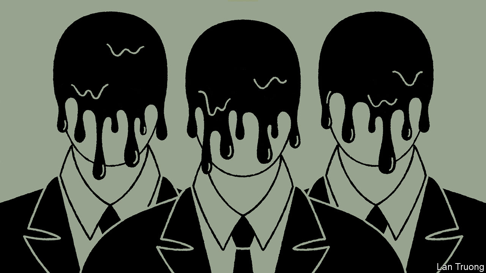

###### Banyan

# A slew of scandals puts Singapore’s government on the back foot 

##### Its response is to insist that the system is working as intended 

 

> Jul 27th 2023 

In power in Singapore since 1959, the People’s Action Party (PAP) has always demanded that its legitimacy be judged by its steady hand at the helm as well as by its spotless conduct. Yet uncomfortable disclosures in recent weeks have put it on the defensive. Singaporeans are dismayed at the party that has been in charge for even longer than the city state has been independent.

In mid-July the transport minister, S. Iswaran, was arrested along with a tycoon, Ong Beng Seng, who brought Formula One racing to Singapore. The Corrupt Practices Investigation Bureau (CPIB) is looking into the relationship between the two men.

Lee Hsien Loong, the prime minister, claims the arrests show that the system is working. After all, the government acted promptly—Mr Lee himself gave approval for the CPIB’s investigation. Questions remain, however, not least why Mr Iswaran’s arrest was only announced three days after it had taken place. Many Singaporeans think the explanation of “operational considerations” given by Lawrence Wong, the deputy prime minister and Mr Lee’s successor-in-waiting, is limp.

Much harder to defend are the circumstances surrounding the departure of Parliament’s speaker, Tan Chuan-Jin, once a PAP high-flyer. An innocent outsider might assume that his calling a member of the opposition Workers’ Party, Jamus Lim, a “fucking populist”, caught in Parliament on a hot mic, would be the clear reason for his going (Mr Lim was merely arguing that more should be done to help lower-income groups). Mr Tan later apologised for “unparliamentary” language. Yet, points out Ian Chong of the National University of Singapore, it apparently occurred to few PAP leaders to reflect on the flagrant partisanship in a supposedly impartial post.

In Mr Lee’s book the slur was the lesser sin. Worse, he said, Mr Tan was having an affair with a fellow married MP. Put aside the prime minister’s staggering claim that he had found time to give marriage counselling to the peccant couple. More troubling was his admission that he had accepted Mr Tan’s resignation as far back as February but asked the speaker to stay in place until he had sorted out succession arrangements for his constituency. Prolonging the tenure of a compromised speaker is surely putting party above country. Was the president informed? No one has said. Meanwhile, for the PAP, the mysterious leaking of a video which revealed that two prominent members of the opposition were also having an affair could not have come at a better time.

The government cites the Tan saga as further evidence that it keeps an eye out for wrongdoing and then acts on its findings. There is a Singaporean phrase for it: “Ownself check ownself”, a form of self-monitoring that has been raised almost to dogma by the PAP leadership. 

The process was also kicked into gear following the revelation that the home and law minister, K. Shanmugam, and the foreign minister, Vivian Balakrishnan, have been renting colonial-era homes on Ridout Road from the land authority that Mr Shanmugam himself oversees. Again, the CPIB was called in. It found no wrongdoing, or favours for either minister. A review by Singapore’s senior minister, Teo Chee Hean, also cleared them of any taint.

So why do Singaporeans resent the Ridout episode? Surely because, to turn the PAP’s words against it, public perception matters. Reporting to the prime minister, who appoints its head, the CPIB cannot be fully independent. The senior minister is both a friend of Mr Shanmugam’s and in the same branch of government. The case for an independent judge to be appointed to head such reviews is a strong one. Even if everything at Ridout Road is squeaky clean, the optics are appalling. Finding affordable housing is a big worry for cramped Singaporeans. Mr Shanmugam has a house and grounds the size of a shopping mall.

Another feature of the Singapore model follows from the party’s spotlessness and steady hand: with the grown-ups in charge, liberal democratic features such as a combative press and a vigorous civil society can be dispensed with. Nothing wrong with “ownself check ownself”. But if internal checks cannot ensure spotlessness and a steady hand, there is good reason to add external ones. That is a conclusion that the PAP, which is now playing whack-a-mole in going after what it says are false online comments on its various scandals in the press and online blogs, is a very long way from drawing.■


