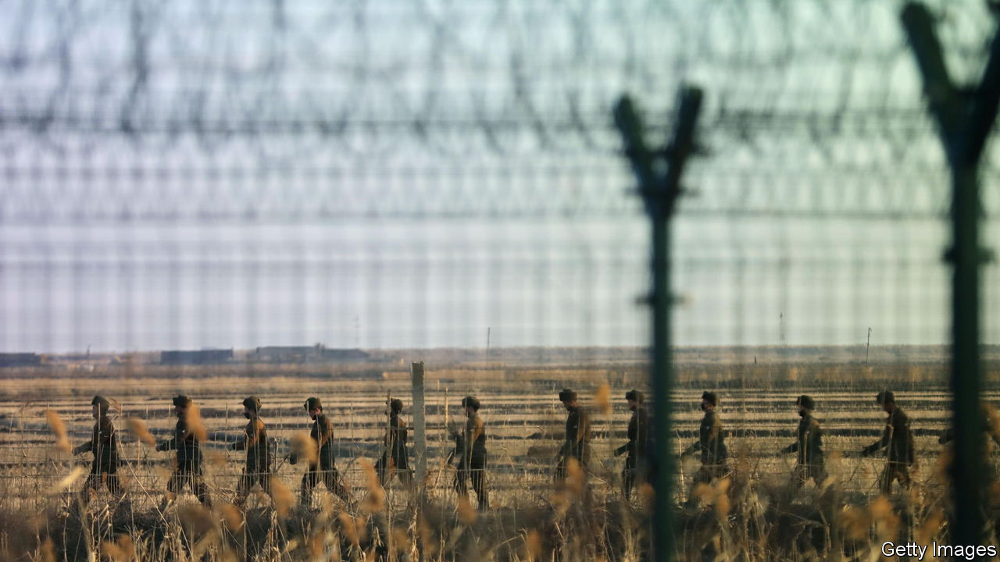

###### Unsplendid isolation

# Kim Jong Un has no desire to let his country rejoin the world 

##### Ongoing pandemic-era seclusion hurts North Koreans—but suits their dictator 

 

> Jul 24th 2023 

SECLUSION FROM the world has long been a guiding principle for the rulers of North Korea, a secretive hereditary dictatorship. Kim Jong Un, the current despot, took isolation to a new level during the covid-19 pandemic. The border with China was slammed shut, with the construction of a new border fence and shoot-to-kill orders against anyone attempting to cross. Travel to North Korea, already a niche pursuit at best, ceased completely. Foreign diplomats, aid workers and businesspeople left the country in droves. In contrast to other parts of the world, the shutdown continued after the pandemic. Until this week, the only people thought to have officially  in nearly three and a half years were the Chinese ambassador and a handful of his staff.

In recent weeks speculation has grown that seclusion may at last be easing. The rumours have been fuelled by Chinese customs statistics, satellite imagery and reports from the border that suggest a modest rise in trade between China and North Korea. On July 25th and 26th Chinese and Russian delegations travelled to North Korea for a military parade to mark the armistice that ended the Korean War.

Yet expectations that the regime has any serious plans for a wider opening are probably misguided. Being locked down and shut off from the world for years has been painful for ordinary North Koreans, many of whom depend on informal trade for their livelihoods. Mr Kim, by contrast, has thrived. Pandemic-era controls have allowed him to extend his power over party and people. They have also helped him advance the country’s nuclear programme far from the prying eyes of the world, distracted by the war in Ukraine and America’s tetchy relationship with China. He will probably attempt to hang on to some form of that control for as long as he can.

Germophobic and xenophobic, Mr Kim handled the pandemic with a paranoid vigilance. The new threat of the virus and the old one of perceived enemies, notably “imperialist” America and its “puppets” in South Korea, commingled. Kim Yo Jong, the dictator’s trusted sister, accused the South of spreading the virus via balloons released by local activists to carry anti-regime leaflets across the border. She threatened to respond “not only by exterminating the virus but also by wiping out the South Korean authorities”. 

Three and a half years after the pandemic began, there are few credible signs that this attitude has changed. True, the rest of the world seems impatient for the hermit kingdom to reopen. International aid agencies are preparing to send staff back to the country. In Japan a pro-North Korean newspaper is advertising tours. Much is made of reports that traders in Hyesan, one of three hubs for China-North Korea trade, are gearing up to handle higher goods volumes. Yet Mr Kim has given no official hint that these amount to much. 

Given past hyper-vigilance, the reticence is hardly surprising. Why should Mr Kim rush things? Jeongmin Kim of NK News, a leading website tracking North Korea, emphasises the disadvantages to the regime of having bothersome foreigners back. They snoop around where they can—ready, among other things, to point to the threadbare state of the economy.

Indeed, ordinary North Koreans have been the main victims of pandemic controls. The border closure and domestic covid-era edicts put an end to much of the informal trading that was a lifeline to millions. There are reports of street vendors and pullers of delivery carts being summarily apprehended and sent to the gulag. The number of malnourished people has risen by some 10% compared with the early days of the pandemic, reckons the UN’s World Food Programme. 

Yet the welfare of his people is a secondary concern for the leader. Control ranks higher, points out Aidan Foster-Carter, another Korea-watcher. The pandemic-era emergency has given Mr Kim cover to expand control over all aspects of life in the country. He has continued to streamline party organisation, and has forced the powerful army to defer more to the party. Backtracking on market liberalisation, he has recentralised prices and steered more food distribution into state-run shops.

Mr Kim’s expansion of control is making North Korea more alarming for the world. For whatever meagre surpluses can be squeezed from the economy flow into boosting the dictator’s nuclear programme, a family obsession for three generations. Profits from the armed forces’ many money-making activities can be appropriated for the same purpose. Mr Kim also controls the revenues from the state’s criminal activities, including cyber-theft, which American officials say may fund as much as half the weapons programme.

The North’s arsenal has increased in size and grown more diverse. New kit has been tried out, and missile launches now also test for operational readiness. Reputable estimates of the nuclear stockpile range from enough for 20 up to 116 weapons and growing. Last year the regime tested a record number of missiles. On July 12th it launched a second test of the Hwasong-18, its first solid-fuel missile capable of reaching America. Yet the launch barely registered in many Western capitals. Between Ukraine and China, America and its allies have bigger problems.

North Korea has not detonated a nuclear device since 2017. If it conducts its seventh nuclear test soon, that may indicate that Mr Kim’s boffins have achieved their long-desired miniaturisation of a nuclear warhead to fit on a missile. He would then boast both strategic and tactical (that is, useful on the battlefield) nuclear weapons, as well as the means for a first- and second-strike capability against America and South Korea. Ankit Panda of the Carnegie Endowment for International Peace in Washington, DC, says that this undermines the credibility of the allies’ claim that any use of nukes by the North would lead to the annihilation of the regime. In time, that might tempt Mr Kim to use his weapons.

There are worryingly few checks left on him. China and Russia used to join UN sanctions against North Korea. But since it loudly supported Russia’s invasion of Ukraine last year, they have had Mr Kim’s back. Both countries now block fresh resolutions against North Korea at the UN. They undoubtedly help Mr Kim evade the existing sanctions.

America and its allies are hardly more of a roadblock. Yoon Suk-yeol, the hawkish president of South Korea,  in engaging with the North. Meanwhile President Joe Biden’s insistence that any American engagement must involve the North putting its nukes on the table is, for Mr Kim, a non-starter. Better to wait to see if Donald Trump, whom Mr Kim charmed at their meeting in Singapore in 2018, returns to the White House.

At some point, North Korea may feel the need to engage again with the world. For now, Mr Kim can sit back. Among the few known knowns about his activities, gleaned from satellite imagery, is that he has extended his seaside resort on the east coast, and has been spending time drifting about on his luxury yachts. ■

