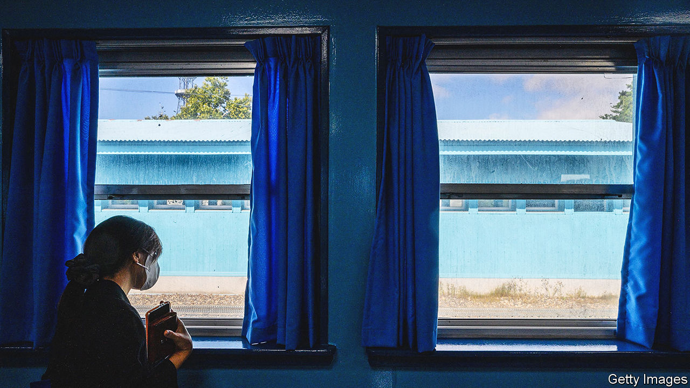

###### A little less conversation

# South Korea has given up on talking to the North 

##### The conservative government prefers emphasising its military superiority 

 

> Jul 27th 2023 

THE AUTUMN of 2018 was a heady time on the Korean peninsula. Meetings earlier that year between Moon Jae-in, then South Korea’s president, and Kim Jong Un, North Korea’s dictator, had buoyed hopes for peace between the two Koreas and prosperity in the North. So had a bromance-laden encounter between Mr Kim and Donald Trump, America’s president, in Singapore. 

Coffee shops in Seoul drew pictures of Mr Kim into their milk foam as South Koreans queued around the block for Pyongyang-style cold noodles. In September 2018 Mr Moon, standing next to Mr Kim, addressed a crowd of 150,000 North Koreans in a stadium in the North’s capital, something no other South Korean president had done before. He promised “to mend the broken blood ties of our people”. 

How times change. The talks which Mr Moon’s enthusiasm helped facilitate broke down a few months later with nothing to show for them in terms of either peace or prosperity. When covid-19 struck, Mr Kim  and concentrated on developing weapons. Yoon Suk-yeol, who succeeded Mr Moon as president in 2022, has little truck with mending blood ties. Apparently keen to match the North’s bellicose rhetoric, he claims that “only overwhelming force on our part will bring true peace.” 

Mr Yoon has matched his tough talk with shows of military readiness. South Korea and America conducted their largest-ever live-fire exercises in May and have held several rounds of trilateral missile-defence exercises with Japan (Mr Moon had scaled down drills). After publicly musing about South Korea getting its own nuclear weapons, Mr Yoon persuaded President Joe Biden to set up a forum to discuss how the Americans would use theirs in the event of war on the peninsula. A visit from an American nuclear-capable submarine, the first in over 40 years, accompanied the group’s inaugural meeting. The North Korean regime protested that the sub’s presence might justify using its own nuclear weapons and expressed its rage with a volley of (conventional) missiles into the sea.

At home, Mr Yoon’s hard-nosed stance is making itself felt most strongly in the shake-up of an institution whose job it is to look after all things to do with North Korea: the optimistically named Ministry of Unification (MOU). Set up in 1969 by Park Chung-hee, the South’s strongman ruler, the ministry facilitates inter-Korean co-operation during times of detente but also gathers information about North Korea, monitors human-rights abuses and helps refugees from the North. 

Given the contradictory nature of its tasks—being reminded of their crimes tends to make North Korea’s leaders less co-operative—the ministry’s focus depends on the vagaries of politics. Mr Moon had its officials establish a de facto embassy in the North (which Mr Kim blew up a few months later) and devise schemes to connect the two countries by road and rail. Human-rights monitoring fell by the wayside. An annual report on North Korea’s atrocious treatment of its citizens that the ministry was legally required to produce was classified for fear of upsetting Mr Kim.

Mr Yoon has said the ministry will no longer act as “a support department for North Korea” and appointed Kim Yung-ho, a conservative scholar, to lead it. At his confirmation hearing on July 19th the (South Korean) Mr Kim, who served as a human-rights envoy under two previous conservative governments, cut a mainstream, if hawkish, figure. Yet he has said in the past that “the path to unification opens up when the Kim Jong Un regime is overthrown” and that the dialogue-based approach taken for the past 25 years had been a “scam”. Should the North ever seek to return to the table, he seems unlikely to recommend taking up any offer of talks.

Tough talk on North Korea’s regime tends to come with a sharper focus by the MOU on the human rights of ordinary North Koreans. There are some signs that it has begun paying more attention. In March it published the report Mr Moon’s administration would not. But even as the ministry has appeared keener to support human-rights groups, little has changed in practice, says Sokeel Park of Liberty in North Korea, an NGO.

For now, the South’s reticence is matched by the North’s insouciance. Yet Mr Yoon’s attempts to keep up with the North’s bellicosity make for an uneasy equilibrium. Talking will not persuade the North to abandon its nuclear weapons. But it may eventually become necessary to dissuade it from using them. ■

