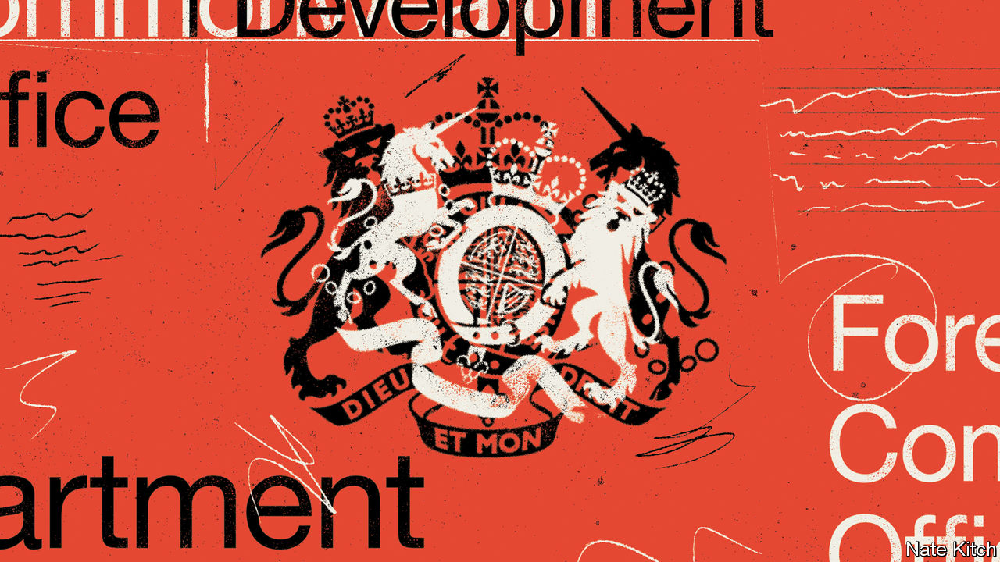
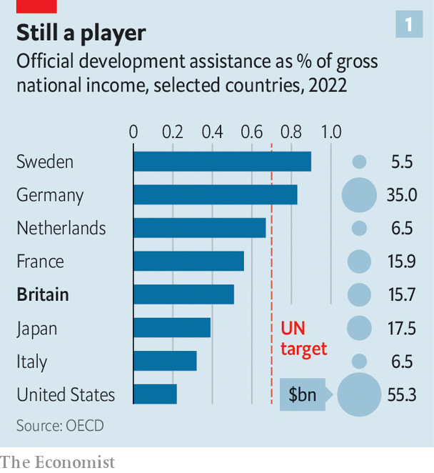
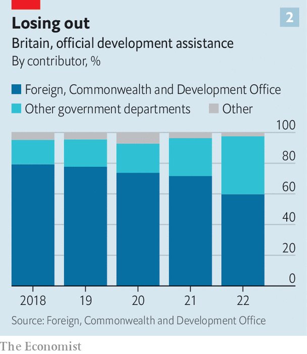

###### Foreign policy

# Britain has blown its reputation as a world-leader in aid 

##### Blame a botched merger of its aid and diplomatic corps, lower spending, and more secrecy 

 

> Jul 27th 2023 

MERGERS ALMOST always go wrong. Investors, rightly, worry when a corporate one is announced. Combining two organisations, their differing goals, incompatible IT systems and management structures, at best causes headaches. It always proves expensive. Cultures clash. People get distracted. According to the , 70-90% of mergers and acquisitions (M&amp;A) deals fail. The only surprise is that the figure isn’t higher. 

The prospects were thus never great for a tie-up between the Foreign &amp; Commonwealth Office (FCO) and the Department for International Development (DfID), which got under way in 2020. On one side was the diplomatic service, with lots of staff and an annual budget of some £2.4bn ($3.1bn). On the other was DfID, with fewer staff but a budget roughly four times bigger. Cultures differed starkly. As one former official noted, the choice of footwear said it all: hard-nosed diplomats showed up to meetings in smart office shoes; the bleeding hearts in sandals or trainers. 

The success, or not, of the expanded Foreign, Commonwealth and Development Office (FCDO) has taken on totemic significance as Britain seeks a global role post-Brexit. To some, like Simon McDonald, who led the diplomatic service until 2020, it will let a fading power speak with one voice abroad. In his vision, other agencies, such as the Department for International Trade, could one day be wrapped in. To others, the deal was a hostile takeover by right-wingers bent on gutting the development corps. Awkwardly, Andrew Mitchell, who was brought in last year as the minister for development and Africa, had been in the second camp: he had previously called the merger a “self-inflicted act of vandalism”. 

Three years on, which side has been proved right? The success of an M&amp;A deal is judged mostly on whether the two groups are doing their work better after the tie-up than before. On this score the FCDO has been struggling. 

 


Britain remains a big spender on the needy: it set aside $15.7bn, or 0.5% of gross national income (GNI) for doing so in 2022 and thus ranks as a donor behind America, France, Germany and Japan, but still ahead of other countries (see chart). Public opinion about that spending is split. Labour voters generally back it; the right wing of the Conservative Party, egged on by tabloids, loathes such do-goodery, associating it with waste, wokeism and handouts for corrupt African leaders.

Some Conservatives favour aid. It was a Tory government, in 2015, that signed up to spend 0.7% of GNI on it. Then Boris Johnson, as prime minister, squeezed it. As foreign secretary between 2016 and 2018, he had lamented how often DfID overshadowed its aristocratic older brother. He was most peeved on one trip to an African country, when its leader denied him an audience, only to learn that a DfID director had been granted one a week before. 

Nonetheless, Mr Johnson’s decision to merge diplomacy and aid was fair. Others, including Australia, Canada and Norway, have all tried doing so (albeit with mixed success). But his handling of the merger was badly botched. He announced it during the covid-19 pandemic without consulting cabinet. He did not wait for publication of the “integrated review” of foreign policy, security, defence and international development, which he had previously billed as the biggest rethink of Britain’s global stance since the cold war. He also seemed to confirm fears that this was a populist attack on aid, describing DfID as a “giant cashpoint in the sky” that dished out taxpayers’ money without care for domestic interests.

Months later the government then reneged on the 0.7% promise, abruptly cutting the budget to 0.5% of GNI, at least until public finances improved. Other departments, which have a long history of trying to grab aid spending, have meanwhile grown more adept at doing so. The share of the aid budget controlled by DfID had already dropped from 86% in 2014 to 73% in 2019. Today, less than 60% of aid is spent by the FCDO. Most striking, a large portion is siphoned off by the Home Office to pay bills at hotels in Britain that house asylum-seekers from Afghanistan, Ukraine and beyond. These huge domestic costs for refugees jumped to £3.7bn last year, almost 30% of the total aid budget. 

Many people in Whitehall think the merger was bungled. The FCDO is not working better today than before. It is tough to measure its foreign-policy achievements, not least because Ukraine absorbs so much attention. But the muddled merger adds to the perception that Britain’s foreign policy in the wake of Brexit has seen barriers thrown up against the world. 

For those who consider that aid buys influence abroad, the sharp cut in spending means Britain carries noticeably less weight. For Sir John Vereker, who led aid efforts when international development split from the FCO in 1997, DfID became “by common consent one of the strongest pieces of British soft power”, with a recognised brand and highly qualified staff. That argument has weakened.

 


It is easier to gauge the merger’s shortcomings in terms of British aid’s effectiveness. Less aid is getting to the poorest places than before (partly because of Ukraine). The share of British aid that goes to specific regions in Africa slipped to 44% in 2022 from around 50% in 2019. 

Nor is Britain, as it once was, a model on aid transparency. Unlike DfID, the FCDO seems loth to let outsiders evaluate its work. Publish What You Fund, a non-profit group that ranks donors’ openness, for years put DfID in its top spot. Under the FCDO Britain is tumbling down the rankings. Sarah Champion, chair of the international development committee in Parliament, says the FCDO has repeatedly presented “dodgy information”. Requests for data, like a breakdown of what money goes to helping women and girls, have been unanswered. Ironically, too, the abrupt aid cuts led to the sort of frittering of funds the Tory right was so keen to stem, after the FCDO had to stop funding projects midway, often wasting what was already spent. 

The merger has been costly. A project devoted to integrating the departments is expected to cost more than £40m, a new IT and human-resources system over £100m. Staff morale has dipped. Just over one in ten employees leave the FCDO every year, a relatively low churn rate for the civil service. But it has been hard to recruit top talent. By last December the government had still not filled 200 development jobs, once considered to be plum posts. In a survey of staff engagement, last year, the FCDO scored below average across Whitehall—and lower than the FCO or DfID did before the merger. “Change can be uncomfortable,” a spokesperson from the department says. “As with any merger, there will have been people from both departments who were worried.”

The department says a turnaround may, however, be under way. Development aid is inching back up the agenda at the FCDO. Mr Mitchell, a dynamic former head of DfID, has a seat in cabinet and on the National Security Council. He is working on a white paper for British aid. The Independent Commission for Aid Impact, which monitors Britain’s foreign aid, says the FCDO is being more co-operative. In an annual report published in July the FCDO said spending on bilateral aid will rise in the next financial year. Africa will get more. 

Meanwhile the Labour Party is mulling a more dramatic overhaul if it wins office. Sir Keir Starmer, its leader, pledged last year to undo the merger but has more recently hinted at other options, such as keeping aid under the Foreign Office but in a free-standing agency. That would in effect be back to its status before 1997, when DfID was set up. Undoing the merger would cause another round of headaches, costs and confusion. Better, then, to work on saving a troubled marriage. ■


