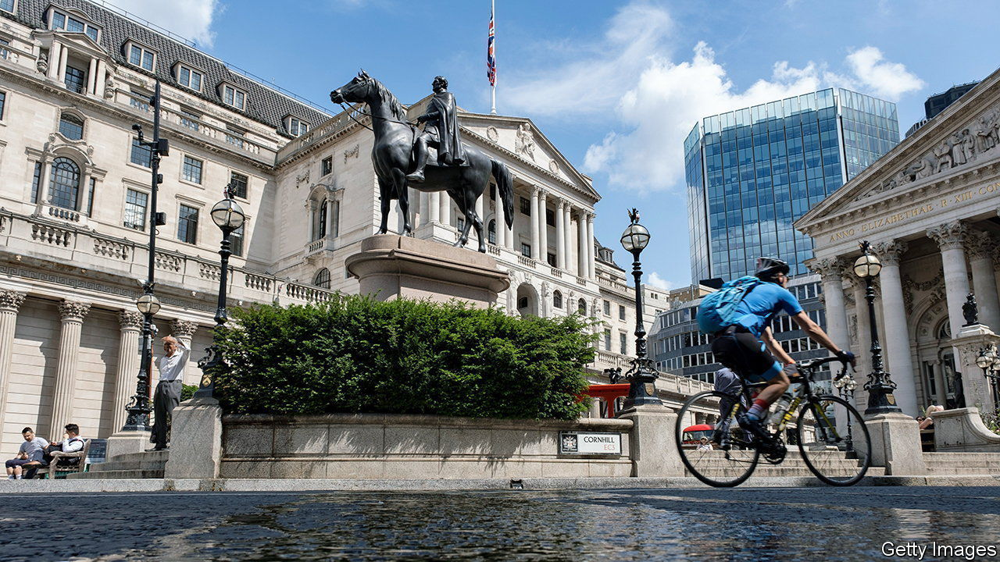
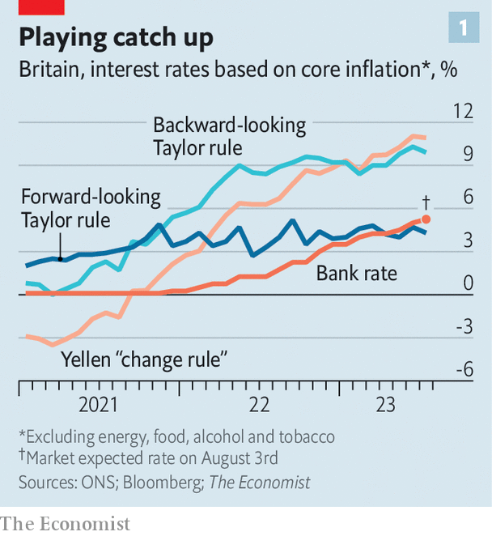
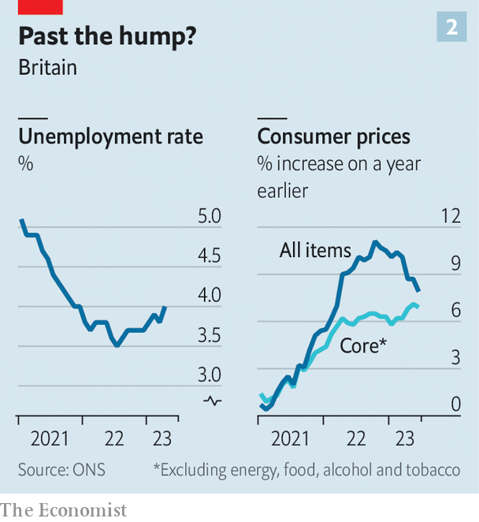

###### Bank of England

# How high should Britain’s interest rates go? 

##### Rules of thumb suggest rates are still too low. Forecasters disagree 

 

> Jul 27th 2023 

RATE-SETTERS at the Bank of England had an easy job in the 18th century. For more than 100 years, from 1719 to 1821, the central bank’s policy rate was left undisturbed, at 5%. In June their rather more active successors set interest rates at the same point after 13 successive increases, designed to fight annual inflation which peaked at over 11% in October. The job is not yet done. Investors expect that on August 3rd the bank will again raise rates, to 5.25%, and will lift them by another half a percentage point by Christmas.

Not long after, the tightening will end, according to many forecasters. Optimism has grown since annual inflation was calculated to be 7.9% in June, lower than expectations. Yet economists’ predictions have a poor recent record. In November the bank itself criticised as too hawkish market expectations that rates would peak merely around 5%. And, alarmingly, simple rules of thumb suggests the bank could still be well behind the curve.

 


The textbook formula for setting interest rates is a “Taylor rule”, named for John Taylor of Stanford University. It has three inputs: the gap between current inflation and the target; how much slack is in the economy; and, last, the so-called neutral rate of interest, at which the central bank is neither stimulating the economy nor dampening it. Plug plausible assumptions for the British economy into the Taylor rule and it spits out the eye-watering recommendation of interest rates of 11.4%, up at levels last seen in 1992 when the bank was desperately trying to defend the pound against a run. Such high rates might guarantee the end of inflation but they would also doom the government and, indeed, much of the economy. 

Most central bankers would take such a result as proof that the algorithm is broken. What, then, is the Taylor rule missing? Start with inflation. Britain’s high headline rate partly reflects the effect of international food and energy prices, over which the bank has little control. But use core inflation, which excludes food and energy, and the Taylor rule still suggests raising interest rates to a punishing 9.9%. 

Ben Bernanke, a former chair of America’s Federal Reserve, once drew an analogy between monetary policy and a golfer trying to play with an unfamiliar club: taking huge swings risks dramatically overshooting or undershooting the hole. Instead, the wise golfer would gradually tap her way forwards and learn how her tool works. The central banker should do the same. Yet even an “inertial” Taylor rule, designed to avoid big swings in interest rates—and still using core inflation—would suggest the bank has been a laggard and should immediately raise rates to 6%. 

Part of the problem, as the bank’s chief economist, Huw Pill, has noted, is that no one truly knows how the economy works. Rules that rely on conceptually shaky concepts of the neutral interest rate or the true potential output of the economy can lead policymakers astray. The 0.5% neutral real rate of interest and 4% equilibrium unemployment rate that your correspondent has assumed reflect received wisdom but have not been scientifically calculated. 

Janet Yellen, current American treasury secretary and another former Fed chair, once suggested a monetary-policy rule that would not rely on estimates of a neutral rate of interest at all. Instead it would make small changes based only on observable data. It works like gradually adding spice to a dish, tasting it and adding more only as needed. Applied in Britain today, however, Ms Yellen’s rule comes to a similar conclusion as the Taylor one does: rates should rise to 10.9%. 

 


The only way to get the bank off the hook is to alter the exercise more fundamentally. Most Taylor rules are backward-looking. Yet it can take over a year for the effects of monetary policy to feed into the economy. The sophisticated central banker is supposed to “target the forecast” for inflation, rather than reacting too zealously to what has already happened. Otherwise, he might neglect inflationary or disinflationary pressures that are starting to build but do not yet appear in the data. 

A forward-looking policy rule would therefore rely on inflation forecasts. Financial markets expect the inflation rate in two years’ time to have fallen to around 3%. Inflation expectations themselves depend on predicted monetary policy. But set aside the circularity and plug the figure into a Taylor rule and it suggests the bank is in danger of raising rates too high: the recommended interest rate is only 4.3%. That helps to explain the dissents of doveish policymakers at the bank who have opposed recent rate increases. 

The trouble is that inflation forecasting has gone haywire of late. In July 2022 the average forecaster surveyed by the Treasury expected inflation to fall to 3.6% by the end of 2023; today the expected figure is 4.9%. In May the bank said it had begun to pay less attention to its own model of the economy owing to its unreliability. The less confidence you have in economists’ assurances that the inflation problem will soon dissipate, the trickier it is to set aside the fact that the hard data say monetary policy is still too loose. ■


