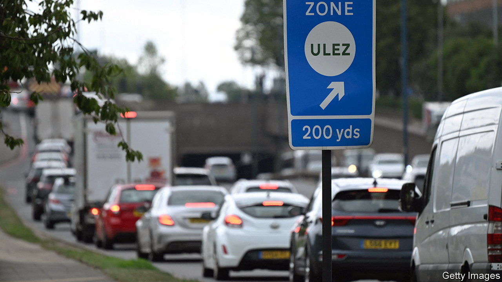
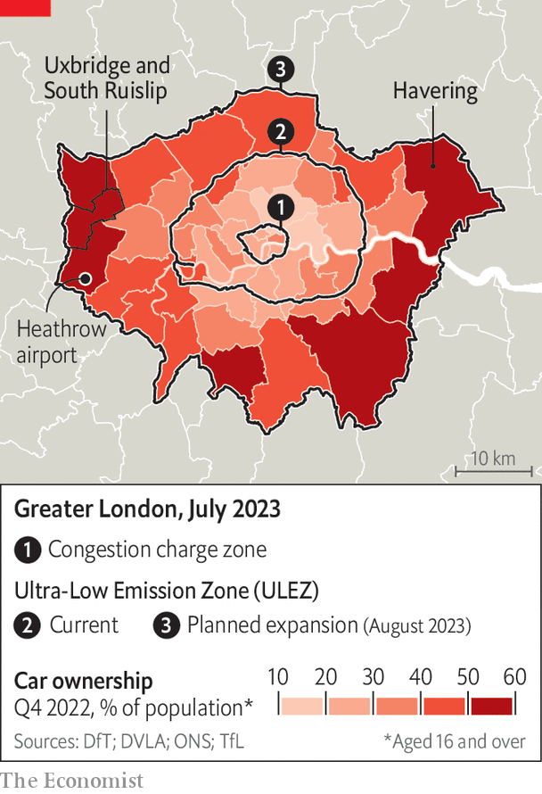

###### The politics of ULEZ

# London’s latest effort to clear bad air is contested but necessary 

##### Despite the backlash, expect other cities to copy the ULEZ scheme 

 

> Jul 25th 2023 

AS UXBRIDGE GREW in the 1930s, one of its attractions to those moving from central London was abundant space. The suburban town lured commuters with the promise of semi-detached houses and room to park a motor car. George Orwell, who lived in Uxbridge in 1933, thought he had glimpsed a future England “along the arterial roads”, where life centred around “the , the radio and the internal combustion engine.”

Orwell was right: the car’s dominance in Uxbridge, and suburbs like it, is entrenched. But doubts exist over another attraction—the chance for residents to escape the city’s smog. For the air is not clean. On August 29th a scheme championed by Sadiq Khan, London’s mayor, will tackle this by expanding a scheme known as the ultra-low emission zone (ULEZ) to the city’s outer boroughs. The initiative obliges drivers of the most polluting vehicles inside the zone to pay £12.50 ($16) a day. On July 21st the voters of Uxbridge and South Ruislip narrowly stuck with the ruling Conservatives in a by-election. That outcome was seen by many as a rebuke to Mr Khan, a Labour man, and ULEZ.

In two other by-elections held on the same day, the Conservatives were mauled. In Selby and Ainsty (in North Yorkshire) they lost to Labour on a swing of nearly 24 points; in Somerton and Frome (in Somerset) to the Liberal Democrats on a 29-point swing. Such swings, if repeated nationally, would see the Conservatives turfed from national office. Labour has not won in Uxbridge for 50 years. Yet the election postmortems have focused on whether it should ditch some of its green policies. 

Mr Khan’s plan creates the world’s biggest (and an especially strict) clean-air zone. ulez, which snares petrol cars and vans over 19 years old and diesel ones over eight, will triple in size, and cover almost 9m residents. Milan’s “Area B” is the other notable clean-air zone in Europe, says Lucy Sadler of Urban Access Regulations, which analyses policies. ULEZ will be around seven times bigger. 

London, though hardly as suffocated as Delhi or Beijing, is badly polluted. Cancer, asthma and lung disease associated with high concentrations of nitrogen oxide and small particulates kill an estimated 4,000 Londoners every year, according to a study from Imperial College in 2021. Air remains dirtiest near the city centre, which has most congestion, but the suburbs are also affected. Most deaths occur in outer London, where more people live and toxicity is falling only slowly. Those most at risk—children, the elderly, those with lung problems—tend not to be drivers. 

Yet it is not just London that will have to act. By law cities across Europe, including Britain, must show they are trying to meet European Union air-quality standards adopted in 2008 (and since transposed into British law). In 2018 the High Court ruled against the government because 33 towns and cities had unsafe air and no plans for cleaning it. The government ordered them to act. Many will roll out, or expand, clean-air zones. 

 


London has been in the vanguard. Learning from Singapore and Oslo, it introduced a congestion charge 20 years ago (see map). In 2008 it added a low-emission zone, targeting lorries. As mayor, Boris Johnson announced the original ULEZ, which arrived in 2019 and grew in 2021. That programme has helped cut the concentration of nitrogen oxide in central London by over a quarter. Along with crackdowns on idling vehicles at school gates, these policies are popular—at least in inner London, which has extensive public transport and fewer car-owners. 

Elsewhere, clean-air schemes face a bumpier ride. Manchester slammed the brakes on plans for a clean-air zone this year, following furious opposition. Similar plans in Bristol and Birmingham were greeted by concerted non-payment campaigns. (In June the French government delayed plans to expand clean-air zones in 43 towns and cities, including Paris.)

Uxbridge is particularly unforgiving territory for Mr Khan and Labour. Cut in two by the A40 and skirted by the M25, it is more car-dependent than anywhere in Greater London bar Havering. Access to public transport is poor. Many residents commute by car to nearby towns or Heathrow airport (which locals grumble is the real polluter of concern). Driving is “the only way I can work,” says Sharon Jones, a cleaner. Almost 80% of households own a vehicle, in line with the national average but far above the share in central London. 

Mr Khan insists ULEZ will affect only one-tenth of vehicles on outer London’s roads (opponents are disputing that figure in court). The local council has argued that the figure for Uxbridge is much higher. It is likely that some voters wrongly believed they would have to pay. Meanwhile, those forced to switch vehicles have suffered because of a rush to sell before the August deadline: resale prices for non-compliant vehicles have plunged. 

The mayor can’t do much about that. He lacks funds to compensate losers from ULEZ, though some argue it could have been more cleverly designed. It is not expected to raise revenues, given the implementation costs. Nor will the national government expand a £110m scheme that pays owners of old cars to scrap them. Meanwhile the mayor’s new innovation, a “Superloop” bus route connecting points of outer London, looks pitifully inadequate. 

Recriminations over the Uxbridge result within Labour have been rapid. Sir Keir Starmer, the party leader, has used it to warn against complacency in the next general election. He told a policy forum this week that the party is doing something wrong when its policies appear on “every Tory leaflet”. Labour must abandon policies that annoy suburban voters, he said.

Yet the greater risk is probably for the Conservatives. Some in that party saw the Uxbridge result as a repudiation of green policies in general. They may now target a national policy on replacing gas boilers, as voters start worrying about the costs of that. But Britons are overwhelmingly concerned about the climate. They can see the world is burning; some literally from their sunloungers. 

Mr Khan is unlikely to delay the ULEZ roll-out, though he could do a better job of explaining exactly who will be affected. But London’s mayor is an unusual politician in Britain—one who does not rely on the votes of many motorists to keep his job. He is likelier, therefore, to drive ahead as planned. ■


