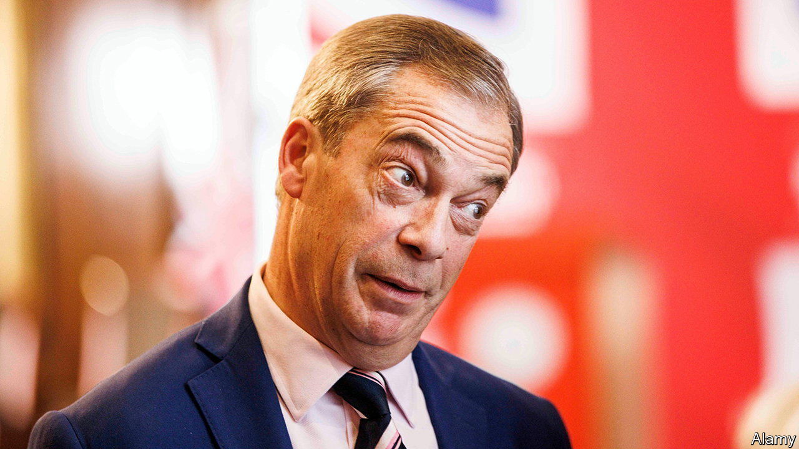

###### Britain’s banks and political risk

# Nigel Farage, NatWest and a political storm 

##### Britain’s government puts down a marker on free speech and business 

 

> Jul 26th 2023 

NIGEL FARAGE, the front man of the Brexit campaign, has sown havoc in another British institution. Mr Farage had claimed he was the victim of “blatant corporate prejudice” after Coutts, a bank whose clients include the royal family, dropped him. The government agreed. Early on July 26th Dame Alison Rose, the chief executive of NatWest, Coutts’s parent group and one of Britain’s biggest lenders, resigned over her mishandling of the affair. The state remains NatWest’s largest shareholder. At a time when businesses appear ready to dump clients at the first whiff of controversy, ministers have laid down a marker. 

Banks have been under increasing regulatory pressure to vet “politically exposed persons” for money-laundering risks. In 2012 Coutts was whacked with a £8.8m ($11.3m) fine for lax due diligence. Since the beginning of the war in Ukraine, businesses with links to Russia are under more scrutiny. But an internal Coutts risk report obtained by Mr Farage concluded that there was no sign of dodgy cash flows. 

Rather, it said, he had been “below commercial criteria for some time” (clients need £1m in investments or borrowing from the bank, or £3m in savings with it). Moreover, it assessed Mr Farage as a reputational risk: his perceived sympathy for Vladimir Putin and Donald Trump, and his views on climate change, immigration, human rights and women amounted to “commentary and behaviours that do not align to the bank’s purpose and values”. Coutts has embraced Pride and Black History Month in pursuit of “trailblazers and pioneers, disrupters and challengers”, meaning the new rich. Beery Mr Farage—whose “default, ambient reputation”, the report said, was of a “disingenuous grifter”—did not fit the luxury brand. 

As for Dame Alison, she admitted to a “serious error of judgment” in being the source of a BBC story that stated, incorrectly, that Mr Farage was dropped purely on commercial grounds. It was an apparent breach of the first rule of banking: do not gossip about clients. She quit after Downing Street and the Treasury made plain their disquiet. (She had been a friend of the government, taking on reviews into energy efficiency and women entrepreneurs.) On the same day Andrew Griffith, the City minister, called in bosses of retail banks for a lecture on their clients’ right to free expression. Proposed reforms will give dumped clients longer notice periods and more transparency. There is a trade-off between the prerogative of businesses to guard their reputations by choosing their clients with care, and that of people to enter politics without repercussions. Ministers have decisively sided with the latter. ■


