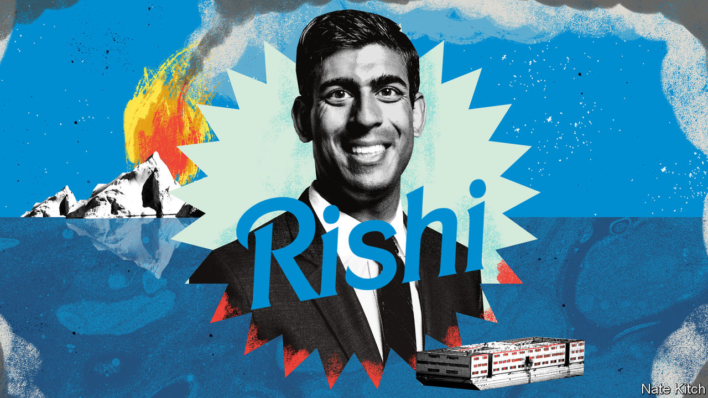

###### Bagehot

# No, really. Rishi Sunak is a right-winger 

##### The prime minister is the most right-wing Conservative leader of his generation 

 

> Jul 27th 2023 

Followers of Rishi Sunak on social media are treated to high politics and low culture. In one post, the prime minister accused Labour of being on the same side as “criminal gangs” who profit from smuggling people across the Channel into Britain. In another, a beaming Mr Sunak posed with his young family mulling whether to see “Barbie”, the pinktastic film about the doll, or “Oppenheimer”, a biopic about the godfather of the atom bomb. “Barbie first it is,” posted the unapologetically lowbrow politician. 

Mr Sunak’s perky and nerdy demeanour covers an overlooked fact: he is comfortably the most right-wing Conservative prime minister since Margaret Thatcher. Taking a hard position on asylum-seekers is just the beginning. On everything from social issues, devolution and the environment to Brexit and the economy, Mr Sunak is to the right of the recent Tory occupants of 10 Downing Street. Yet neither voters nor his colleagues seem to have noticed. 

Critics dismiss Mr Sunak’s hardline position on small boats crossing the Channel as focus group-led posturing. Mr Sunak has made stemming the flow of people across those waters one of the main goals of his government. The prime minister has curtailed the right of asylum for people who arrive in small boats. A barge for 500 asylum-seekers is docked in Dorset waiting for its human cargo. Mr Sunak wants to solve the crisis in the most aggressive and prominent way. If it is all for show, it is a needlessly expensive blockbuster. There is a simpler explanation for Mr Sunak’s approach: he believes in it. 

Where recent Conservative prime ministers dragged the party towards liberalism, Mr Sunak is resolutely traditionalist. David Cameron, prime minister from 2010 until 2016, backed gay marriage against the wishes of a majority of his MPs. Theresa May’s government tried to let trans people “self-ID”, so people could change gender without a medical or lengthy bureaucratic process. Those days are gone. When the Scottish National Party introduced similar rules, Mr Sunak’s government blocked them, upsetting 25 years of constitutional norms. On trans rights, Mr Sunak has picked a fight. “I know what a woman is,” says Mr Sunak. It would be an easy topic to skirt, yet the prime minister runs at it. 

Each recent Conservative prime minister has boasted of their environmentalism. David Cameron extolled his green credentials to the point of mockery, even riding a sledge within the Arctic Circle. Mrs May made “net zero” law in one of the most consequential, but least commented upon, achievements of her government. Mr Sunak’s government is a reluctant follower, keeping the same goal but grudgingly. The prime minister is “simply uninterested” in the environment, wrote Zac Goldsmith, a former minister, in a resignation letter. He is right. Any environmental obligation that stands between Mr Sunak and re-election will be ditched.

Critics within the party moan that Mr Sunak is a closet leftie: a man who was too quick to spend money when he was chancellor during the pandemic and is too slow to cut taxes now that he is prime minister. Such largesse was out of necessity, rather than choice. By instinct, Mr Sunak is the most fiscally conservative leader since Mr Cameron. Mrs May was comfortable with a larger state as was Boris Johnson, Mr Sunak’s predecessor from 2019 to 2022. By contrast, Mr Sunak winces at the idea. Mr Sunak’s idol is Nigel Lawson, Thatcher’s chancellor, who cut taxes only once it could be afforded. Mr Sunak is attempting the same path. Yet economic thinking in the Tory party has become so confused that fiscal hawkishness is painted as proto-socialist. 


When it comes to Brexit, now a religious question for the Conservatives rather than a policy one, Mr Sunak was always a believer. The prime minister churned out articles for his school newspaper about the perils of a European superstate. This marks him out among former prime ministers. Mr Cameron opposed Brexit. Mrs May grinned and bore it. Mr Johnson supported it out of cynicism rather than conviction. Ms Truss learned to love it for similar reasons. Mr Sunak is alone among his peers in thinking that it was always and remains a fundamentally good idea. 

Mr Sunak’s credentials as a right-winger are close to immaculate. Yet few see him this way. Partly this is a matter of age. Other prime ministers who came to power in their early 40s, such as Sir Tony Blair and Mr Cameron, tried to drag the country in a liberal direction. Mr Sunak has no such plans. Race plays a role, too. Bizarrely, given that the Conservative cabinet is filled with ethnic minorities, there is still an assumption that non-white Britons are left-leaning liberals. It is an increasingly wrong one. 

Right on

Ultimately, Mr Sunak’s strange reputation is due to the scrambling of British politics after 2016, which mangled the old left-right axis. Mr Sunak’s most decisive act was to bring down Mr Johnson. If Mr Johnson was Brexit incarnate, then his assassin must be a Remainer stooge. Right-wing Brexiters flocked to the Remain-supporting Ms Truss, who was loyal to Mr Johnson, in the leadership contest last summer; Mr Sunak relied on a rump of more liberal Tory MPs. Nor was this delusion isolated to Conservatives. After the unprofessionalism of Mr Johnson and the chaos of Ms Truss, centrists welcomed the rise of the diligent Mr Sunak, mistaking competence for liberalism. They assumed he was one of their own based on his age, manner and background rather than his views. Many of them still do. 

It is this ideological dissonance that creates the danger for Mr Sunak. He is left channelling another former prime minister who had to persuade his party his views were genuine. In 2001, after New Labour had secured re-election, one party wallah asked Sir Tony if he would ditch his rightward drift. Sir Tony replied: “It’s worse than you think. I really do believe in it.” Mr Sunak is right-wing out of conviction, rather than convenience—even if few others believe it.■


