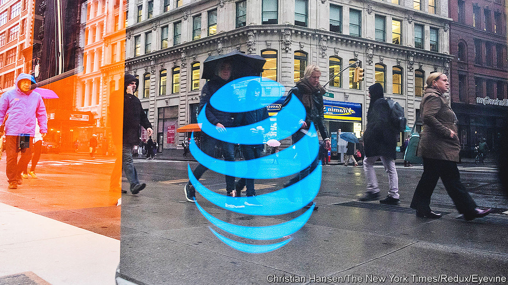

###### Immobile

# Can AT&T and Verizon escape managed decline? 

##### America’s telecoms incumbents are in a funk 

 

> Jul 27th 2023 

IN THE EARLY 1980s AT&amp;T Corporation, then America’s telecoms monopoly, was the darling of Wall Street. As big tech of the day, it was the mightiest company in the S&amp;P 500, accounting for 5.5% of the blue-chip index’s total market value. Today its largest descendants, AT&amp;T and Verizon, can only dream of their parent’s former glory. The two companies make up less than 0.7% of the index—and falling. Their combined market capitalisation of $250bn is roughly half what it was at the start of 2020; the S&amp;P 500 is up by more than two-fifths since then (see chart). 

 


Factors beyond the undynamic duo’s control, such as rising interest rates or the recent discovery of a network of old lead-sheathed telephone cables, which injected uncertainty over their potential liability for the toxic assets, are partly to blame. Yet much of AT&amp;T’s and Verizon’s malaise is of their own making. The two telecoms incumbents are finding just how difficult it is to be a mature firm in a saturated market, especially if you also have a mountain of debt to manage. 

Their core business of selling mobile and broadband subscriptions is stagnating. On July 25th Verizon said that these revenues grew by less than 1% in the second quarter, year on year. The next day AT&amp;T announced that its equivalent figure rose by just 2.4%. What has long been a cosy industry is turning more competitive. A merger in 2020 between T-Mobile and Sprint created a 5G powerhouse that is offering equally fast mobile connections at lower prices. And on July 26th DISH Network, a satellite-TV firm, unveiled a partnership with one of today’s tech titans, Amazon, to provide mobile services for $25 a month to members of Amazon’s Prime loyalty scheme.

Previous big bets have backfired. AT&amp;T’s disastrous $200bn foray into media, including the purchase of Time Warner and DirecTV, has been unwound. But its effects on morale and on the balance-sheet, weighed down by net debt of more than $130bn, continue to be felt. Verizon has been less spendthrift, though it still splurged $53bn in 2021 on 5G spectrum—an investment which was deemed necessary at the time to compete with T-Mobile but which has yet to produce a return, as early hype over 5G has dissipated. Its effort to build a wholesale business, by allowing cable providers such as Comcast and Charter to piggyback on its networks, created new competitors, which are offering bundles of internet and TV at a steep discount.

That leaves the two incumbents with few options. One is to protect margins. Both Verizon and AT&amp;T are touting their premium plans. On July 24th Verizon raised the price of its wireless home broadband by $10, to $35 a month. Both companies are also cutting costs, including by shutting down retail outlets, which helped each trim operating expenses by 2.5% in the first half of 2023, year on year. 

A more radical move would be to follow some European peers, such as TIM in Italy, and spin off their fixed networks. This would raise capital, lower fixed costs and allow management to focus on faster-growing segments such as wireless broadband. Such a deal would, though, be at odds with the industry’s trend towards convergence, whereby cable companies are becoming more like telecom providers, and vice versa, in a battle for consumers. Offering both home and mobile connections, especially in a bundle, makes consumers stickier, reduces churn and increases long-term profitability. That at least is the thinking. To investors, it seems increasingly wishful. ■


