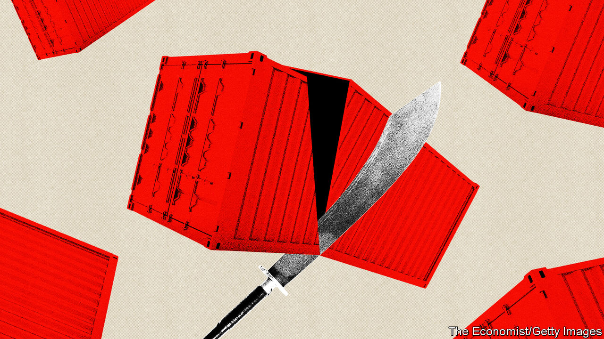
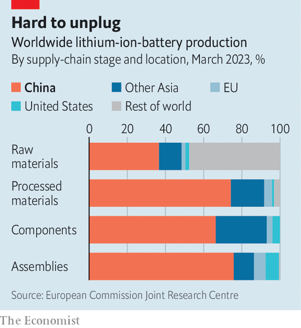

###### The dragon shows its claws

# China hits back against Western sanctions 

##### The Communist Party is becoming less timid in its retaliation against American economic warfare 

 

> Jul 23rd 2023 

IN 2019, AS China’s trade war with America was heating up, the  predicted that the  on rare earths, minerals crucial to the production of most modern hardware, would become a tool to counter American pressure. “Don’t say we didn’t warn you,” the Communist Party mouthpiece thundered. For years the bluster was just that. Between 2009 and 2020 the number of Chinese export controls on the books ballooned nine-fold, according to the OECD, a club of mostly rich countries. Yet these restrictions were haphazard, informal and aimed at narrow targets—random warning shots rather than a strategic offensive.

As America ratchets up its , which among other things make it impossible for Western chip companies to sell Chinese customers cutting-edge semiconductors and the machines to make them, new volleys from Beijing are coming thick and fast. Earlier this month, after China announced its latest export controls, this time on a pair of metals used in chips and other advanced tech, a former commerce-ministry official declared that the measures were “just the beginning” of Chinese retaliation. On July 20th Xie Feng, China’s new ambassador to America, said that his country “cannot remain silent” in the escalating war over technology. A response, he hinted, was coming.

This time it looks much more deliberate. To counter America’s effort to contain China’s technological ambitions, Xi Jinping, China’s paramount leader, has called on regulators to fight back against Western coercion in what he has called an “international legal struggle”. The result is a flurry of lawmaking that is creating a framework for a more robust Chinese reaction to America’s commercial warfare.

The list of  is long. An “unreliable entities” list, created in 2020, punishes any company undermining China’s interests. An export-control law from the same year created a legal basis for an export-licensing regime. In 2021 an anti-sanctions law enabled retaliation against organisations and individuals who carried out the sanctions of other countries. A sweeping foreign-relations law enacted this year, and prompted by Western sanctions against Russia over its invasion of Ukraine, permits countermeasures against a wide range of economic and national-security threats facing the country. It came into effect on July 1st. The same day an anti-espionage statute came into force, extending the reach of Chinese security agencies. All the while, China has tightened various data and cyber-security rules.

The new rules are already being deployed, as opposed to merely brandished. In February Lockheed Martin and a unit of Raytheon, two American armsmakers with non-defence businesses in China, were placed on the unreliable-entities list after shipping weapons to Taiwan (which China regards as part of its territory). The companies are blocked from making new investments in China and from trade activity, among other restrictions. In April , an American chipmaker, was hit with an investigation by China’s cyberspace regulator, based on a new cyber-security law. After Micron failed a security review, Chinese authorities banned its semiconductors from critical infrastructure. 

The laws’ vague wording makes it hard for Western companies to assess any potential impact on their business in China. The “mother of all sanctions laws”, as Henry Gao of Singapore Management University describes the foreign-relations act, hazily vows to hold accountable anyone acting in a manner that is deemed “detrimental to China’s national interests…in the course of engaging in international exchanges”. Several foreign law firms in China have been asked by their Western clients to evaluate the risks of being investigated. One lawyer looking into potential Chinese cyber-probes notes that American tech companies producing commodified hardware components, such as Micron’s memory chips, should be on guard for sudden investigations. 

 


China’s new laws allowing the government to restrict a broad range of minerals and components, meanwhile, are injecting similar uncertainty into the businesses of their foreign buyers. One affected group, notes David Oxley of Capital Economics, a research firm, is Western manufacturers of green-energy technologies. Battery-makers, in particular, are highly dependent on China across the supply chain (see chart). Last year the commerce ministry proposed a ban on exports of ingot-casting technology used in making solar-panel wafers. If imposed, such a prohibition could hold back the development of indigenous solar-power technology in the West, which would hurt Western manufacturers, simultaneously increasing foreign demand for finished Chinese solar panels. 

Post-silicon volley

The restrictions on the , gallium and germanium, could cause a strategic headache for America. The rules, which come into force on August 1st, require exporters to apply for licences to sell the metals to foreign customers. China produces 98% of the world’s raw gallium, a key ingredient in advanced military technology. This includes America’s next-generation missile-defence and radar systems. A shock to the supply of gallium could create long-term problems for the American defence industry, reckons CSIS, a think-tank in Washington. Moreover, a gallium-based compound, gallium nitride, may one day underpin a new generation of high-performance semiconductors. Keeping the material out of foreign hands would stymie Western efforts to develop the technology, while furthering Mr Xi’s goal for China to control it. 

China needs to tread carefully. The country reimports many of the finished products that are manufactured abroad using rare earths, points out Peter Arkell of the Global Mining Association of China, a lobby group, so prohibitions could come back to bite Chinese companies. Outright export bans would also prompt the West to build its own relevant production capacity and seek substitutes, observes Ewa Manthey of ING, a Dutch bank. This would in the longer term weaken China’s hand. And labelling big Western firms with large Chinese operations as unreliable entities could jeopardise thousands of Chinese jobs. That may explain why rather than blacklisting all of Raytheon, whose aviation subsidiary, Pratt &amp; Whitney, employs 2,000 people in China, the commerce ministry limited its ban to the American company’s defence unit.

So far the relatively pragmatic ministries of commerce and foreign affairs have led the implementation of the various laws. One concern among Western businesses is that more hardline agencies supplant them. If the tech war escalates further, China’s National Security Commission, chaired by Mr Xi himself, may take the lead, fears Mr Gao. If that happens, concerns about potential blowback for Chinese commerce are likely to . The consequences are scary to contemplate—and not just for Chinese and American CEOs. ■


