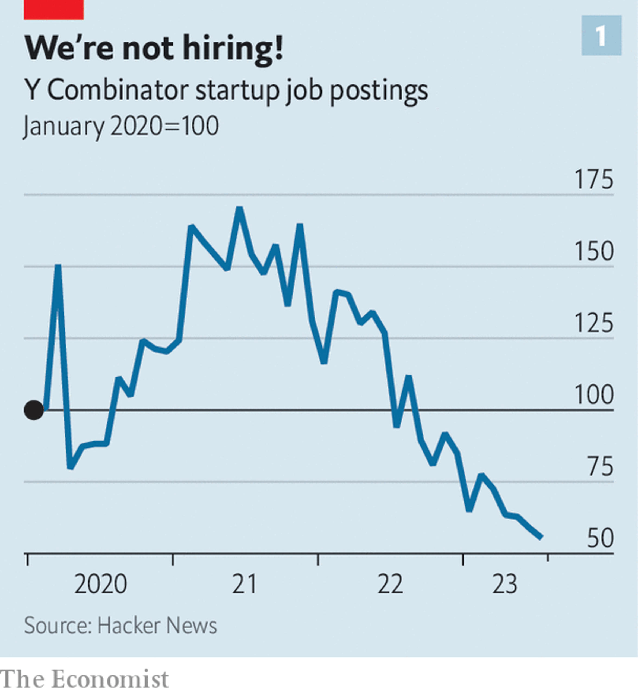
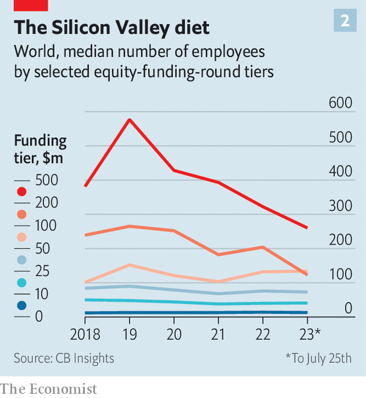

###### Lean innovation

# Next-generation Googles run a tighter ship 

##### Like their big-tech role models, startups embrace efficiency 

 

> Jul 25th 2023 

MARK ZUCKERBERG dubbed 2023 Meta’s “year of efficiency”, corporate-speak for admitting that his social-media empire was bloated. Since November Meta has cut 21,000 jobs, or about a quarter of its workforce. Bosses of its fellow tech titans have also embraced the efficiency mantra. Alphabet, Amazon and Microsoft have collectively shed more than 50,000 jobs since October. Despite an uptick in ad sales, talk of “re-engineering the cost base” and the like still featured in big tech’s quarterly-earnings calls this week. The bloodletting (in plain English) is not limited to the giants. According to layoffs.fyi, a sackings-tracker, nearly 900 tech firms around the world have announced  of more than 220,000 in 2023.

The slump has hit younger firms hardest. Rising interest rates make their promise of rich profits far in the future look less juicy today. As a consequence, . Globally, venture-capital investment in the first half of this year was $144bn, down from $293bn in the same period in 2022. Those that find investors are seeing their valuations squeezed. According to Carta, an equity platform for startups, in the first quarter of 2023 almost a fifth of all venture deals were “down rounds”, where firms raise money at a lower valuation than before. That of Stripe, a fintech star, fell from $95bn to $50bn after its latest funding round in March.

 


This is forcing aspiring Alphabets and Metas to follow their role models and ditch the habits acquired in the era of easy money. Efficiency is the talk of Silicon Valley. Firms accustomed to spending with abandon to win market share find themselves in the unfamiliar position of having to trim fat. And there is plenty of fat to trim. 

 


A good place to start is payroll. Battle-hardened founders gripe that salaries are young firms’ biggest expense. In July startup job postings on Hacker News, a site for coders, were down by 40% compared with a year ago. The average startup is already looking leaner. Numbers from CB Insights, a data provider, show that the median number of employees at young firms is declining. In 2018 the typical firm that raised a round of $10m-25m had some 50 employees. In 2023 a similar one employs 41. It is the same story for larger startups, all the way to late-stage ones raising up to $500m per round (see chart). 

In the go-go years firms hired lots of people who did not have that much to do. Not any more. Most startups, points out Tom Tunguz, a venture capitalist, can run with smaller teams, with a negligible impact on revenues. Tech firms are, naturally, embracing artificial intelligence (AI). An AI “co-pilot” on GitHub, a Microsoft-owned platform for open-source programs, improves coders’ productivity by 30%. And it is not just the geeks who benefit. Other employees use AI-based tools, from chatbots like ChatGPT that churn out emails for marketers to clever software that improves sales efficiency. One founder of an early-stage startup with fewer than ten employees estimates that AI has already boosted his company’s productivity by 30-40%. 

The austere spirit is visible even among one of the few categories of startup that is unaffected by investors’ newfound stinginess: those which develop all the sought-after AI tools. Anthropic, a firm founded by defectors from OpenAI, which created ChatGPT, has secured $1.2bn with 160 employees. Adept, a company started by former employees of DeepMind, an AI lab owned by Alphabet, has raised $415m with 37 employees. Compare that with darlings of the previous startup boom. , a Swedish payments company that experienced wild growth a few years ago, had 2,700 employees by the time it notched up $1.2bn. Databricks, a database-maker, had a staff of 1,700 at a similar stage. ■


