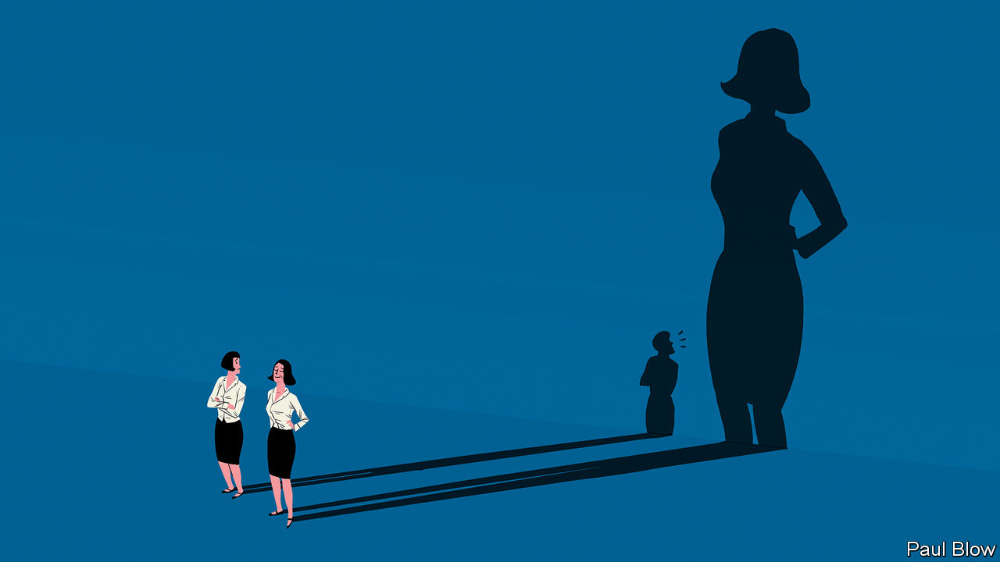

###### Bartleby

# The dark and bright sides of power 

##### Bosses cannot afford to be oblivious to the effects of authority 

 

> Jul 27th 2023 

Power is a fact of corporate life. It also affects behaviour. Research suggests power makes people less likely to take the advice of others, even if those others are experts in their fields. It makes them more likely to gratify their physical needs. In a test conducted by Ana Guinote of University College London, powerful people were likelier than less powerful folk to choose tempting food, like chocolate, and ignore worthier snacks like radishes. In conversations, the powerful are bewitched by themselves: they rate their own stories as more inspiring than interlocutors’. 

They struggle to see things from the perspective of others. In one famous experiment, some people were asked to recall a time they held power over someone else and others a time when another person was in a more powerful position than them; both groups were then asked to draw a capital “E” on their own foreheads. Subjects primed to think of themselves as powerful were three times more likely to draw the “E” as though they were looking at it themselves, making it appear backwards to anyone else. 

Power even makes people think they are taller. In another experiment, those coaxed to think of themselves as powerful were more likely to overestimate their own height relative to a pole, and to pick a loftier avatar to represent them in a game, than less potent counterparts. 

Cause and effect are hard to unravel here: the dominant types who snaffle the chocolate and leave the radishes may also be more likely to climb the ladder. But possessing power seems itself to put a thumb on the scales, towards more entitled and self-serving behaviour.

Power also affects those lower down the pecking order. In a study published in 2016, Christopher Oveis of the University of California, San Diego, and his co-authors looked at how status affects laughter. The researchers recorded members of a fraternity house in an American university, some new joiners and some old hands, teasing each other. Higher-status participants laughed more loudly and with less inhibition than lower-status ones—primates, not mates. 

Power is out of sync with the times. High-performing teams depend on collaboration and candour, not cringing and compliance. Humility is increasingly prized as an attribute of senior executives. In hiring processes some interviewers will look for use of the word “I” rather than “we” as a small marker of how egocentric people really are. 

Entire industries are feted for the way they try to counteract the effects of power. The aviation industry is celebrated for a training technique called “crew resource management” that is designed to encourage a less hierarchical set of interactions in the cockpit. Similar kinds of thinking are visible in other workplaces that have especially clear chains of command, from the army to hospitals. 

Still, power can also get a bad press. Hierarchies emerge organically, and with good reason: precious little gets done when everyone is in charge. Research published this year by Ozgecan Kocak of Emory University and her colleagues found that flatter organisations are likelier to spend too much time exploring options than ones where someone is clearly in charge. It doesn’t particularly matter if the boss knows what they are talking about; the mere fact that authority is being wielded means a team converges more quickly on a decision. 

Power is an instrument for achieving noble ends as well as selfish ones: it is no use having brilliant ideas without the means to put them into practice. One of the most popular classes at Stanford Graduate School of Business is a refreshingly functional one called “Paths to Power”. It is taught by Jeffrey Pfeffer, a charming man who preaches the value of rule-breaking, displays of anger, “strategic misrepresentation” (ie, lying) and many other countercultural qualities in order to get to the top. 

You don’t have to believe that to appreciate the importance of power. Companies like the idea of humility and teamwork but they are also feudal structures that depend on ambition, impatience and gallons of unwarranted self-confidence. The best managers are well aware of how their own power sends ripples across the organisation. They take care not to signal their opinions too early in meetings; they admit when they don’t know the answer to something. But they also know when to stop consulting and start commanding. Up to a certain point, saying “I don’t know” sends a signal of low-ego inclusivity; beyond it, it is just a signal of not knowing. ■


