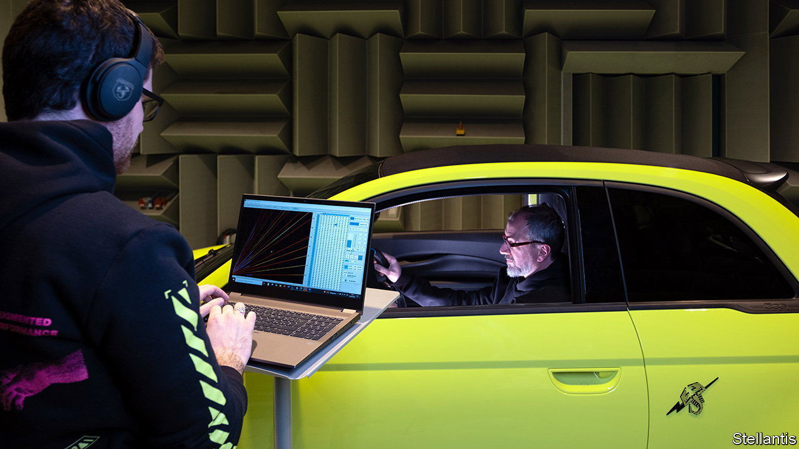

###### Orchestral manoeuvres

# Why your new EV is making funny noises 

##### Car firms offer a new set of sounds to motorists 

 

> Jul 27th 2023 

MOTORING’S SOUNDTRACK use to be generated by the petrol engine and car radio. Near-silent battery power and snazzy infotainment systems have provided an aural void—and a high-tech way to fill it. Carmakers are giving their electric vehicles’ occupants, and anyone within earshot, an alternative set of sounds to enliven the journey.

One trend is to replace the roar of a petrol engine with the roar of a petrol engine. Artificial-noise generation offers a flavour of the past in the cars of the future. Many evs can blast passengers with fake engine noises just as the engine sound of cars has long been tweaked and tuned in sportier models to sound more raucous in the cabin than on the road. Some new models can now inflict that cacophony on the outside world.

The Abarth 500e, Fiat’s souped-up electric version of its popular small car, was launched last year with a speaker in its bumper to mimic the petrol version. Hyundai’s hot-hatch ev, the Ioniq 5 N, likely to go on sale this year, goes one better. As well as broadcasting car noises it can also screech like a fighter jet and, for added driver feedback, will jolt slightly between fake gear changes.

The future is as important as the past when it comes to filling the empty stave of electric motoring. evs usually come with an array of large screens filled with whizzy graphics that demand tuneful accompaniment and an array of new functions that gives an opportunity for a fresh chorus of bleeps, trills and bongs. Meanwhile, regulators in America and Europe insist that evs emit noises to let pedestrians know they are approaching (the 500e’s warning is a strumming guitar).

Some companies, like Mercedes-Benz, leave these acoustic signals to in-house technicians. Others, like Renault, reckon that their sounds will “underline its singular identity”, and enlist noted musicians. Videos recently posted on the French firm’s website highlight its collaboration with Jean-Michel Jarre, a pioneer of electronic music. It follows a trail blazed by bmw, which in 2019 engaged Hans Zimmer, better known for his Oscar-winning film scores, as its resident composer. Fortunately for motorists pining for the peace and quiet of the EV age, all these options come with an “off” switch.■


