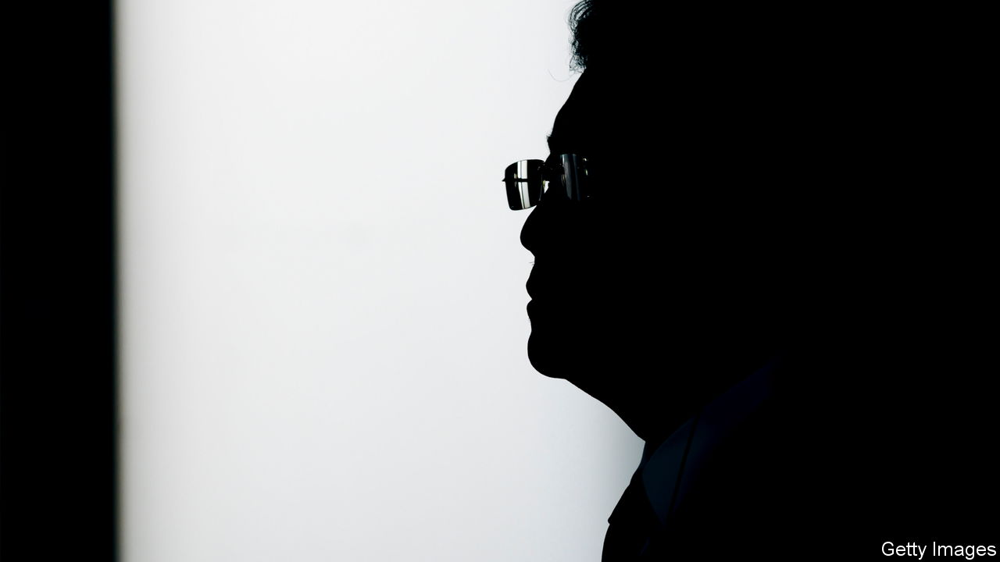

###### Qin Gang is gone

# China’s missing foreign minister loses his job 

##### The pride and fall of Xi Jinping’s model diplomat 

 

> Jul 25th 2023 

Proximity to Xi Jinping—backed by a well-judged blend of worldly charm and anti-Western scorn—propelled  (pictured) to the top of China’s foreign ministry at stunning speed. On July 25th Mr Qin fell, losing his job as foreign minister after vanishing from the public eye for 30 days.

The formal announcement, when it finally came, left everything else about Mr Qin’s fate shrouded in mystery. No mention was made of the unspecified health problems which had been offered, albeit half-heartedly, as an explanation for his absence by underlings. The  stubborn preference for opacity, even at the cost of worldwide diplomatic embarrassment, is—for now—the one fixed point in this murky saga.

Mr Qin, 57, rose through the ranks at exceptional speed after a stint as a close aide to Mr Xi, China’s supreme leader. His disappearance was a crisis for the machinery of state because Mr Qin is so widely seen as a protégé of the party boss.

As foreign minister for the past seven months, and before that as China’s ambassador to Washington, Mr Qin fulfilled perfectly Mr Xi’s instructions to Chinese diplomats to show more swagger, self-confidence and fighting spirit—especially when either wooing Western audiences or explaining to foreign grandees why America and its allies are in decline. That same rapid rise also made Mr Qin a target of envy, which may explain why so many members of Beijing’s power-elite spent recent weeks gleefully sharing ever-wilder rumours about his disappearance, many involving his private life.

China’s rubber-stamp legislature issued a terse bulletin that Mr Qin has been replaced by his own predecessor, Wang Yi, who served as foreign minister from 2013 until 2022. Mr Wang appears to have retained his other, more senior post, as the Communist Party’s top diplomat. At the age of 69, Mr Wang, a member of the ruling Politburo, may not be expected to hold that gruelling double-mandate for very long. However, after the messy confusion of the past month, Mr Wang’s long experience and his suave-yet-imperious manner, makes him a safe pair of hands.

The past month has been a confounding one for Beijing-based foreign diplomats. Ambassadors were initially sympathetic to reports that Mr Qin might be seriously ill, after the foreign ministry abruptly cleared his packed diary following public meetings on June 25th, including with a visiting Russian envoy.

There was understanding about the party’s penchant for secrecy regarding the health of senior officials, notably in a system where leaders are expected to show physical vigour. Ambassadors will miss Mr Qin. Though he was capable of real menace, issuing veiled threats to governments that had angered China in some way, he could also be unusually candid and pragmatic. A fluent English speaker, he was educated at an elite university with close links to China’s intelligence services and began his career as a government-provided researcher for United Press International, an American news agency. A dapper sort, with a taste for traditional Chinese jackets as well as well-cut Western suits, Mr Qin drew on his previous overseas postings to discuss sports with foreign guests, as well as offering views on the hypocrisy of major Western political and even religious institutions. He offered opinions about different foreign media outlets, too, letting it be known that he subscribed to them even in Beijing.

As the days of silence became weeks, foreign ambassadors—and not only from liberal democracies wary of China—grew increasingly startled that their hosts would rather allow rumours to flourish than offer any hints about what had happened to the country’s foreign minister. Indeed many questions remain unanswered, including about Mr Qin’s other high-ranking positions as a state councillor and member of the party central committee. Soon after China’s legislature voted to replace Mr Qin, all traces of his ministerial career began vanishing from the website of the foreign ministry.

The mysteries of the past month offer, in a way, an unusually clear window on the nature of power in Mr Xi’s China. However the episode ends, it is a reminder that Beijing, for all its gleaming skyscrapers and purring fleets of electric cars, is the capital of a Marxist-Leninist regime that plays by its own, brutal rules. ■


