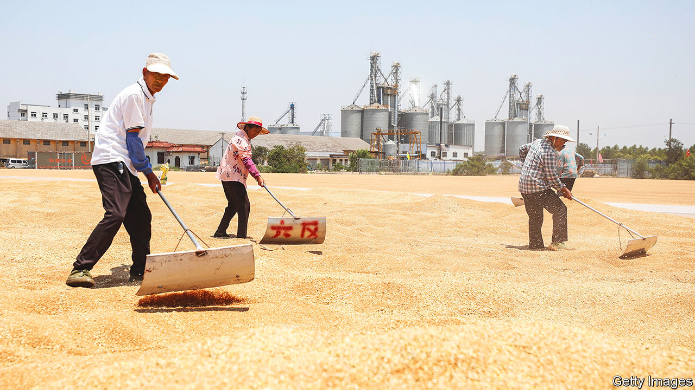
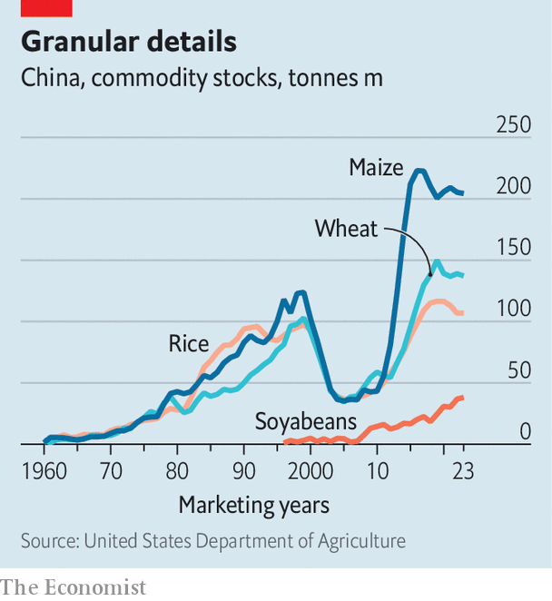

###### Clues to a conflict

# Could economic indicators signal China’s intent to go to war? 

##### Before any missiles are launched, food and fuel must be bought 

 

> Jul 27th 2023 

In the early 1980s, during a tense period in the cold war, the Soviet Union feared that America and its allies were considering a nuclear strike and went looking for warning signs. The KGB’s list of indicators ranged well beyond the military sphere. Big campaigns to donate blood, the slaughter of livestock and the movement of art might signal that an attack was coming.

Today a new kind of cold war pits America against China. And again analysts are looking for . The most likely flashpoint is Taiwan, the self-governing island that China claims and America supports. Were China planning to invade Taiwan, its  would be hard to hide. But before troops begin to muster, other actions, of an economic and financial nature, might signal China’s intent.

The Soviet Union mistook ordinary activities, such as blood drives, for possible indicators of war. When it comes to China, finding signals in the noise is even harder. The country has spent decades improving its armed forces. It routinely stockpiles food. And it has hardened its economy against potential sanctions. All of these actions have fed fears of war—yet they do not necessarily mean that one is imminent. The challenge for Western intelligence agencies, then, is to imagine how China might deviate from this wary baseline in the run-up to an actual attack.

One area to focus on is commodities, namely energy, food and metals. China would want to secure adequate supplies of each before launching an invasion. Many of these goods come from abroad and are bought by the state, so trade data are a useful gauge of the government’s intentions. Patterns that would warrant attention include large and continuous increases in supplies, sudden changes in imports or exports, purchases that go against the market and moves that are out of line with historical trends. No single data point will indicate that a war is coming. But a plausible early-warning system might be formed by pooling observations.

Energy is a good place to start. China imports nearly three-quarters of the oil it uses. The substance accounts for only 20% of the country’s energy use, but it would be crucial to any war effort. Military vehicles run on it, as do the lorries that transport supplies. If China were to start increasing its reserves—it currently has enough to last three months at today’s consumption rate—that would be one of the best indicators that it is preparing for war, says Gabriel Collins of Rice University in Texas.

Detecting increases that deviate from recent trends will be tricky. Chinese imports of oil have been rising for a decade. The country is expanding its storage capacity, building underground caverns that are both more secure and harder to spy on than tanks out in the open. But in wartime China might restrict use largely to the armed forces. Signs of such rationing would be a more obvious, if late, indicator.

Gas makes up a far smaller share of China’s energy mix, but it may still hold clues to a coming conflict. If China feared being cut off from foreign supplies it would probably burn more coal, of which it has plenty. It might also go on a buying spree. Such was the case in the run-up to Russia’s invasion of Ukraine last year, when Russia’s main gas company curbed supply. In the six months before the attack, Chinese entities bought more than 91% of all the liquefied natural gas purchased worldwide under term deals (typically spanning four years or longer), according to Mr Collins and his colleague, Steven Miles. 

The firms signed contracts that locked in near-term supplies, breaking from China’s past practice of focusing on future deliveries. Nine of the 20 state-owned outfits involved in the purchasing had never bought gas before. China may simply have decided to stock up before prices rose even higher (as they did). But Messrs Collins and Miles say the deals raise questions about China’s complicity with Russia.

 


Whereas fuel would be needed to power China’s war machine, food must be procured to sustain its people. China imports more agricultural produce than any other country. Obsessed with, it already has enormous stockpiles. In 2021 an official said its wheat reserves could meet demand for 18 months. Over the past decade China has greatly increased its purchases of wheat, corn, rice and soyabeans (see chart).

How might China change its behaviour if war were on the horizon? The answer is that it would probably buy even more food. One product to watch is soyabeans. China imports 84% of its stock. Much of it is used to feed pigs. (Pork accounts for 60% of all meat consumption in China.) The country currently has enough beans to feed its pigs for under two months. A rapid increase in buying could indicate that it was preparing for conflict, says Gustavo Ferreira, an agricultural officer in the US Army, particularly if these purchases were not matched by a rise in livestock production or if they went against market trends.

Some of this activity may be hard to see. The size of China’s grain hoard, for example, is hotly debated. When it comes to metals, the challenge may be even greater. Items such as beryllium and niobium are used to make military gear. Platinum and palladium go into engines. How much China has of these metals, most of which are imported, is difficult to say because its consumption patterns are unclear.

As with fuel and food, unusual metal-buying patterns could be a signal. Changes in China’s exports would be a more visible indicator. It might become more reluctant to part with the rare-earth metals crucial to many technologies. China has a near-monopoly on many of these. In July it announced export controls on gallium and germanium, two metals used in chips. This was part of its tech battle with America, though, not a sign of a looming hot war.

China buys many of its commodities from countries that might not mind if it invades Taiwan, nor adhere to a Western-led embargo. But China’s leader, Xi Jinping, has told his security chiefs to prepare for the “worst-case scenario”. They would probably want to make China as self-sufficient as possible in the case of war.

Similar thinking infuses China’s approach to the financial system. It has introduced a cross-border payment mechanism that could, if necessary, bypass Western financial institutions—though at present most transactions still go through foreign platforms. China and its state-owned firms increasingly push trade partners to sign contracts in yuan, to reduce the country’s dependence on the dollar. If it were planning for war, China might also move its foreign-exchange reserves out of dollars and euros and into assets that are harder to sequester, such as gold.

Financial markets tend to react late to geopolitical dangers. But if investors got wind of China’s plans, there would be capital flight. The government would probably tighten its capital controls. State entities would also cash in assets held by overseas custodians and repatriate the proceeds. They might renege on some overseas investments or delay payments. In the days leading up to an attack the government might freeze all foreign funds in China.

Some of these actions may come too late to be useful signals of war. Others may prove illusory as indicators. When talking about national security, Mr Xi says “stormy seas” are ahead. The state’s efforts to batten down the hatches could be mistaken for something worse. To a certain extent, that is the point. Part of China’s strategy is to convince the world that it is ready and willing, if not about to invade Taiwan. But its behaviour risks confirming the most pessimistic assumptions of Western analysts.

So it went during the last cold war. In 1983 NATO held a military drill that was to culminate in a simulated nuclear attack. Relying on the kind of indicators the KGB had identified, some Soviet officials feared the exercise might be cover for the real thing. Today, as China practises invading Taiwan, Western analysts must be careful not to suffer from their own confirmation bias. But if economic and financial indicators—along with satellite imagery, signals intelligence and human sources—can help America and its allies see a war coming, perhaps they can prevent it. ■


