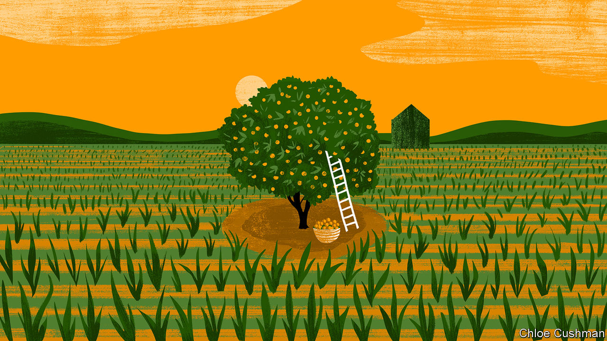

###### Chaguan

# In Xi Jinping’s China, central planners rule 

##### When one plan misfires, expect another laid on top 

 

> Jul 27th 2023 

The problem with central planners is not that they make mistakes. After all, everyone is fallible: even (oh, the shame of it) newspaper columnists. The trouble with technocrats is how they respond when plans go awry. All too often, when goals are missed or policies backfire, their solution is another plan laid on top.

This dynamic is increasingly visible in the China ruled by Xi Jinping. And it is especially true in the countryside. Policies for rural areas have become a tangled thicket of clashing priorities, core principles and “red lines” that must be defended. The transformative reforms of the 1980s, when collective farms were broken up and peasants were allowed to plant whatever the market was eager to buy, seem ever further away.

This renewed insistence on planning comes from the top. Time and again, and most recently at a meeting on July 20th of the powerful Central Finance and Economics Commission, Mr Xi has called food security a That is the high-flown phrase which he uses to denote “the main affairs of state” or “national priorities”. To that end, the supreme leader and his underlings emphasise the need to grow grain, rather than frivolities like fruit or flowers, on China’s limited stocks of prime arable land.

Chinese leaders have long worried about feeding nearly a fifth of the people on Earth with 9% of the world’s arable land and 6% of its fresh water. Mr Xi wants China to become less reliant on imports, notably in an age of rising international tensions. As he puts it, “Chinese people should hold their rice bowls firmly in their own hands, with grains mainly produced by themselves.” In part thanks to top-down price controls it is hard for farmers to make money growing staples. Thus food security challenges another of Mr Xi’s signature policies: identifying high-value crops and agricultural industries to raise farmers’ incomes in the name of poverty alleviation and “rural revitalisation”.

In a growing list of places, officials are responding with more zeal than common sense. Village cadres have sent bulldozers to tear out fruit trees. In the south-western city of Chengdu, Chaguan saw corn and sunflower fields freshly planted in a new suburban park, the Chengdu Eco Belt Park, and along highway verges. In the southern province of Yunnan, terraced rice fields have been cut into slopes. When videos of such incidents surface on social media, some angry netizens recall disastrous Mao-era campaigns to grow food on steep hillsides. Others ask what happened to another national priority since the 1990s, namely the creation of forests to combat soil erosion and bind deserts, including by planting trees on underused farmland beneath the slogan “Grain to Green”.

This resentment is heard in Beijing. In June the Ministry of National Resources issued a directive banning local governments from trying to grow crops on steep slopes and ecologically fragile land, or from using “one-size-fits-all” measures like bulldozing orchards, nurseries and fish ponds to generate new farmland. When recovering arable land that was illegally taken for construction or for other money-earning schemes, officials must proceed “step by step” and protect farmers’ interests at all times.

Yet on the ground a bossier approach may be seen, involving new plans on top of failed schemes. In and around Chengdu, the capital of Sichuan province, officials are focusing on Mr Xi’s current priority. That means growing grain. They are making their obedience visible. Mr Xi visited the fertile Chengdu plain last year, recalling how it was known in history as “heaven’s granary”. Those words, along with Xi-isms about food security and cropland, now appear on village walls and roadside propaganda posters.

The road to the fourth section of Pingshan village, south of Chengdu, dips and climbs like a fairground ride. Every inch of the reddish soil is used. Tiny plots are planted with pungent Sichuan peppercorns, plum trees, grapevines and tea bushes. Still, incomes are low. In 2011 officials boasted of following a priority of the day by “returning farmland to forests”. In Pingshan, this involved planting mulberry trees and promoting the rearing of silkworms. State media predicted that this would open up “new ways to get rich”. Yet today the mulberry trees are gone. Some excited netizens claim that China is in the grip of a national deforestation campaign. The reality is untidier. Mulberry trees did not make money so villagers stopped growing them, reports a young, bare-chested man in sunglasses, watched by a toddler on a tricycle. But Pingshan is not caught up in mass grain-growing campaigns either, being too dry and far from a main road, the young man adds. Luckily, he has another job driving an excavator. Last year that sideline took him to a different village to uproot citrus trees to make arable fields. Asked how farmers reacted, he smiled. “It’s the government’s will, how could they not be satisfied?” he replied.

Because the party knows best

In nearby Yueying village, locals talk of a neighbour who was reluctant to give up his trees. Because the man was a party member, however, he was told “to lead the way” and submit. In Gaohe village, a farmer surnamed Luo describes years of policy about-turns. “When I was young, we grew rice here,” Mr Luo explains. Then locals were encouraged to rent their small plots to a company growing grapes and other cash crops. “That didn’t work out, so they returned the land to us and we started growing citrus fruit,” he says. His family’s six mu (0.4 hectares) of land supported a few hundred trees in all. They made up to 30,000 yuan ($4,200) per mu in good years. The trees were uprooted last year and the land handed to a company that grows rice in a combined plot of about 20 hectares. Mr Luo’s family receives 1,200 yuan per mu in annual compensation. He is fatalistic about clever schemes that come and go. Farming supplements his main income from working in a nearby town. A few trees still surround his family home. “The country asks us to grow rice, so we grow rice,” he says. In Mr Xi’s China, changeable policies are like the weather: a constant to be endured. ■


