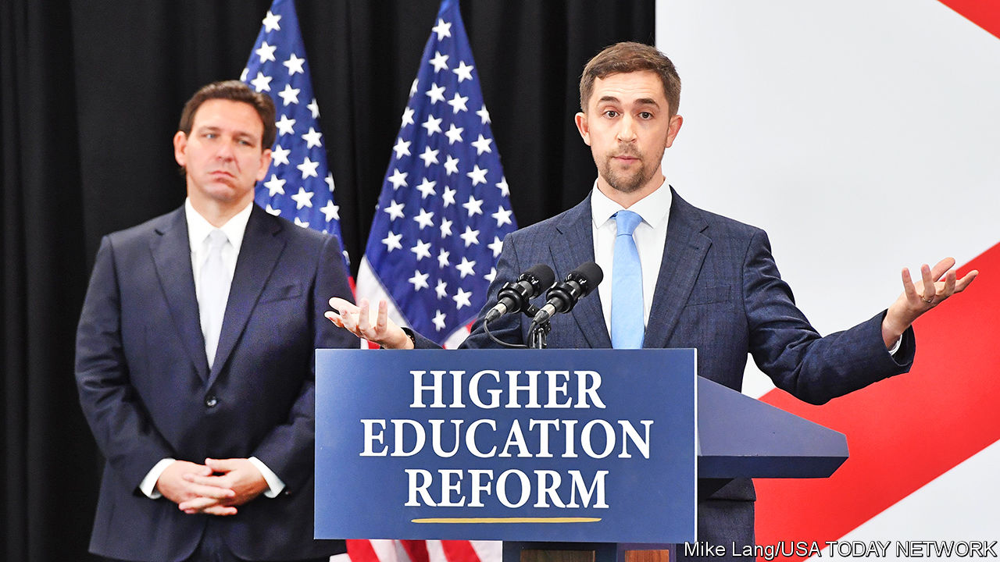

###### America’s culture war

# Christopher Rufo offers a history of the left 

##### The conservative controversialist will set the tone for the presidential contest in 2024 

 

> Jul 26th 2023 

 By Christopher Rufo. 

The American left’s political philosophy may lack a plain name—what some call wokeness, others call identity politics, critical race theory (CRT) or anti-racism—but it does have a chief sceptic. Christopher Rufo, a former film-maker and conservative writer employed by the Manhattan Institute, a think-tank, rose to prominence in 2020 by documenting the encroachment of progressive ideas into American school curriculums. 

More than anyone outside elected office except perhaps , a former Fox News anchor, Mr Rufo (pictured right) has served as a mastermind of the right’s attacks on the left. He brought attention to CRT (the teaching of systemic racism as a cause of inequality), inspiring Donald Trump to issue an executive order in 2020 banning it in federal departments and contracts. Mr Rufo is now zeroing in on other divisive issues, such as gender and sexuality.  (pictured left), the governor of Florida and a close follower of Mr Rufo’s work, hopes to surf the waves of anti-woke animus to the White House. He may not be name-checked in the presidential contest of 2024, but Mr Rufo will influence many Republican candidates and the subjects they rage against. 

For obvious reasons Mr Rufo’s new book has been attracting great interest. But readers may be surprised that it is more of an origin story than a polemic. “America’s Cultural Revolution” is an intellectual history of the critical theories, generally Marxist in origin, that emerged decades ago and which, in Mr Rufo’s persuasive and well-written telling, morphed into today’s theory of social justice.

The running metaphor throughout the work is Maoist, starting with the title invoking , which began in 1966 (though the reader might quibble with the sensationalist comparison, given the mostly non-existent death toll for the American version). Mr Rufo argues that radical ideas of overthrowing capitalism and deconstructing objectivity that were discredited by the history of communism’s failings in the East nonetheless went on a “long march through the institutions” of America, beginning with universities and ending with the takeover of elite businesses, media firms and the government. To illustrate this gradual “cultural revolution”, Mr Rufo chooses four horsemen—the thinkers Herbert Marcuse, Angela Davis, Paolo Freire and Derrick Bell—and traces the impact of their ideas over time.

The research is meticulous, and the details are forensic. Many previous intellectual biographies of thinkers like Bell, a Harvard law professor who fathered the discipline of CRT, and Freire, a Brazilian education scholar who developed his influential “pedagogy of the oppressed”, are written by smitten disciples and seemed more like religious apologia than rigorous history. Mr Rufo’s methodical recounting of their radical ideas—pushing to deconstruct the concept of merit, abolish prisons, dismantle capitalism and develop “revolutionary consciousness” in schoolchildren—is refreshingly sceptical. It is also difficult to dispute, given that the most incendiary points are usually delivered by quoting the thinkers directly. 

The mostly restrained accounting, given Mr Rufo’s reputation for stoking controversy, gives the entire work a cerebral feel. “The elements of critical race theory are, in fact, a near-perfect transposition of race onto the basic structures of Marxist theory,” he writes. Through the recounted history, some worrying trends in American life make more sense. Universities are hiring based on applicants proffering the right answers to “diversity statements”, and Californian pupils will be required from 2025 to take ethnic-studies courses that will help, in the state’s words, “challenge racist, bigoted, discriminatory, and imperialist/colonial beliefs” and “connect ourselves to past and contemporary movements that struggle for social justice”.

However, Mr Rufo’s analysis, for all its merits, falters in two ways. The first is that it often skips over the most interesting phase of the process—the actual mutation of these ideas within the academy into something more virulent—in favour of minute details in the lives of his four appointed prophets. This is not a critical flaw.

But the second one is more serious. Mr Rufo often cannot help but portray the left’s revolution as on the cusp of total victory, if not already there. “The corporation no longer exists to maximise profit, but to manage ‘’. The state no longer exists to secure natural rights, but to achieve ‘social justice’,” he writes. 

The takeover is hardly so complete. Companies are still plainly motivated by profit, and some are laying off the staff they had hired to oversee diversity-and-inclusion initiatives. Many Republican states are resisting the mandate of social justice and doing so in consultation with Mr Rufo himself. The fatalistic accounting of the takeover of the federal government—“the state, it turned out, was an easy capture…there was barely any resistance at all”—rests on a few questionable anti-racism trainings. It is hardly compelling. Much of the zealotry that ran wild after the murder of an unarmed black man, George Floyd, by police in 2020 has faded. Today Democrats pretend that some other party called for the defunding of the police. 

The counter-revolution to America’s cultural revolution that Mr Rufo explicitly calls for is already happening—and has been under way for years. He should know that, because he is, to appropriate the Leninist terminology, in the vanguard. ■


