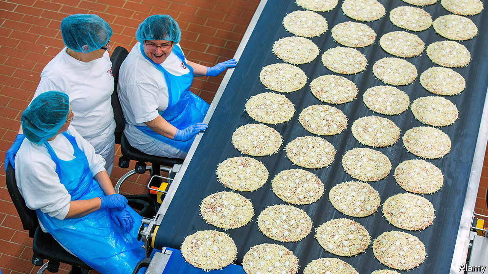

###### World in a dish

# Confronting the dangers of ultra-processed food 

##### A cocktail of additives and preservatives poses a risk to people’s health 

 

> Jul 24th 2023 

WHICH IS healthier:  or ? That is easy. Now which is healthier: a made from scratch or one made from the same basic ingredients, with the same number of calories, pulled out of a box in the freezer? 

Many people concerned with what they eat would instinctively say the former, perhaps citing a vague concern with “processed food”. Such food can often be delicious. (This columnist has a particular weakness for salty potato crisps.) And there is much to cheer about  being cheap and abundant, when for most of human history they were neither. But as Chris van Tulleken’s new book, “Ultra-Processed People”, explains, that cheapness and abundance come at a cost.

Mr van Tulleken, a doctor and television presenter, draws a distinction between “ultra-processed food” (UPF) and “processed food”. Almost everything people consume is processed in some form:  is harvested and hulled, animals are butchered. He uses a definition proposed by Carlos Monteiro, a food scientist, describing UPF as “formulations of ingredients, mostly of exclusive industrial use, made by a series of industrial processes, many requiring sophisticated equipment and technology”. A pizza made from scratch contains minimally processed food (wheat turned into flour, tomatoes into sauce, milk into cheese). The one in the freezer, with its thiamine mononitrate and sodium phosphate, is UPF.

The cocktail of additives and preservatives in UPF harm people in ways both known and unknown. It seems to affect the gut microbiome, the trillions of bacteria that  in a range of ways. Calorie-rich but usually nutrient-poor, UPF contributes to obesity in part because its palatability and soft texture foster overconsumption, overriding satiety signals from the brain. 

Because this frankenfood is cheap to produce and buy, UPF displaces healthier alternatives, particularly for poor people. Extra weight was once a sign of wealth, but among British and American women today, . (Curiously, rates do not vary for men, even though a greater share of American men than women are obese.)

The reasons why UPF can be harmful are not always clear, even to scientists. Additives that may be safe in isolation or small quantities may be harmful in combination with other chemicals or when consumed regularly. If we are what we eat, considering the impact of UPF is essential, but too often Mr van Tulleken’s case for clean food is accompanied by anti-capitalist preening: for instance, he nonsensically calls corporate-tax minimisation “part of ultra-processing”. 

Environment matters, too. People who live in what the author calls “food swamps”, where “UPF is everywhere but real food is harder to reach”, could spend large amounts of time and money seeking out fresh food, but that is not how most people live. There is nothing wrong with the odd fast-food trip, but anyone who can afford to eat less upf probably should. ■


