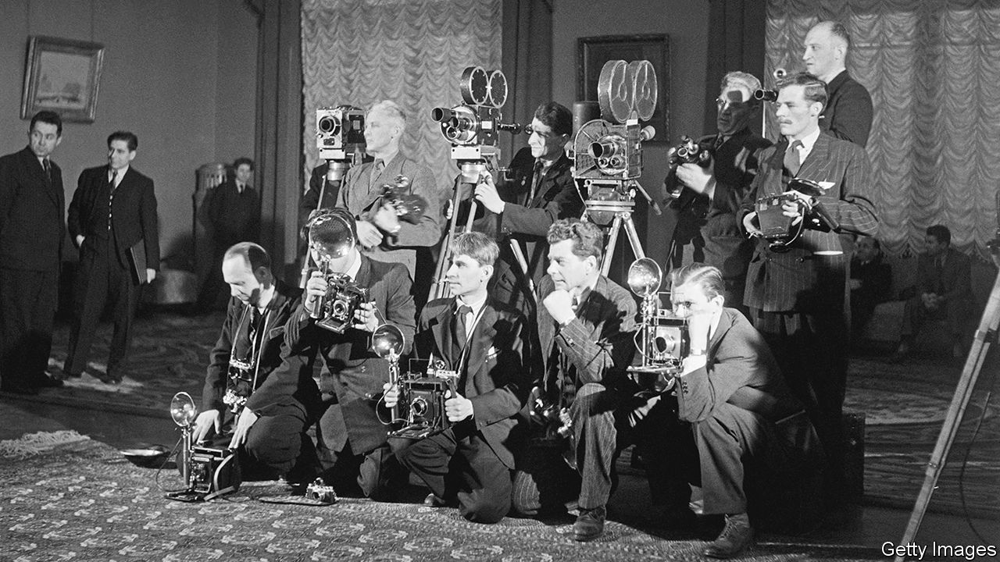

###### Rotten reporting on Russia

# How Stalin’s scribbling stooges tricked Western readers 

##### A new book shows how journalists failed to capture Russia’s horrors 

 

> Jul 27th 2023 

By Alan Philps. 

When Germany attacked the Soviet Union in 1941, Winston Churchill persuaded Josef Stalin to let a posse of British and American journalists come to reside in Moscow to tell the Western world about the communists’ bravery in fending off the Nazis. More than a dozen scribes found themselves corralled within the Metropol Hotel, a huge art-nouveau edifice just off Red Square in Moscow, which already housed a motley group of Stalinist spies and prostitutes. (The hotel remains open today but with a different clientele.)

The Western journalists, mostly male, all tightly muzzled by censors and prevented from travelling freely, soon found themselves in hock to (and occasionally in bed with) a bevy of women who doubled as translators and fixers. “The Red Hotel” is a compelling and often horrifying tale of moral degradation and occasional heroism superbly told by a seasoned reporter, Alan Philps, who knew Moscow first-hand in the last years of communism.

The shiniest stars in Mr Philps’s book are the female fixers who were controlled by the secret police but managed against the odds to retain a modicum of their integrity. Among the most remarkable was Nadya Ulanovskaya, a Jewish Ukrainian who had been a revolutionary in the 1920s. Reprieved at the last minute after being sentenced to death by firing squad, she then became part of a Soviet spy ring in America and elsewhere. Mr Philps, who has invoked a stunning range of Russian and Western archival sources and obscure memoirs, draws heavily from Ulanovskaya’s little-known autobiography, showing how this fervent believer in communism lost all faith in it.

Even before Churchill’s wartime press deal with Stalin, a reporter previously based in Russia for the  had written a bitter, unpublished cable to his editors, lamenting that correspondents in Moscow had been “reduced to the role of precis-writers of TASS [the Soviet news agency]…Every correspondent still there knows that his work is entirely valueless.” Indeed, the correspondents in the hotel, which they called a “gilded cage”, issued not a peep in their dispatches about the twin horrors of Stalin’s benighted country: pervasive poverty and the terror imposed by the NKVD, forerunner of the KGB. 

The most shameful nadir of Western coverage was the carefully orchestrated group visit in 1944 to the grisly site of the Soviet massacre of Polish officers and gendarmes at Katyn forest, which the press corps dutifully attributed to the Germans. Altogether some 22,000 Poles are reckoned to have been murdered there and at other sites by the NKVD.

Some of the correspondents who had submitted to the rigours of censorship later wrote memoirs that sorrowfully acknowledged how they had been unable to convey a truthful picture of the Soviet reality. No Western journalist during the war was able to interview Stalin face-to-face, though one managed to enrage him at a state banquet by cheekily calling for a free press. (He then promptly left the country.) Amid the hunger immiserating much of the population, the correspondents were treated to frequent, gargantuan meals. 

Of the correspondents depicted in “The Red Hotel”, probably the one who wrote most truthfully was Arthur Cholerton of the . After a break in Britain he was refused re-entry; his translator and lover was sentenced to 15 years in the gulag. The most despicable yet mysterious of the hotel team was Ralph Parker, who wrote grovelling pro-Soviet dispatches for both the  and the of London. A former senior KGB official wrote in 2001 that Parker was as valuable as Kim Philby, the notorious British double-agent. Guy Burgess, another Briton who spied for Russia and ended up in Moscow, told a visitor, “We all think he’s an agent, but we can’t make out whose side he’s on.” Parker was the sole Western reporter to have the honour of receiving from Stalin an answer to a written question. After the war, would the Soviet Union respect the independence of Poland? “Unquestionably,” came Stalin’s brazenly mendacious reply. 

The worst effect of the correspondents’ varnished reports, which disguised the horror of the regime, was that many of their readers in the West were lulled into believing that “Uncle Joe” was a worthy ally with whom cosy relations could be established after the war. Many readers felt betrayed and angry when the conditions imposed on their newspapers’ reporters were later exposed.

The obstacles to free reporting faced by Western correspondents persisted long after Stalin. But the moral hazard whereby Western journalists and academics took care not to offend the regime, so as not to lose their visa, prevailed until the end of communism. Mr Philps makes no bones about painting Vladimir Putin as a clone of previous dictators: his regime depends on, among other things, a subservient press at home and the indulgence of hacks who wish to visit from abroad. But fewer foreign journalists today are willing to play his game. ■


