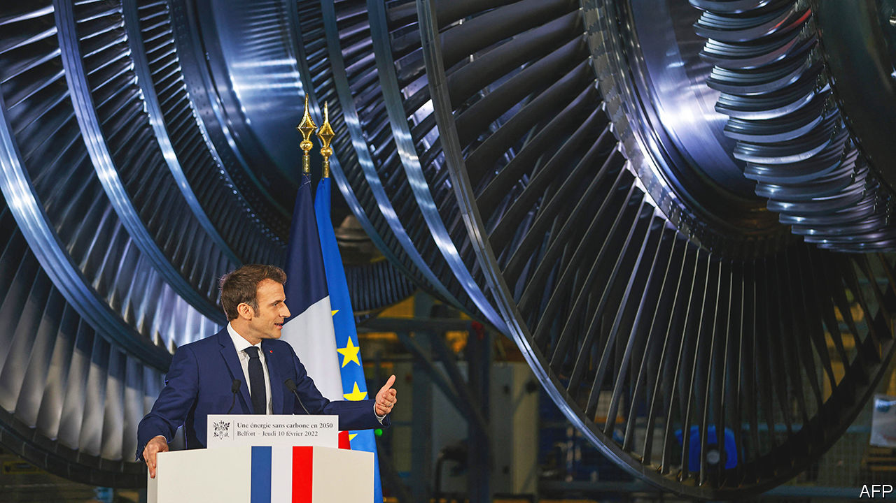
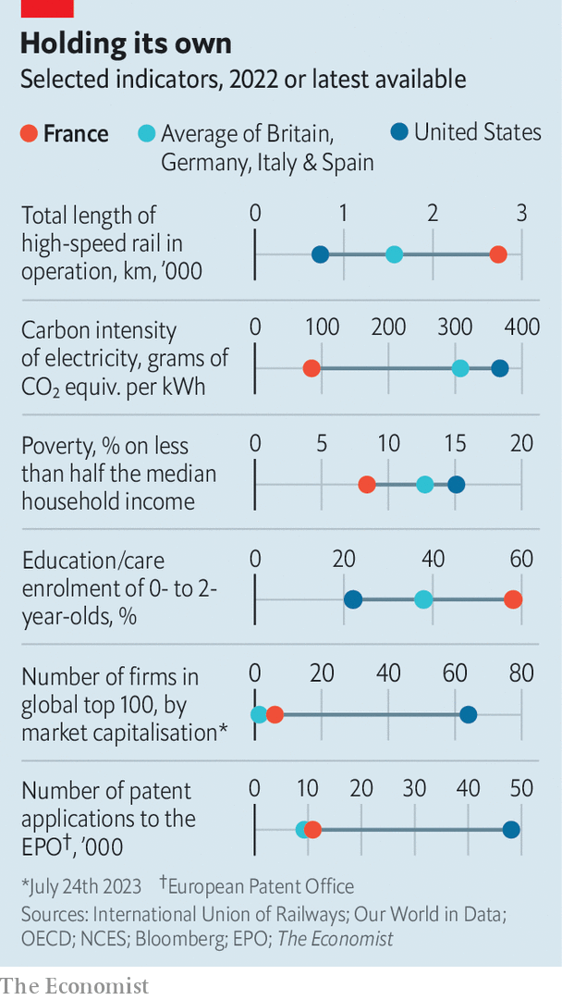

###### The France that works

# Beneath France’s revolts, hidden success 

##### On many counts it is quietly doing better than other Europeans 

 

> Jul 27th 2023 

So far this year the French have done a fine job portraying their country as broken. Twice they have spread mayhem, and derailed a state visit, with street rebellions. The first, over a rise in the retirement age, underlined people’s refusal to face up to the financing needs of the state pension system. The second, over the fatal police shooting of a 17-year-old, spoke of a failure to get law enforcement right in rough neighbourhoods. Emmanuel Macron, the president, runs a minority government that seems to lurch from crisis to crisis.

Yet behind the headlines, one of the abiding mysteries of France today is this: a country with an aversion to change, a talent for revolt and an excessive taste for taxes still manages to get so much right. Recently France has even outperformed its big European peers. Since 2018 cumulative growth in GDP in France, albeit modest, has been twice that in Germany, and ahead of Britain, Italy and Spain. 

 


Indeed by some measures France shows surprising vitality compared with its four biggest European neighbours (see chart ). This is partly due to historical decisions. France’s high-speed (and green) rail network, which debuted in the 1980s, dwarfs not only America’s but the average of its big European peers. France also generates some of Europe’s lowest-carbon electricity, thanks not to renewables but to its nuclear industry, launched in the 1970s. This still provides 66% of France’s electricity, despite maintenance issues last year at the country’s 56 reactors. Six new-generation reactors are now planned.

France’s performance reflects more recent choices too. It has more companies in the global top 100, measured by market capitalisation, than any other European country. It owes this largely to its luxury-goods giants, which have jumped in profitability and scale in the past decade. French luxury brands were more profitable in 2022 than American tech firms. All three of the world’s top luxury firms—LVMH, Hermès and Dior—are French. 

There is more to French business, though, than the hand-stitched leather clutch. France is also home to the euro zone’s most valuable bank, BNP Paribas. Between 2017 and 2022 the country increased its share of global arms exports by four points, to 11%. Last year France registered more patents than the average of its big European neighbours, and nearly twice as many as Britain. On a wooded plateau south of Paris, the government is pouring billions into an innovation cluster around Saclay, designed to become a “French MIT”. 

Britain and Germany are still home to more of Europe’s top 100 unicorns, or unlisted firms valued at over $1bn. Yet the startup scene in Paris has been transformed. One-time pioneers such as Xavier Niel have become establishment figures. In 2019 Mr Macron promised that France would produce 25 tech unicorns by 2025; the figure was reached last year. “Business-school graduates used to prefer the security of big corporate life,” says Frédéric Mazzella, head of BlaBlaCar, a French ride-sharing firm and an early unicorn. “Now it’s become cool to be a tech entrepreneur.”

How to explain this under-hyped French performance? One recent factor is the global revival of state interventionism, newly fashionable even in America and Britain. In France this tradition goes back to Louis XIV’s finance minister, Jean-Baptiste Colbert, and was revived by government central planners after the second world war as . The EU is now less strict about public subsidies, leaving France freer to indulge its core instincts.

Take the four gigafactories being built in “battery valley” in northern France. This reaches from the port of Dunkirk to Douvrin and Douai in the old mining basin. When, or if, fully operational it will make France one of the biggest electric-battery producers in Europe. State handouts helped to persuade ProLogium, a Taiwanese firm, to build the factory in Dunkirk. Roland Lescure, France’s industry minister, argues that it was “not just about subsidies” but “reliable, low-carbon energy supply” as well as “accelerated planning procedures and the growing battery ecosystem”. Batteries will roll off the production line in Douvrin this year, only two years after the first planning application was lodged. 

A second explanation is the fine-tuning of a set of social preferences. The revolutionary-minded French like to think that theirs has become a deeply unequal society. The feeling is reinforced by the soaring wealth of their billionaires, while inflation squeezes ordinary people’s budgets. This year Bernard Arnault, head of the LVMH luxury empire, became the world’s richest man for a time, worth $211bn (before ceding to Elon Musk). In 2022 six of the top ten European billionaires were French. Mr Macron, who reduced the wealth tax to a mere mansion tax, is seen by his detractors as the  bent on loosening labour protection and curbing benefits.

Yet France on Mr Macron’s watch has managed to combine a more favourable attitude towards wealth creation with a welfare state that still does a better job than its big peers at correcting inequality. The French poverty rate is well below the average of its European neighbours, and little over half America’s. Nursery education, a proven means of improving life chances for lower-income groups, is now compulsory from the age of three. The French live six years longer on average than Americans, and far fewer are obese. Their jobless rate, at 6.9%, is at its lowest in 15 years. Despite Mr Macron’s reforms, the French state still takes more in taxes as a share of GDP than any OECD country bar Denmark—and devotes more to social spending. 

A final factor is policy stability. Mr Macron is the first president in 20 years to be re-elected. Bruno Le Maire has been finance minister for the longest consecutive period under the Fifth Republic. The pair vowed not to put up taxes, and have stuck to it. An annual confab of foreign corporate titans, invited by Mr Macron to “Choose France”, has turned into a sought-after elite event. This year over 200 of them jetted in to be dined at Versailles, jointly announcing another €13bn ($14.4bn) of investments. Morgan Stanley is nearly doubling its headcount in Paris. Pfizer is doubling to €1.2bn its investment in the country over the next four years. “The reality is that there is a long-term trend towards greater attractiveness,” says Ludovic Subran, chief economist at Allianz, a German insurer. 

France has not got everything right, far from it. There are genuine concerns about standards in state schools and regional access to health services. Politics remains polarised and society anxious. Average real wages have been flat, not rising as in America. All those French subsidies and infrastructure projects come with an eye-watering price tag. The public finances are stretched, partly by capping energy bills to protect consumers from the cost-of-living crisis, which is only slowly being phased out. France has not balanced a government budget since before Mr Macron was born. 

Yet, as the French board super-fast trains on the way to their enviably long summer holidays, France’s model continues to defy those who predict its collapse. A recent analysis by Sam Bowman, a British commentator, puzzled over France’s relative wealth, despite high taxes and tight labour laws. Better infrastructure, simpler planning and housing supply, cheaper child care and abundant energy seemed to explain it. “France gets so much wrong,” he concluded, “and yet it still does pretty well on the metrics that actually matter.”■

