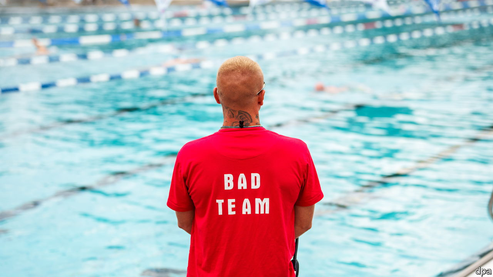

###### Law and order poolside

# Germany tries to stop brawls in public swimming pools 

##### Summer tensions are high at the Schwimmbad 

 

> Jul 27th 2023 

Summer in Berlin is not dull this year. More than 100 police spent July 20th chasing reports of a stray lion. None turned up; it was probably a wild boar. So Berliners returned to the other big local debate: whether police should patrol municipal pools to prevent brawls.

Both Friedrich Merz, the head of Germany’s opposition Christian Democrats (cDU), and Nancy Faeser, the Social Democratic interior minister, are in favour. The police union is not. Cops, it says, are not trained to be (lifeguards); in Germany, world champion of occupational licensing, the job requires a three-year apprenticeship. One idea is to restrict pools to families with children during peak hours. 

Fights at pools are nothing new, but the frequency and violence have risen lately. In the past four weeks Eric Voss of the German society for bathing culture has tallied around 20 brawls or assaults in Germany’s 2,800 public outdoor pools. Some stem from cultural clashes between immigrant groups or residual frustration from pandemic lockdowns. A new factor is high inflation that has made vacation trips unaffordable. “We have all become more thin-skinned and more selfish,” says Peter Harzheim, Germany’s head lifeguard.

What to do? Mr Harzheim favours video surveillance, guards and requiring bathers to sign in with an ID (which recently became mandatory in Berlin). He also thinks crimes at pools need to be punished faster. (The cDU wants miscreants hauled before a judge on the same day; Mr Harzheim finds this unrealistic.) Some pool operators deploy volunteer mediators. In Stuttgart their blue shirts read  (respect guides), in Berlin .

Unsurprisingly, the far-right Alternative for Germany party is diving in, blaming the fights on migrants. Sensationalist media are fanning the flames too. By autumn the heat will probably dissipate, but for now the scene at German pools is not very chill.■

