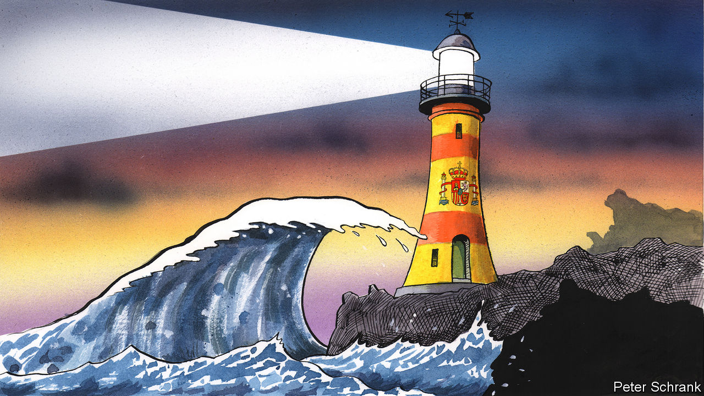

###### Charlemagne

# Spain shows that some voters still want centrism 

##### The reasons for an Iberian wave of moderation 

 

> Jul 26th 2023 

People do not always think through the metaphors they use. Though the phrase “meteoric rise” is common, meteors are better known for falling. Prices are said to “spike” even when their rise is not accompanied by a descent. And when people talk about “waves” sweeping Europe, they often forget a crucial feature: waves break. That seems to have been what happened to the wave of nationalist populism that failed to sweep into Spain in the general election on July 23rd. 

The election was expected to hand power to a coalition of the centre-right People’s Party (PP) and, for the first time in Spain’s modern democratic history, the hard right, in the shape of a ten-year-old party called Vox. Nationalist-populist parties already run Hungary, Poland and Italy; others share power in Sweden and Finland. Getting into government in Spain would have confirmed that Europe’s populist swell was rising. Right-wingers from across the continent did their best to stir the waters. At Vox’s final campaign rally at the Plaza de Colón in Madrid (a favourite spot for nationalists, featuring the biggest national flag in Spain), Poland’s Mateusz Morawiecki, Hungary’s Viktor Orban and Italy’s Giorgia Meloni appeared in videos cheering the party on. 

Instead, Vox lost 19 of its 52 deputies. The PP came first, but even with Vox it lacks a majority, and no other party will join any coalition that includes the populists. The governing left-wing bloc headed by Pedro Sánchez, the Socialist prime minister, won fewer seats, and can reach a majority only by including a gaggle of regional separatists. Spain may have to hold new elections. The wave turned out to be one of those monsters that build far offshore, only to crash early. Why?

The reasons lie below the surface. Superficially, Vox shares many of the common bugaboos of Europe’s right: feminism and gender identity, demographic decline, immigration and the “religion” of climate change. Yet until recently it was unusual in rarely bashing the EU. Spain has profited so handsomely from its membership since 1986—rising living standards, good roads, high-speed rail—that running against Europe seemed suicidal. In this campaign, though, Santiago Abascal, Vox’s leader, switched the formula. The party platform denounces Brussels bureaucrats whom “no one elected” and calls for subordinating EU law to Spain’s (impossible under the bloc’s treaties). The profile of Jorge Buxadé, a Vox MEP and former member of the fascist Falange party, rose during the campaign. This scared some voters away.

The weakness of the ultranationalists in Spain, and in next-door Portugal, is often attributed to the living memory of far-right dictatorships that ended only in the mid-1970s. With those dictators gone, attitudes in Spain and Portugal changed faster than in almost any other European countries. In a survey in 2021, Spanish support for gay marriage was the third-highest in the EU, after only Sweden and the Netherlands. Portugal has the most liberal drug laws in Europe. Both countries’ nationalist parties have grown in recent years. But they are nowhere near the 30% that went to Marine Le Pen and Eric Zemmour in the first round of France’s presidential election last year, the 35% taken by hard-right parties in Italy’s latest election or the roughly 20% each in Sweden and Finland. 

What seems to best explain the surge and then recession of Vox is a factor entirely specific to Spain: the question of Catalan independence. Vox’s first big moment came after Catalonia’s separatist leaders staged an unconstitutional independence referendum in 2017. That infuriated huge numbers of Spaniards in other regions, not all of them conservative. Vox, which advocates abolishing Spain’s devolution of extensive powers to its regions, was perfectly placed to take advantage. Since then the independence question has receded from the headlines, in part because Mr Sánchez has deftly cut deals with separatist parties. That may have done more to undercut Vox than anything else. 

Meanwhile, other wavelets that could have joined a big populist splash are instead petering out. The decade-long fragmentation of Spain’s politics, in which the two big traditional parties lost ever more voters to shiny new ones, has gone into reverse. Podemos, a far-left outfit born during the global financial crisis, is a shadow of its former self; it had to join another leftist grouping, Sumar, to survive the election. The combined vote share won by the PP and the Socialists, which had fallen to 45% in April 2019, recovered to 65%. Portugal, too, has social-democratic and conservative parties in decent nick: they won 70% of the vote last year. 

The other Iberian exception

This is now a rarity in Europe. In France, the two parties that have dominated the Fifth Republic since 1958 came in fifth and tenth in the presidential elections. In Germany, the far-right Alternative for Germany is polling ahead of each of the three parties in the current government. Conservative politicians in Germany and in the Netherlands are now talking cautiously about breaking the taboo against working with the hard right. And although Spain shows that fragmentation is not irreversible, its return to the centre has left the PP and Socialists almost evenly matched. Neither can assemble a majority without parties that infuriate many Spaniards: Catalan and Basque separatists on the left, Vox on the right. 

They could, of course, do what the Germans, Dutch and Danes have done in recent years and form a grand coalition. Spaniards say they want the big parties to work together. But the country has no such tradition, and there is much bad blood between the big two. Having dodged a metaphorical populist wave, Spain’s politicians would love to spend the next few weeks at the beach catching some literal ones. Instead they will have to sort out whether to cobble together a flimsy coalition, to vote yet again—probably around Christmas, so ruining another holiday season—or to listen to the majority who want the centre to hold.■


