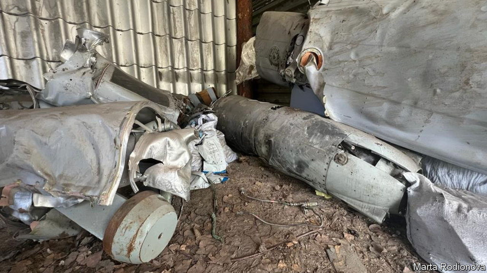

###### Cold cases

# Ukraine’s missile cemetery 

##### Dissecting Russian rockets for clues 

 

> Jul 27th 2023 

The missiles line up like headstones: tipped on their sides, ordered by family and final resting date. Grass grows around them, where leaked fuel has not killed it. Walking among them is like browsing a catalogue of Russia’s war effort. There are cruise missiles, ballistic missiles, glide bombs, free-fall bombs and twisted components: wires, circuit boards, gyroscopes, lenses, casing and cladding. All of this metal fallen from the sky has been collected in a secret study centre near Kyiv. “If you are going to battle something,” says Colonel Mykola Danilyuk, “you need to first understand what you are dealing with.” 

Ukraine’s missile graveyard was launched in the spring of 2022. When the centre’s officers arrive at an impact site, they must first figure out what projectile hit it. Then they look for serial numbers or other markings. The more effective the missile, the less tends to be left of it. The best case is when air defence scores a hit on the engine and the rest of the missile falls intact. Then the officers can easily work out when and where it was produced and serviced, and whether it has been upgraded. Understanding the dynamics of production is key to staying ahead of the game, says “Sasha”, an officer at the site.

Some news is encouraging: Russia is running down its missile stockpiles. The most recent arrivals were built in the second quarter of 2023. But the high rate of use shows the Russians have stepped up production. They appear to be prioritising their most effective cruise missile, the air-launched Kh-101. This is increasingly their weapon of choice, says Colonel Danilyuk: able to fly low to avoid detection and to change direction dozens of times. A typical attack comprises several strike groups, including Kh-101s and drones. “One group might attack Kyiv from the north, and a second group will make figure-of-eight turns before striking an airbase in Odessa.” 

Russia is modernising its missiles in the midst of war. Kh-101s recovered in 2022 had a homing system using one optical sensor; the latest have three. Such findings change Ukraine’s calculations about how to fight them, says Sasha. Earlier in the war, he says, studying the optical contrast seekers of Kalibr sea-launched cruise missiles allowed Ukrainians to engineer cone-shaped decoys to trick them. These are now deployed at targets such as bridges. Other findings helped air-defence forces deal with Russian “thermal traps”: clouds of projectiles released from missiles that aim to overwhelm automated systems. The Ukrainians can now tell the decoys from the real thing, says Colonel Danilyuk. 

A missile’s post-mortem can also reveal who built it. Remarkably, because of bureaucracy at the plant which produces the Kalibr, many components carry the names of workers who produced them. Ukraine has used this fact to publicly identify and shame them for killing civilians. “We put it to the workers that they had options: to leave or sabotage production,” says Sasha. Sure enough, production stalled for a while in the winter. 

Colonel Danilyuk is unimpressed by the missiles’ electrical circuity, which has not moved on from Soviet designs: “The relay box might say it was produced in 2022, but it’s the same size as you saw in the 1970s.” The Russians are, however, using imported microcomponents. The vast majority of those in the optical homing systems of Kh-101s came not from China, but America. These include Altera Flex logic boards, which are dual-use and so not subject to sanctions. It would be difficult to stop the flow: “You can simply order them on Aliexpress and export them in a couple of suitcases from Kazakhstan.” 

The experts say their 16 months of study leaves little doubt about the capacities of the military industry they are taking on. The build quality of the missiles was always impressive, they said. But Russia had not yet found a strategy to use them to turn the war, they added. The growing success of Ukrainian air-defence systems (including hand-held surface-to-air missiles that are many times cheaper than their targets) raises questions as to the viability of Russian cruise missiles in modern warfare. “In non-nuclear mode, they haven’t been precise or destructive enough to make a strategic difference,” says Sasha. ■

