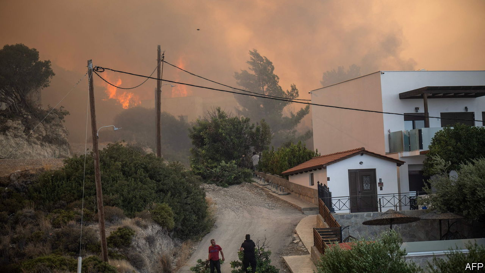

###### Greek fire

# Wildfires threaten Greece’s tourist economy 

##### Thousands have been evacuated, and more fires may be coming 

 

> Jul 27th 2023 

Wildfires have destroyed thousands of hectares of forest on Greek islands, forcing the evacuation of over 30,000 tourists and locals from Corfu, Evia and Rhodes. With temperatures above 40°C (104°F), a week-long blaze caused chaos on Rhodes, where some tour operators cancelled flights until August. On Corfu and Evia holiday-makers fled luxury villas on the coast. Efthymios Lekkas, a natural-disaster expert, blamed “an unprecedented heatwave…combined with very strong winds”. Several EU countries and Turkey sent firefighters and water-dropping aircraft to join local forces. On July 25th an old Greek air-force firefighting plane crashed in Evia. With the  (annual northerly winds) expected to strengthen, there may be little respite ahead.■

